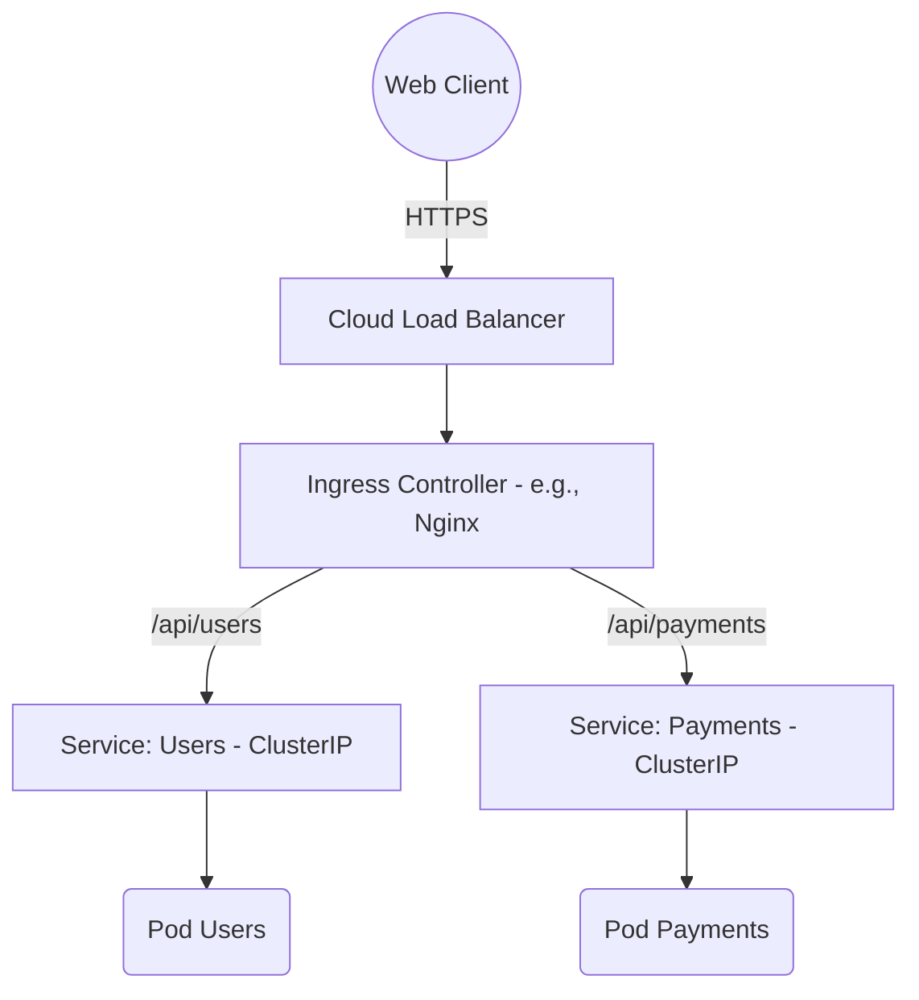

# 02 - Networking & Security

Networking and security are frequent interview topics. You need to understand how traffic enters the cluster, how Pods communicate, and how to restrict those flows.

## 1. Kubernetes Network Model (CNI)

By default, Kubernetes enforces a very open network: **all Pods can communicate with all other Pods**, without NAT, even across different nodes.

The actual implementation of this network is delegated to a **CNI (Container Network Interface)**: a plugin installed on the cluster.

- **Classic CNI plugins:** Calico, Flannel, WeaveNet.
- **Current trend (interview bonus):** **Cilium**, based on **eBPF**, which replaces `kube-proxy`/`iptables` for better performance and finer-grained network security.

!!! info "Simply Remember"
    You don't need to know the internal details of the CNI for an entry-level interview, just know that it **handles network communication between Pods**, and be able to name 2-3 plugins (Calico, Flannel, Cilium).

## 2. Exposing an Application (Services & Ingress)

Pods are ephemeral (their IPs change). A **Service** provides a fixed IP address and a stable DNS name for a group of Pods.

| Service Type | Use Case | Explanation |
| :--- | :--- | :--- |
| **ClusterIP** | Internal (default) | Accessible only inside the cluster. |
| **NodePort** | Dev / Test | Opens a static port (30000-32767) on all nodes. To be avoided in production. |
| **LoadBalancer** | Production Cloud | Asks the Cloud Provider (AWS, OCI, etc.) to create an external Load Balancer. |

!!! danger "Architecture Trap: LoadBalancer vs Ingress"
    If you have 50 microservices and create a `type: LoadBalancer` for each, you pay for 50 Load Balancers (very expensive).
    **Solution: Ingress.** A single HTTP/HTTPS entry point (one Load Balancer) that routes traffic to different internal Services based on URL or domain.



## 3. Security: RBAC and Network Policies

Two levels of security: **API access** (who can do what) and **network access** (who can talk to whom).

### A. RBAC (Role-Based Access Control)
Never give admin rights to an application. Principle of **least privilege**.

- **Role / ClusterRole:** what you are allowed to do (e.g., `get, list` on `pods`).
- **ServiceAccount:** the identity of a Pod.
- **RoleBinding / ClusterRoleBinding:** associates a Role with a ServiceAccount.

### B. Network Policies (the Internal Firewall)
By default, all traffic is allowed between Pods. A **NetworkPolicy** restricts these flows.

!!! info "Golden Rule to Know by Heart"
    In production, you always start with a **"Default Deny" NetworkPolicy** that blocks all traffic in a Namespace. Then, you explicitly open the necessary flows (e.g., the Frontend can talk to the Backend, but not the other way around).

## 4. YAML Manifests to Know

### A. NetworkPolicy Default Deny + Targeted Rule

```yaml
# 1. Bloque tout le trafic entrant/sortant du namespace
apiVersion: networking.k8s.io/v1
kind: NetworkPolicy
metadata:
  name: default-deny-all
  namespace: production
spec:
  podSelector: {}
  policyTypes:
  - Ingress
  - Egress
---
# 2. Autorise seulement le frontend à parler au backend
apiVersion: networking.k8s.io/v1
kind: NetworkPolicy
metadata:
  name: allow-backend-traffic
  namespace: production
spec:
  podSelector:
    matchLabels:
      app: payment-backend
  policyTypes:
  - Ingress
  ingress:
  - from:
    - podSelector:
        matchLabels:
          app: payment-frontend
    ports:
    - protocol: TCP
      port: 8080
```

### B. Minimal RBAC (Least Privilege)

```yaml
apiVersion: v1
kind: ServiceAccount
metadata:
  name: cicd-deployer
  namespace: production
---
apiVersion: rbac.authorization.k8s.io/v1
kind: Role
metadata:
  name: deployment-manager
  namespace: production
rules:
- apiGroups: ["apps"]
  resources: ["deployments"]
  verbs: ["get", "list", "watch", "update", "patch"]
---
apiVersion: rbac.authorization.k8s.io/v1
kind: RoleBinding
metadata:
  name: bind-cicd-deployer
  namespace: production
subjects:
- kind: ServiceAccount
  name: cicd-deployer
  namespace: production
roleRef:
  kind: Role
  name: deployment-manager
  apiGroup: rbac.authorization.k8s.io
```

## 5. Essential Commands to Know

```bash
kubectl get svc                     # Liste les Services
kubectl get ingress                 # Liste les Ingress
kubectl auth can-i create deployments --as=system:serviceaccount:production:cicd-deployer -n production
                                     # Teste les permissions RBAC d'un compte
kubectl exec -it pod-frontend -- nc -zvw3 payment-backend 8080
                                     # Vérifie si un Pod peut joindre un autre (test NetworkPolicy)
```

## 6. Interview Questions to Prepare

!!! question "Q: Why do Pods need a Service?"
    Because Pods are ephemeral and their IP changes each time they are recreated. The Service provides a fixed IP and a stable DNS name to access them reliably.

!!! question "Q: What is the difference between ClusterIP, NodePort and LoadBalancer?"
    ClusterIP = access only inside the cluster. NodePort = opens a port on each node (dev/test). LoadBalancer = provisions an external load balancer from the cloud provider (production).

!!! question "Q: Why use an Ingress rather than a LoadBalancer Service for each app?"
    To avoid paying for one Load Balancer per microservice. Ingress centralizes HTTP/HTTPS routing through a single entry point.

!!! question "Q: What is the principle of least privilege in RBAC?"
    Give a ServiceAccount only the permissions strictly necessary for its purpose (e.g., `get/list` on pods, not a wildcard `*`).

!!! question "Q: What does a 'Default Deny' NetworkPolicy do?"
    It blocks all incoming and outgoing traffic in a namespace by default, forcing each required flow to be explicitly opened (Zero Trust approach).
