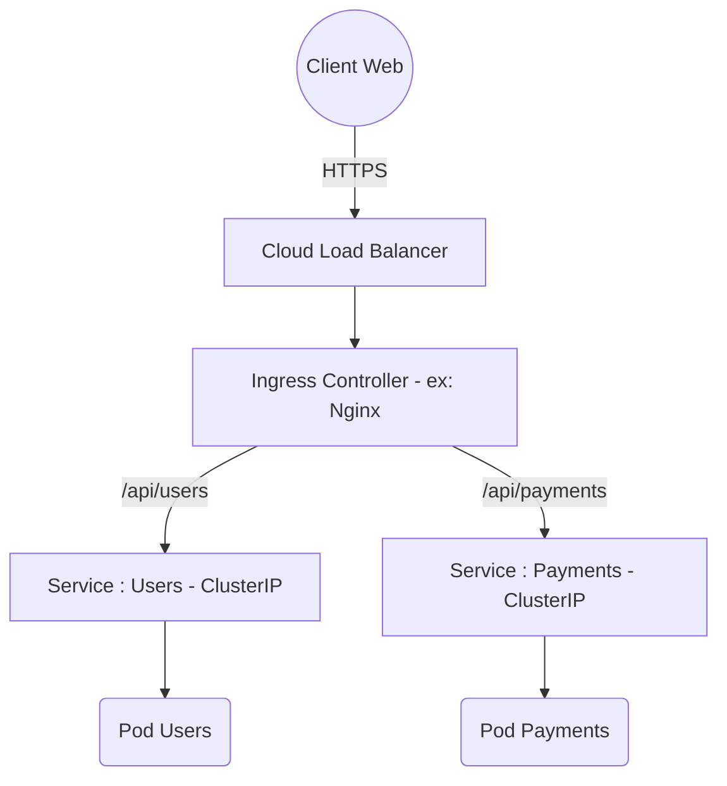

# 02 - Réseau & Sécurité

Le réseau et la sécurité sont des sujets fréquents en entretien. Il faut comprendre comment le trafic entre dans le cluster, comment les Pods communiquent, et comment restreindre ces flux.

## 1. Le modèle réseau Kubernetes (CNI)

Par défaut, Kubernetes impose un réseau très ouvert : **tous les Pods peuvent communiquer avec tous les autres Pods**, sans NAT, même sur des nœuds différents.

L'implémentation réelle de ce réseau est déléguée à un **CNI (Container Network Interface)** : un plugin qu'on installe sur le cluster.

- **Plugins CNI classiques :** Calico, Flannel, WeaveNet.
- **Tendance actuelle (bonus entretien) :** **Cilium**, basé sur **eBPF**, qui remplace `kube-proxy`/`iptables` pour de meilleures performances et de la sécurité au niveau réseau plus fine.

!!! info "À retenir simplement"
    Vous n'avez pas besoin de connaître les détails internes du CNI pour un entretien entry-level, juste savoir que c'est **lui qui gère la communication réseau entre Pods**, et pouvoir citer 2-3 noms (Calico, Flannel, Cilium).

## 2. Exposer une application (Services & Ingress)

Les Pods sont éphémères (leurs IPs changent). Un **Service** fournit une adresse IP fixe et un nom DNS stable pour un groupe de Pods.

| Type de Service | Cas d'usage | Explication |
| :--- | :--- | :--- |
| **ClusterIP** | Interne (par défaut) | Accessible uniquement à l'intérieur du cluster. |
| **NodePort** | Dev / Test | Ouvre un port statique (30000-32767) sur tous les nœuds. À éviter en production. |
| **LoadBalancer** | Production Cloud | Demande au Cloud Provider (AWS, OCI...) de créer un Load Balancer externe. |

!!! danger "Piège d'architecture : LoadBalancer vs Ingress"
    Si vous avez 50 microservices et créez un `type: LoadBalancer` pour chacun, vous payez 50 Load Balancers (très cher).
    **Solution : l'Ingress.** Un point d'entrée HTTP/HTTPS unique (un seul Load Balancer) qui route le trafic vers différents Services internes selon l'URL ou le domaine.



## 3. Sécurité : RBAC et Network Policies

Deux niveaux de sécurité : **l'accès à l'API** (qui peut faire quoi) et **l'accès réseau** (qui peut parler à qui).

### A. RBAC (Role-Based Access Control)
Ne jamais donner de droits d'admin à une application. Principe du **moindre privilège**.

- **Role / ClusterRole :** ce qu'on a le droit de faire (ex: `get, list` sur `pods`).
- **ServiceAccount :** l'identité d'un Pod.
- **RoleBinding / ClusterRoleBinding :** associe un Role à un ServiceAccount.

### B. Network Policies (le pare-feu interne)
Par défaut, tout le trafic est autorisé entre Pods. Une **NetworkPolicy** restreint ces flux.

!!! info "Règle d'or à connaître par cœur"
    En production, on commence toujours par une **NetworkPolicy "Default Deny"** qui bloque tout le trafic d'un Namespace. Ensuite, on ouvre explicitement les flux nécessaires (ex: le Frontend peut parler au Backend, mais pas l'inverse).

## 4. Manifestes YAML à connaître

### A. NetworkPolicy Default Deny + règle ciblée

```yaml
# 1. Bloque tout le trafic entrant/sortant du namespace
apiVersion: networking.k8s.io/v1
kind: NetworkPolicy
metadata:
  name: default-deny-all
  namespace: production
spec:
  podSelector: {}
  policyTypes:
  - Ingress
  - Egress
---
# 2. Autorise seulement le frontend à parler au backend
apiVersion: networking.k8s.io/v1
kind: NetworkPolicy
metadata:
  name: allow-backend-traffic
  namespace: production
spec:
  podSelector:
    matchLabels:
      app: payment-backend
  policyTypes:
  - Ingress
  ingress:
  - from:
    - podSelector:
        matchLabels:
          app: payment-frontend
    ports:
    - protocol: TCP
      port: 8080
```

### B. RBAC minimal (moindre privilège)

```yaml
apiVersion: v1
kind: ServiceAccount
metadata:
  name: cicd-deployer
  namespace: production
---
apiVersion: rbac.authorization.k8s.io/v1
kind: Role
metadata:
  name: deployment-manager
  namespace: production
rules:
- apiGroups: ["apps"]
  resources: ["deployments"]
  verbs: ["get", "list", "watch", "update", "patch"]
---
apiVersion: rbac.authorization.k8s.io/v1
kind: RoleBinding
metadata:
  name: bind-cicd-deployer
  namespace: production
subjects:
- kind: ServiceAccount
  name: cicd-deployer
  namespace: production
roleRef:
  kind: Role
  name: deployment-manager
  apiGroup: rbac.authorization.k8s.io
```

## 5. Commandes de base à connaître

```bash
kubectl get svc                     # Liste les Services
kubectl get ingress                 # Liste les Ingress
kubectl auth can-i create deployments --as=system:serviceaccount:production:cicd-deployer -n production
                                     # Teste les permissions RBAC d'un compte
kubectl exec -it pod-frontend -- nc -zvw3 payment-backend 8080
                                     # Vérifie si un Pod peut joindre un autre (test NetworkPolicy)
```

## 6. Questions d'entretien à préparer

!!! question "Q: Pourquoi les Pods ont-ils besoin d'un Service ?"
    Parce que les Pods sont éphémères et leur IP change à chaque recréation. Le Service fournit une IP fixe et un nom DNS stable pour y accéder de façon fiable.

!!! question "Q: Quelle est la différence entre ClusterIP, NodePort et LoadBalancer ?"
    ClusterIP = accès interne au cluster uniquement. NodePort = ouvre un port sur chaque nœud (dev/test). LoadBalancer = provisionne un load balancer externe chez le cloud provider (production).

!!! question "Q: Pourquoi utiliser un Ingress plutôt qu'un Service LoadBalancer pour chaque app ?"
    Pour éviter de payer un Load Balancer par microservice. L'Ingress centralise le routage HTTP/HTTPS via un seul point d'entrée.

!!! question "Q: Qu'est-ce que le principe du moindre privilège en RBAC ?"
    Ne donner à un ServiceAccount que les permissions strictement nécessaires à son usage (ex: `get/list` sur des pods, pas de wildcard `*`).

!!! question "Q: Que fait une NetworkPolicy 'Default Deny' ?"
    Elle bloque tout le trafic entrant et sortant d'un namespace par défaut, forçant à ouvrir explicitement chaque flux nécessaire (approche Zero Trust).