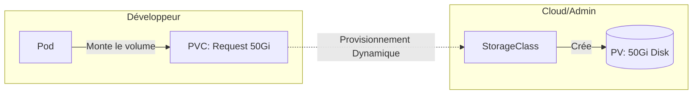

# 03 - Storage & Configuration

Containers are designed to be stateless and ephemeral. But to run databases or other apps that need to keep their data, persistent storage is required.

## 1. Persistent Storage Architecture

Kubernetes abstracts storage via the **CSI (Container Storage Interface)** standard, which allows plugging any Cloud storage (AWS EBS, OCI Block Storage, NFS, etc.) in a standardized way.

Three objects to know:

1.  **StorageClass (SC):** The storage profile defined by the admin (e.g., `fast-ssd`, `standard`).
2.  **PersistentVolumeClaim (PVC):** The *request* made by the developer ("I need 50Gi").
3.  **PersistentVolume (PV):** The actual disk allocated in the Cloud.



!!! success "Concept to Remember: Dynamic Provisioning"
    Today, disks (PVs) are no longer created manually. When a PVC is created, the CSI **automatically creates** the corresponding disk from the Cloud Provider.

## 2. Access Modes

- **ReadWriteOnce (RWO):** the volume can be mounted in read/write by **a single Node**. This is the standard for a database.
- **ReadWriteMany (RWX):** the volume can be mounted by **multiple Nodes** at the same time (requires NFS/EFS, not a classic block disk).

!!! warning "Classic Interview Question"
    *Why can't an AWS EBS or OCI Block Volume disk be shared among multiple Pods on different nodes?*
    **Answer:** A Cloud block disk only supports `ReadWriteOnce` (attached to a single machine at a time), to avoid data corruption. For sharing across multiple nodes, a network file system (NFS, EFS) is required.

## 3. Configuration and Secrets

Configuration must be separated from code (Docker image) — this is a standard best practice.

*   **ConfigMap:** non-confidential data (environment variables, config files, URLs).
*   **Secret:** passwords, tokens, TLS keys.

!!! danger "Tricky Question: Are K8s Secrets Secure?"
    **No, not by default!** A Secret is just **Base64** encoded, it is not encryption. Anyone with read access to the API can decode it.
    **Production best practices:** enable encryption at rest (etcd encryption), or use an external vault (HashiCorp Vault, AWS Secrets Manager) via a tool like External Secrets Operator.

## 4. Minimal YAML Manifest

```yaml
apiVersion: v1
kind: PersistentVolumeClaim
metadata:
  name: postgres-data
spec:
  accessModes:
    - ReadWriteOnce
  storageClassName: standard
  resources:
    requests:
      storage: 20Gi
---
apiVersion: v1
kind: ConfigMap
metadata:
  name: app-config
data:
  DB_HOST: "postgres-service"
  LOG_LEVEL: "info"
---
apiVersion: v1
kind: Secret
metadata:
  name: app-secret
type: Opaque
data:
  DB_PASSWORD: cGFzc3dvcmQxMjM=   # valeur encodée en base64
```

Using it in a Pod:

```yaml
    spec:
      containers:
      - name: api
        image: my-app:v1
        envFrom:
        - configMapRef:
            name: app-config
        env:
        - name: DB_PASSWORD
          valueFrom:
            secretKeyRef:
              name: app-secret
              key: DB_PASSWORD
        volumeMounts:
        - name: data
          mountPath: /var/lib/postgresql/data
      volumes:
      - name: data
        persistentVolumeClaim:
          claimName: postgres-data
```

## 5. Essential Commands to Know

```bash
kubectl get pvc                     # Liste les PVCs et leur statut (Bound/Pending)
kubectl get pv                      # Liste les volumes physiques
kubectl get storageclass            # Liste les StorageClass disponibles
kubectl create secret generic my-secret --from-literal=password=1234
                                     # Crée un Secret en ligne de commande
kubectl get secret my-secret -o jsonpath='{.data.password}' | base64 -d
                                     # Décode un Secret (démontre qu'il n'est pas chiffré)
```

## 6. Interview Questions to Prepare

!!! question "Q: What is the difference between PV, PVC and StorageClass?"
    The StorageClass is the storage profile defined by the admin. The PVC is the storage request made by the developer. The PV is the actual disk that satisfies that request.

!!! question "Q: What is Dynamic Provisioning?"
    The fact that Kubernetes automatically creates the physical disk (PV) as soon as a PVC is created, without manual admin intervention.

!!! question "Q: What is the difference between ConfigMap and Secret?"
    ConfigMap stores non-sensitive data (config, URLs). Secret stores sensitive data (passwords, tokens), but is only Base64 encoded by default, not encrypted.

!!! question "Q: Are Kubernetes Secrets secure by default?"
    No. They are only Base64 encoded, which is not encryption. You must enable encryption at rest or use an external vault for real security.

!!! question "Q: Why can't a classic block disk (EBS/Block Volume) be attached to multiple Pods on different nodes?"
    Because these disks only support `ReadWriteOnce`: they are designed to be used by a single machine at a time, to avoid data corruption.
