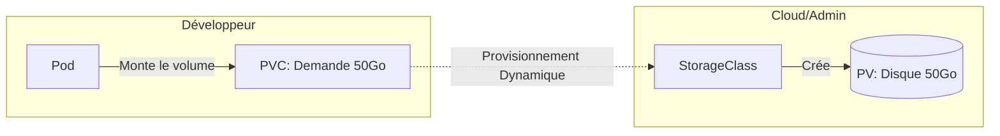

# 03 - Stockage & Configuration

Les conteneurs sont conçus pour être sans état (stateless) et éphémères. Mais pour faire tourner des bases de données ou d'autres apps qui ont besoin de garder leurs données, il faut du stockage persistant.

## 1. L'architecture du Stockage Persistant

Kubernetes abstrait le stockage via le standard **CSI (Container Storage Interface)**, qui permet de brancher n'importe quel stockage Cloud (EBS AWS, Block Storage OCI, NFS...) de façon standardisée.

Trois objets à connaître :

1.  **StorageClass (SC) :** Le profil de stockage défini par l'admin (ex: `fast-ssd`, `standard`).
2.  **Persistent Volume Claim (PVC) :** La *demande* faite par le développeur ("j'ai besoin de 50Go").
3.  **Persistent Volume (PV) :** Le disque réel alloué dans le Cloud.



!!! success "Concept à retenir : le Dynamic Provisioning"
    Aujourd'hui, on ne crée plus les disques (PV) manuellement. Quand un PVC est créé, le CSI **crée automatiquement** le disque correspondant chez le Cloud Provider.

## 2. Access Modes : les modes d'accès

- **ReadWriteOnce (RWO) :** le volume peut être monté en lecture/écriture par **un seul Nœud**. C'est le standard pour une base de données.
- **ReadWriteMany (RWX) :** le volume peut être monté par **plusieurs Nœuds** en même temps (nécessite du NFS/EFS, pas un disque bloc classique).

!!! warning "Question classique d'entretien"
    *Pourquoi un disque AWS EBS ou OCI Block Volume ne peut-il pas être partagé entre plusieurs Pods sur des nœuds différents ?*
    **Réponse :** Un disque bloc Cloud ne supporte que `ReadWriteOnce` (attaché à une seule machine à la fois), pour éviter la corruption de données. Pour du partage entre plusieurs nœuds, il faut un système de fichiers réseau (NFS, EFS).

## 3. Configuration et Secrets

La config doit être séparée du code (image Docker) — c'est une bonne pratique classique.

*   **ConfigMap :** données non confidentielles (variables d'environnement, fichiers de config, URLs).
*   **Secret :** mots de passe, tokens, clés TLS.

!!! danger "Question piège : les Secrets K8s sont-ils sécurisés ?"
    **Non, pas par défaut !** Un Secret est juste encodé en **Base64**, ce n'est pas du chiffrement. Toute personne avec un accès en lecture sur l'API peut le décoder.
    **Bonnes pratiques en production :** activer le chiffrement au repos (etcd encryption), ou utiliser un coffre-fort externe (HashiCorp Vault, AWS Secrets Manager) via un outil comme External Secrets Operator.

## 4. Manifeste YAML minimal

```yaml
apiVersion: v1
kind: PersistentVolumeClaim
metadata:
  name: postgres-data
spec:
  accessModes:
    - ReadWriteOnce
  storageClassName: standard
  resources:
    requests:
      storage: 20Gi
---
apiVersion: v1
kind: ConfigMap
metadata:
  name: app-config
data:
  DB_HOST: "postgres-service"
  LOG_LEVEL: "info"
---
apiVersion: v1
kind: Secret
metadata:
  name: app-secret
type: Opaque
data:
  DB_PASSWORD: cGFzc3dvcmQxMjM=   # valeur encodée en base64
```

Utilisation dans un Pod :

```yaml
    spec:
      containers:
      - name: api
        image: my-app:v1
        envFrom:
        - configMapRef:
            name: app-config
        env:
        - name: DB_PASSWORD
          valueFrom:
            secretKeyRef:
              name: app-secret
              key: DB_PASSWORD
        volumeMounts:
        - name: data
          mountPath: /var/lib/postgresql/data
      volumes:
      - name: data
        persistentVolumeClaim:
          claimName: postgres-data
```

## 5. Commandes de base à connaître

```bash
kubectl get pvc                     # Liste les PVCs et leur statut (Bound/Pending)
kubectl get pv                      # Liste les volumes physiques
kubectl get storageclass            # Liste les StorageClass disponibles
kubectl create secret generic my-secret --from-literal=password=1234
                                     # Crée un Secret en ligne de commande
kubectl get secret my-secret -o jsonpath='{.data.password}' | base64 -d
                                     # Décode un Secret (démontre qu'il n'est pas chiffré)
```

## 6. Questions d'entretien à préparer

!!! question "Q: Quelle est la différence entre PV, PVC et StorageClass ?"
    La StorageClass est le profil de stockage défini par l'admin. Le PVC est la demande de stockage faite par le développeur. Le PV est le disque réel qui satisfait cette demande.

!!! question "Q: Qu'est-ce que le Dynamic Provisioning ?"
    C'est le fait que Kubernetes crée automatiquement le disque physique (PV) dès qu'un PVC est créé, sans intervention manuelle de l'admin.

!!! question "Q: Quelle est la différence entre ConfigMap et Secret ?"
    Le ConfigMap stocke des données non sensibles (config, URLs). Le Secret stocke des données sensibles (mots de passe, tokens), mais n'est encodé qu'en Base64 par défaut, pas chiffré.

!!! question "Q: Les Secrets Kubernetes sont-ils sécurisés par défaut ?"
    Non. Ils sont seulement encodés en Base64, ce qui n'est pas un chiffrement. Il faut activer le chiffrement au repos ou utiliser un coffre-fort externe pour une vraie sécurité.

!!! question "Q: Pourquoi ne peut-on pas attacher un disque bloc classique (EBS/Block Volume) à plusieurs Pods sur des nœuds différents ?"
    Parce que ces disques ne supportent que `ReadWriteOnce` : ils sont conçus pour être utilisés par une seule machine à la fois, pour éviter la corruption des données.