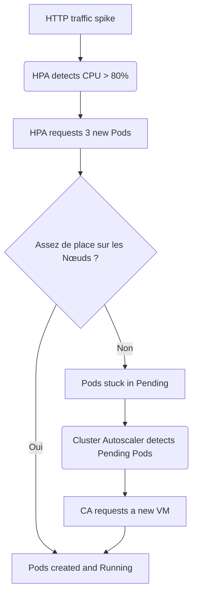

# 04 - Scheduling & Scalability

Properly managing a cluster's resources is essential: if misconfigured, you waste money (over-provisioning) or the cluster collapses under load (under-provisioning).

## 1. Requests vs Limits

Kubernetes uses two concepts to manage a container's CPU and RAM.

*   **Requests:** what the container *guaranteedly* needs to start. The Scheduler uses it to find a node with enough free space.
*   **Limits:** the absolute ceiling allowed.

!!! danger "Classic Interview Question: OOMKilled vs CPU Throttling"
    What happens if an app exceeds its limits?
    
    - **RAM:** the Linux kernel **immediately kills** the process. The Pod shows status **`OOMKilled`**.
    - **CPU:** the process is not killed, it is **throttled**. This is **CPU Throttling**, which can cause unexplained latencies.

## 2. The 3 Quality of Service (QoS) Classes

Kubernetes automatically derives a QoS class based on the declared Requests/Limits:

| QoS Class | Condition | Eviction Priority |
| :--- | :--- | :--- |
| **Guaranteed** | Requests == Limits (CPU and RAM) | Last to be evicted |
| **Burstable** | Requests < Limits | Evicted if RAM is saturated |
| **BestEffort** | No Request/Limit defined | **First to be evicted** |

!!! info "Remember"
    In production, aim for **Guaranteed** for critical apps (e.g., database), and avoid **BestEffort** except for truly expendable workloads.

## 3. Scheduling: Where to Place Pods?

*   **Node Affinity (attraction):** "I *want* to go to this type of node" (e.g., attract a Pod to GPU nodes).
*   **Taints & Tolerations (repulsion):** the Node says "I refuse all Pods, except those that tolerate me" (e.g., a GPU node has a Taint, only ML Pods with the matching Toleration can be scheduled there).

!!! info "Key Difference"
    **Affinity** is Pod-side ("I want to go there"). **Taint** is Node-side ("I refuse everyone except..."). Both are often used together to dedicate nodes to a specific usage.

## 4. Auto-scaling (3 Dimensions)

1.  **HPA (Horizontal Pod Autoscaler):** adds/removes **Pod replicas** based on a metric (CPU, RAM, etc.).
2.  **VPA (Vertical Pod Autoscaler):** adjusts the **Requests/Limits** of an existing Pod.
3.  **Cluster Autoscaler (CA):** adds/removes **physical nodes** (VMs) from the Cloud Provider.



!!! warning "Classic Trap"
    Never use HPA and VPA at the same time on the same metrics (CPU/RAM): they conflict and create infinite scaling loops.

## 5. Minimal YAML Manifest

```yaml
apiVersion: apps/v1
kind: Deployment
metadata:
  name: api
spec:
  replicas: 3
  selector:
    matchLabels:
      app: api
  template:
    metadata:
      labels:
        app: api
    spec:
      containers:
      - name: api
        image: my-app:v1
        resources:
          requests:
            cpu: "250m"
            memory: "256Mi"
          limits:
            cpu: "500m"
            memory: "512Mi"
---
apiVersion: autoscaling/v2
kind: HorizontalPodAutoscaler
metadata:
  name: api-hpa
spec:
  scaleTargetRef:
    apiVersion: apps/v1
    kind: Deployment
    name: api
  minReplicas: 2
  maxReplicas: 10
  metrics:
  - type: Resource
    resource:
      name: cpu
      target:
        type: Utilization
        averageUtilization: 70
```

## 6. Essential Commands to Know

```bash
kubectl top pods                          # Consommation CPU/RAM des Pods en temps réel
kubectl top nodes                         # Consommation CPU/RAM des nœuds
kubectl get hpa                           # État des HorizontalPodAutoscalers
kubectl describe pod <nom>                # Voir la QoS et les events (OOMKilled, etc.)
kubectl drain worker-02 --ignore-daemonsets   # Évacue un nœud pour maintenance
kubectl uncordon worker-02                # Réintègre le nœud après maintenance
```

## 7. Interview Questions to Prepare

!!! question "Q: What is the difference between Requests and Limits?"
    The Request is the guaranteed amount used by the Scheduler to place the Pod. The Limit is the maximum ceiling the container cannot exceed.

!!! question "Q: What happens if a Pod exceeds its RAM limit? And CPU limit?"
    For RAM, the process is killed immediately (`OOMKilled`). For CPU, it is not killed but throttled.

!!! question "Q: What is the 'Guaranteed' QoS class?"
    When Requests == Limits for CPU and RAM. These Pods are the last to be evicted under node resource pressure.

!!! question "Q: What is the difference between Node Affinity and Taints/Tolerations?"
    Node Affinity attracts a Pod to certain nodes (Pod-side). Taints repel all Pods from a node except those that have the matching Toleration (Node-side).

!!! question "Q: What is the difference between HPA and Cluster Autoscaler?"
    HPA adds Pod replicas. If the cluster has no more room for these new Pods, the Cluster Autoscaler adds physical nodes to accommodate them.
