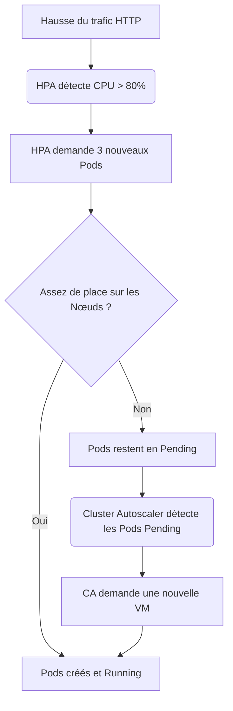

# 04 - Scheduling & Scalabilité

Bien gérer les ressources d'un cluster est essentiel : mal configuré, on gaspille de l'argent (sur-provisionnement) ou le cluster s'effondre sous la charge (sous-provisionnement).

## 1. Requests vs Limits

Kubernetes utilise deux concepts pour gérer le CPU et la RAM d'un conteneur.

*   **Requests :** ce dont le conteneur a *garanti* besoin pour démarrer. Le Scheduler s'en sert pour trouver un nœud avec assez de place.
*   **Limits :** le plafond absolu autorisé.

!!! danger "Question d'entretien classique : OOMKilled vs CPU Throttling"
    Que se passe-t-il si une app dépasse ses limites ?
    
    - **RAM :** le noyau Linux **tue** immédiatement le processus. Le Pod affiche le statut **`OOMKilled`**.
    - **CPU :** le processus n'est pas tué, il est **ralenti** (bridé). C'est le **CPU Throttling**, qui peut causer des latences inexpliquées.

## 2. Les 3 classes de Qualité de Service (QoS)

Kubernetes déduit automatiquement une classe de QoS selon les Requests/Limits déclarées :

| Classe QoS | Condition | Priorité d'éviction |
| :--- | :--- | :--- |
| **Guaranteed** | Requests == Limits (CPU et RAM) | Dernière évincée |
| **Burstable** | Requests < Limits | Évincée si RAM saturée |
| **BestEffort** | Aucune Request/Limit définie | **Première évincée** |

!!! info "À retenir"
    En production, on vise **Guaranteed** pour les apps critiques (ex: base de données), et on évite **BestEffort** sauf pour des workloads vraiment sacrifiables.

## 3. Le Scheduling : où placer les Pods ?

*   **Node Affinity (attirance) :** "Je *veux* aller sur ce type de nœud" (ex: attirer un Pod vers des nœuds GPU).
*   **Taints & Tolerations (répulsion) :** le Nœud dit "je refuse tous les Pods, sauf ceux qui me tolèrent" (ex: un nœud GPU a un Taint, seuls les Pods ML avec la Toleration correspondante peuvent s'y placer).

!!! info "Différence clé"
    L'**Affinity** est côté Pod ("je veux aller là"). Le **Taint** est côté Nœud ("je refuse tout le monde sauf..."). On utilise souvent les deux ensemble pour dédier des nœuds à un usage spécifique.

## 4. L'Auto-scaling (3 dimensions)

1.  **HPA (Horizontal Pod Autoscaler) :** ajoute/supprime des **réplicas de Pods** selon une métrique (CPU, RAM...).
2.  **VPA (Vertical Pod Autoscaler) :** ajuste les **Requests/Limits** d'un Pod existant.
3.  **Cluster Autoscaler (CA) :** ajoute/supprime des **nœuds physiques** (VMs) chez le Cloud Provider.



!!! warning "Piège classique"
    Ne jamais utiliser HPA et VPA en même temps sur les mêmes métriques (CPU/RAM) : ils entrent en conflit et créent des boucles de scaling infinies.

## 5. Manifeste YAML minimal

```yaml
apiVersion: apps/v1
kind: Deployment
metadata:
  name: api
spec:
  replicas: 3
  selector:
    matchLabels:
      app: api
  template:
    metadata:
      labels:
        app: api
    spec:
      containers:
      - name: api
        image: my-app:v1
        resources:
          requests:
            cpu: "250m"
            memory: "256Mi"
          limits:
            cpu: "500m"
            memory: "512Mi"
---
apiVersion: autoscaling/v2
kind: HorizontalPodAutoscaler
metadata:
  name: api-hpa
spec:
  scaleTargetRef:
    apiVersion: apps/v1
    kind: Deployment
    name: api
  minReplicas: 2
  maxReplicas: 10
  metrics:
  - type: Resource
    resource:
      name: cpu
      target:
        type: Utilization
        averageUtilization: 70
```

## 6. Commandes de base à connaître

```bash
kubectl top pods                          # Consommation CPU/RAM des Pods en temps réel
kubectl top nodes                         # Consommation CPU/RAM des nœuds
kubectl get hpa                           # État des HorizontalPodAutoscalers
kubectl describe pod <nom>                # Voir la QoS et les events (OOMKilled, etc.)
kubectl drain worker-02 --ignore-daemonsets   # Évacue un nœud pour maintenance
kubectl uncordon worker-02                # Réintègre le nœud après maintenance
```

## 7. Questions d'entretien à préparer

!!! question "Q: Quelle est la différence entre Requests et Limits ?"
    La Request est la quantité garantie utilisée par le Scheduler pour placer le Pod. La Limit est le plafond maximal que le conteneur ne peut pas dépasser.

!!! question "Q: Que se passe-t-il si un Pod dépasse sa limite de RAM ? Et de CPU ?"
    Pour la RAM, le processus est tué immédiatement (`OOMKilled`). Pour le CPU, il n'est pas tué mais ralenti (throttling).

!!! question "Q: Qu'est-ce que la classe de QoS 'Guaranteed' ?"
    C'est quand Requests == Limits pour le CPU et la RAM. Ces Pods sont les derniers à être évincés en cas de pression sur les ressources du nœud.

!!! question "Q: Quelle est la différence entre Node Affinity et Taints/Tolerations ?"
    Node Affinity attire un Pod vers certains nœuds (côté Pod). Les Taints repoussent tous les Pods d'un nœud sauf ceux qui ont la Toleration correspondante (côté Nœud).

!!! question "Q: Quelle est la différence entre HPA et Cluster Autoscaler ?"
    Le HPA ajoute des réplicas de Pods. Si le cluster n'a plus de place pour ces nouveaux Pods, le Cluster Autoscaler ajoute des nœuds physiques pour les accueillir.