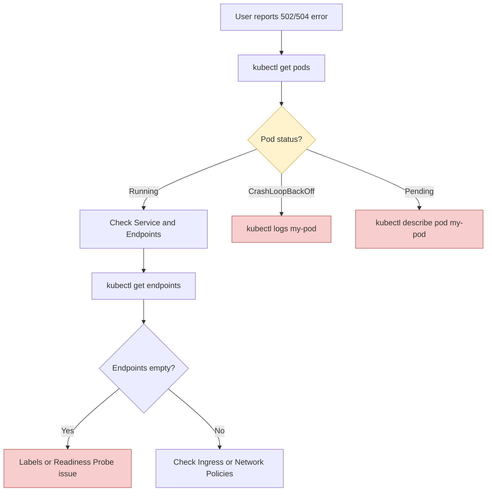

# 05 - Observability & Troubleshooting

Troubleshooting is the moment of truth in a technical interview. What is expected above all is a clear **investigation logic** when production is down.

## 1. Observability (Standard Stack)

A "blind" Kubernetes platform is a ticking time bomb. Observability rests on three pillars:

- **Metrics:** Prometheus (time-series data collection) + Grafana (dashboards).
- **Logs:** Fluentd, Loki or the ELK stack.
- **Traces:** Jaeger, OpenTelemetry (to follow a request across multiple microservices).

!!! info "Simply Remember"
    You don't need to know these tools in depth, just know **what each pillar is for** (metrics = quantified health status, logs = event details, traces = journey of a request).

## 2. The 4 Pod Statuses to Know by Heart

This is **THE** most tested topic in interviews. Always start a diagnosis with the Pod status.

### A. `Pending`
The Pod is created but the Scheduler cannot find any node to host it.
*   **Causes:** insufficient resources (Requests too high), blocking Taints, volume (PVC) not provisioned.
*   **Command:** `kubectl describe pod <nom>` → check the `Events` section.

### B. `CrashLoopBackOff`
The container starts, crashes, Kubelet restarts it, it crashes again, etc.
*   **Causes:** application bug at startup, missing environment variable, overly aggressive Liveness Probe.
*   **Command:** `kubectl logs <nom> --previous` (logs of the instance that just crashed).

### C. `ImagePullBackOff` / `ErrImagePull`
The Kubelet cannot download the Docker image.
*   **Causes:** typo in the image name/tag, non-existent image, or missing `imagePullSecrets` for a private registry.

### D. `OOMKilled`
The application consumed more RAM than its Limit. The Linux kernel kills it (Exit Code 137) to protect the node.

!!! danger "The Reflex to Have in an Interview"
    When facing a Pod problem, always follow the same logic:
    1. `kubectl get pods` → what is the status?
    2. `kubectl describe pod <nom>` → what do the Events say?
    3. `kubectl logs <nom>` (or `--previous` if it crashed) → what does the application say?

## 3. Debug Methodology (Mental Model)



!!! info "Classic Interview Question"
    **Interviewer:** "My Pod is Running, my Service is correctly configured, but my Ingress returns a 503 error. What do you check?"
    **Answer:** "I check the Service **Endpoints** (`kubectl get endpoints`). If the Pod fails its **Readiness Probe**, it is not added to the Endpoints, so the Ingress has nowhere to route traffic → 503."

## 4. YAML Manifest to Know: PodDisruptionBudget (PDB)

Prevents a maintenance operation (node drain, upgrade) from making the application completely unavailable, by guaranteeing a minimum number of active replicas.

```yaml
apiVersion: policy/v1
kind: PodDisruptionBudget
metadata:
  name: payment-api-pdb
  namespace: production
spec:
  minAvailable: 80%      # Au moins 80% des réplicas restent toujours UP
  selector:
    matchLabels:
      app: payment-api
```

## 5. Essential Commands to Know

```bash
kubectl get pods                          # Statut général des Pods
kubectl describe pod <nom>                # Events détaillés (cause d'un Pending, etc.)
kubectl logs <nom>                        # Logs du conteneur actuel
kubectl logs <nom> --previous             # Logs de l'instance qui vient de crasher
kubectl get endpoints <service>           # Vérifie si le Service a des Pods valides derrière lui
kubectl get events -A --sort-by='.lastTimestamp'   # Liste tous les events récents du cluster
```

## 6. Interview Questions to Prepare

!!! question "Q: What does CrashLoopBackOff mean?"
    The container starts then crashes in a loop, and Kubernetes restarts it each time with an increasing delay (backoff). It is often an application bug or a missing configuration.

!!! question "Q: How to diagnose a Pod stuck in Pending?"
    With `kubectl describe pod`, check the Events section: it usually indicates a lack of resources on the nodes or a volume/Taint issue.

!!! question "Q: What is the difference between `kubectl logs` and `kubectl logs --previous`?"
    `logs` shows the logs of the currently running container. `logs --previous` shows the logs of the previous instance, useful when the container just crashed and restarted.

!!! question "Q: My Service doesn't route to any Pod, what do you check?"
    I check `kubectl get endpoints`: if it's empty, it's probably a labels problem (Service selector doesn't match any Pod) or a failing Readiness Probe.

!!! question "Q: What is a PodDisruptionBudget for?"
    To guarantee that a minimum number of replicas remains available during voluntary operations (maintenance, node drain, upgrade), to avoid service disruption.
