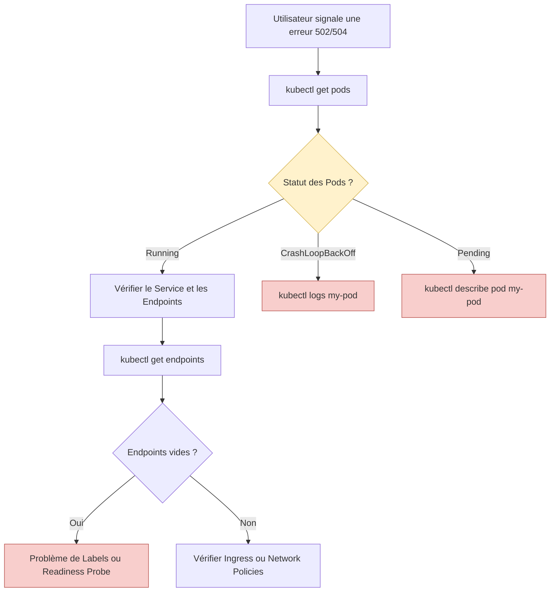

# 05 - Observabilité & Troubleshooting

Le dépannage (Troubleshooting) est l'épreuve de vérité en entretien technique. On attend surtout une **logique d'investigation** claire face à une production en panne.

## 1. L'Observabilité (la stack standard)

Une plateforme Kubernetes "aveugle" est une bombe à retardement. L'observabilité repose sur trois piliers :

- **Métriques :** Prometheus (collecte de données time-series) + Grafana (dashboards).
- **Logs :** Fluentd, Loki ou la stack ELK.
- **Traces :** Jaeger, OpenTelemetry (pour suivre une requête à travers plusieurs microservices).

!!! info "À retenir simplement"
    Vous n'avez pas besoin de connaître ces outils en profondeur, juste savoir **à quoi sert chaque pilier** (métriques = état de santé chiffré, logs = détail des événements, traces = parcours d'une requête).

## 2. Les 4 statuts de Pods à connaître par cœur

C'est **LE** sujet le plus testé en entretien. Toujours commencer un diagnostic par l'état du Pod.

### A. `Pending`
Le Pod est créé mais le Scheduler ne trouve aucun nœud pour l'accueillir.
*   **Causes :** ressources insuffisantes (Requests trop hautes), Taints bloquants, volume (PVC) non provisionné.
*   **Commande :** `kubectl describe pod <nom>` → regarder la section `Events`.

### B. `CrashLoopBackOff`
Le conteneur démarre, crash, Kubelet le redémarre, il crash à nouveau, etc.
*   **Causes :** bug applicatif au démarrage, variable d'environnement manquante, Liveness Probe trop agressive.
*   **Commande :** `kubectl logs <nom> --previous` (logs de l'instance qui vient de crasher).

### C. `ImagePullBackOff` / `ErrImagePull`
Kubelet n'arrive pas à télécharger l'image Docker.
*   **Causes :** faute de frappe dans le nom/tag de l'image, image inexistante, ou `imagePullSecrets` manquant pour un registre privé.

### D. `OOMKilled`
L'application a consommé plus de RAM que sa Limit. Le noyau Linux la tue (Exit Code 137) pour protéger le nœud.

!!! danger "Le réflexe à avoir en entretien"
    Face à un problème de Pod, on suit toujours la même logique :
    1. `kubectl get pods` → quel est le statut ?
    2. `kubectl describe pod <nom>` → que disent les Events ?
    3. `kubectl logs <nom>` (ou `--previous` s'il a crashé) → que dit l'application ?

## 3. Méthodologie de debug (schéma mental)



!!! info "Question classique d'entretien"
    **Recruteur :** "Mon Pod est Running, mon Service est bien configuré, mais mon Ingress renvoie une erreur 503. Que regardez-vous ?"
    **Réponse :** "Je vérifie les **Endpoints** du Service (`kubectl get endpoints`). Si le Pod ne passe pas sa **Readiness Probe**, il n'est pas ajouté aux Endpoints, donc l'Ingress n'a nulle part où router le trafic → 503."

## 4. Manifeste YAML à connaître : PodDisruptionBudget (PDB)

Empêche une opération de maintenance (drain de nœud, upgrade) de rendre l'application totalement indisponible, en garantissant un minimum de réplicas actifs.

```yaml
apiVersion: policy/v1
kind: PodDisruptionBudget
metadata:
  name: payment-api-pdb
  namespace: production
spec:
  minAvailable: 80%      # Au moins 80% des réplicas restent toujours UP
  selector:
    matchLabels:
      app: payment-api
```

## 5. Commandes de base à connaître

```bash
kubectl get pods                          # Statut général des Pods
kubectl describe pod <nom>                # Events détaillés (cause d'un Pending, etc.)
kubectl logs <nom>                        # Logs du conteneur actuel
kubectl logs <nom> --previous             # Logs de l'instance qui vient de crasher
kubectl get endpoints <service>           # Vérifie si le Service a des Pods valides derrière lui
kubectl get events -A --sort-by='.lastTimestamp'   # Liste tous les events récents du cluster
```

## 6. Questions d'entretien à préparer

!!! question "Q: Que signifie CrashLoopBackOff ?"
    Le conteneur démarre puis crash en boucle, et Kubernetes le redémarre à chaque fois avec un délai croissant (backoff). C'est souvent un bug applicatif ou une config manquante.

!!! question "Q: Comment diagnostiquer un Pod bloqué en Pending ?"
    Avec `kubectl describe pod`, regarder la section Events : ça indique généralement un manque de ressources sur les nœuds ou un problème de volume/Taint.

!!! question "Q: Quelle est la différence entre `kubectl logs` et `kubectl logs --previous` ?"
    `logs` montre les logs du conteneur en cours d'exécution. `logs --previous` montre les logs de l'instance précédente, utile quand le conteneur vient de crasher et a redémarré.

!!! question "Q: Mon Service ne route vers aucun Pod, que vérifiez-vous ?"
    Je vérifie `kubectl get endpoints` : si c'est vide, c'est probablement un problème de labels (selector du Service ne correspond à aucun Pod) ou une Readiness Probe qui échoue.

!!! question "Q: À quoi sert un PodDisruptionBudget ?"
    À garantir qu'un nombre minimum de réplicas reste disponible pendant les opérations volontaires (maintenance, drain de nœud, upgrade), pour éviter une interruption de service.