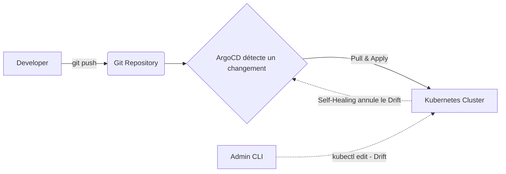

# 06 - Templating & GitOps (Helm, Kustomize, ArgoCD)

Managing dozens of raw YAML files per environment (Dev, Staging, Prod) manually is unmanageable. You need a templating tool and, ideally, an automated deployment tool (GitOps).

## 1. Helm — the Package Manager for Kubernetes

Helm works like `apt` or `npm`, but for Kubernetes. You install applications via **Charts** (pre-configured packages), customizable with a `values.yaml` file.

### Typical Use Cases
- Install a third-party tool in one command (Prometheus, Nginx Ingress, Cert-Manager, Redis).
- Package your own application to easily deploy it across multiple environments (dev/staging/prod) by just changing the `values`.

### Structure of a Helm Chart
```
mon-app/
├── Chart.yaml # Métadonnées (nom, version)
├── values.yaml # Valeurs par défaut (image, replicas, ressources...)
└── templates/
├──── deployment.yaml # Template du Deployment (utilise les valeurs de values.yaml)
├──── service.yaml
└──── _helpers.tpl # Fonctions réutilisables (noms, labels...)
```


### Example: `values.yaml`

```yaml
replicaCount: 2

image:
  repository: my-registry/mon-app
  tag: "v1.0.0"

service:
  port: 80

resources:
  requests:
    cpu: "250m"
    memory: "256Mi"
```

### Example: `templates/deployment.yaml` (with Go templating)

```yaml
apiVersion: apps/v1
kind: Deployment
metadata:
  name: {{ .Release.Name }}-mon-app
spec:
  replicas: {{ .Values.replicaCount }}
  selector:
    matchLabels:
      app: mon-app
  template:
    metadata:
      labels:
        app: mon-app
    spec:
      containers:
      - name: mon-app
        image: "{{ .Values.image.repository }}:{{ .Values.image.tag }}"
        resources:
          requests:
            cpu: {{ .Values.resources.requests.cpu }}
            memory: {{ .Values.resources.requests.memory }}
```

### Essential Helm Commands

```bash
helm repo add bitnami https://charts.bitnami.com/bitnami   # Ajouter un dépôt de Charts
helm search repo redis                                     # Chercher un Chart

helm install ma-release bitnami/redis                      # Installer un Chart tiers
helm install mon-app ./mon-app -f values-prod.yaml          # Installer son propre Chart avec des valeurs custom

helm upgrade mon-app ./mon-app -f values-prod.yaml          # Mettre à jour une release
helm rollback mon-app 1                                    # Revenir à la révision précédente

helm list                                                   # Lister les releases installées
helm uninstall mon-app                                      # Désinstaller

helm template mon-app ./mon-app -f values.yaml              # Générer le YAML final sans l'installer (debug)
```

!!! info "What to Remember"
    `values.yaml` = the parameters. `templates/` = YAML files with `{{ .Values.xxx }}` placeholders instead of hardcoded values. Helm replaces these placeholders at `install`/`upgrade` time.

---

## 2. Kustomize — Customize YAML Without Templating

Kustomize is built into `kubectl` (`kubectl apply -k`). Unlike Helm, **no templating**: you start from a base YAML (`base`) and apply patches per environment (`overlays`), in pure YAML.

### Typical Use Cases
- Deploy the same application to dev/staging/prod with precise differences (number of replicas, resources, env variables) without duplicating all the YAML.
- Teams that prefer to avoid Helm templating complexity for their own microservices.

### Typical Structure
```
mon-app/
├── base/
│ ├── deployment.yaml
│ ├── service.yaml
│ └── kustomization.yaml
└── overlays/
├──── dev/
│   └──── kustomization.yaml
└──── production/
├────── kustomization.yaml
└── patch-replicas.yaml
```

### `base/kustomization.yaml`

```yaml
apiVersion: kustomize.config.k8s.io/v1beta1
kind: Kustomization
resources:
  - deployment.yaml
  - service.yaml
```

### `overlays/production/kustomization.yaml`

```yaml
apiVersion: kustomize.config.k8s.io/v1beta1
kind: Kustomization
resources:
  - ../../base

patches:
  - path: patch-replicas.yaml
    target:
      kind: Deployment
      name: mon-app
```

### `overlays/production/patch-replicas.yaml`

```yaml
apiVersion: apps/v1
kind: Deployment
metadata:
  name: mon-app
spec:
  replicas: 5   # En production, on veut 5 replicas au lieu de 2 en base
```

### Essential Kustomize Commands

```bash
kubectl apply -k overlays/production      # Applique l'overlay production directement
kubectl kustomize overlays/production     # Affiche le YAML final généré (sans l'appliquer)
kubectl diff -k overlays/production       # Voir ce qui va changer avant d'appliquer
```

!!! info "Helm or Kustomize, Which to Choose in an Interview?"
    Expected answer: *"Both are complementary. I use **Helm** to install third-party tools (their Charts are maintained by the community), and **Kustomize** to manage environment variations for my own microservices, without complex templating."*

---

## 3. GitOps with ArgoCD

GitOps is based on a simple principle: **Git is the single source of truth**. ArgoCD is a tool that runs inside the cluster, watches a Git repository, and keeps the cluster synchronized with what is written in Git.

### Typical Use Case
Instead of running `kubectl apply -f` manually or from a CI pipeline, you push the YAML to Git, and ArgoCD automatically applies the changes to the cluster.

- **Drift Detection:** if someone manually modifies a Deployment via `kubectl`, ArgoCD detects it.
- **Self-Healing:** ArgoCD can automatically revert that modification to return to the state defined in Git.



### Example: ArgoCD `Application` Manifest

```yaml
apiVersion: argoproj.io/v1alpha1
kind: Application
metadata:
  name: mon-app-production
  namespace: argocd
spec:
  project: default
  source:
    repoURL: 'https://github.com/mon-org/mon-repo-gitops.git'
    targetRevision: main
    path: overlays/production   # peut pointer vers un dossier Kustomize ou un Chart Helm
  destination:
    server: 'https://kubernetes.default.svc'
    namespace: production
  syncPolicy:
    automated:
      prune: true       # supprime les ressources qui n'existent plus dans Git
      selfHeal: true     # annule les modifications manuelles faites au kubectl
    syncOptions:
      - CreateNamespace=true
```

### Essential ArgoCD Commands

```bash
argocd app list                        # Liste les applications gérées
argocd app get mon-app-production      # Détail d'une application (statut, sync)
argocd app sync mon-app-production     # Forcer une synchronisation manuelle
argocd app history mon-app-production  # Historique des déploiements
```

---

## 4. Interview Questions to Prepare

!!! question "Q: What is the fundamental difference between Helm and Kustomize?"
    Helm uses a templating system (Go templates) with variables in `values.yaml`. Kustomize does not use templating: it starts from a base YAML and applies patches on top, in pure YAML.

!!! question "Q: Why use Helm rather than writing YAML by hand?"
    To reuse ready-made packages (e.g., install Prometheus in one command), manage versions (easy rollback), and easily parameterize an app for multiple environments via `values.yaml`.

!!! question "Q: What is GitOps?"
    An approach where Git is the single source of truth for the desired state of the cluster. A tool like ArgoCD watches the Git repository and automatically synchronizes the cluster with what is declared there.

!!! question "Q: What is Self-Healing in ArgoCD?"
    It is ArgoCD's ability to detect that a change was made manually (outside Git) on the cluster, and to automatically correct it to return to the state defined in Git.

!!! question "Q: How to test the rendering of a Helm Chart or a Kustomize overlay without applying it to the cluster?"
    With `helm template` for Helm, or `kubectl kustomize` (or `kubectl diff -k`) for Kustomize — it displays the final generated YAML without deploying anything.
