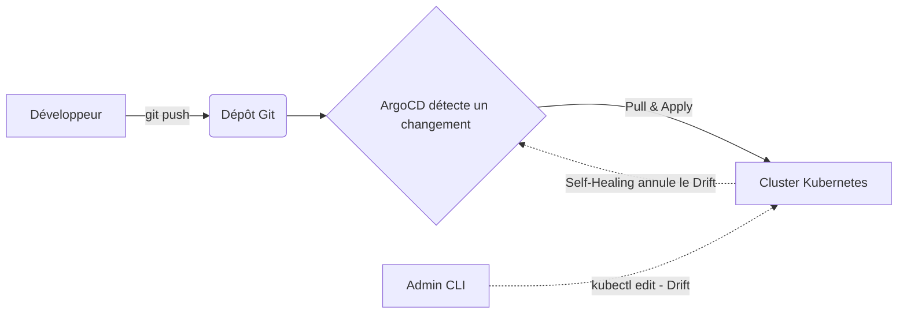

# 06 - Templating & GitOps (Helm, Kustomize, ArgoCD)

Gérer des dizaines de fichiers YAML bruts par environnement (Dev, Staging, Prod) est ingérable à la main. Il faut un outil de templating et, idéalement, un outil de déploiement automatisé (GitOps).

## 1. Helm — le gestionnaire de paquets de Kubernetes

Helm fonctionne comme `apt` ou `npm`, mais pour Kubernetes. On installe des applications via des **Charts** (des paquets préconfigurés), personnalisables avec un fichier `values.yaml`.

### Cas d'usage typiques
- Installer un outil tiers en une commande (Prometheus, Ingress Nginx, Cert-Manager, Redis).
- Packager sa propre application pour la déployer facilement sur plusieurs environnements (dev/staging/prod) en changeant juste les `values`.

### Structure d'un Chart Helm
```
mon-app/
├── Chart.yaml # Métadonnées (nom, version)
├── values.yaml # Valeurs par défaut (image, replicas, ressources...)
└── templates/
├──── deployment.yaml # Template du Deployment (utilise les valeurs de values.yaml)
├──── service.yaml
└──── _helpers.tpl # Fonctions réutilisables (noms, labels...)
```


### Exemple : `values.yaml`

```yaml
replicaCount: 2

image:
  repository: my-registry/mon-app
  tag: "v1.0.0"

service:
  port: 80

resources:
  requests:
    cpu: "250m"
    memory: "256Mi"
```

### Exemple : `templates/deployment.yaml` (avec templating Go)

```yaml
apiVersion: apps/v1
kind: Deployment
metadata:
  name: {{ .Release.Name }}-mon-app
spec:
  replicas: {{ .Values.replicaCount }}
  selector:
    matchLabels:
      app: mon-app
  template:
    metadata:
      labels:
        app: mon-app
    spec:
      containers:
      - name: mon-app
        image: "{{ .Values.image.repository }}:{{ .Values.image.tag }}"
        resources:
          requests:
            cpu: {{ .Values.resources.requests.cpu }}
            memory: {{ .Values.resources.requests.memory }}
```

### Commandes Helm essentielles

```bash
helm repo add bitnami https://charts.bitnami.com/bitnami   # Ajouter un dépôt de Charts
helm search repo redis                                     # Chercher un Chart

helm install ma-release bitnami/redis                      # Installer un Chart tiers
helm install mon-app ./mon-app -f values-prod.yaml          # Installer son propre Chart avec des valeurs custom

helm upgrade mon-app ./mon-app -f values-prod.yaml          # Mettre à jour une release
helm rollback mon-app 1                                    # Revenir à la révision précédente

helm list                                                   # Lister les releases installées
helm uninstall mon-app                                      # Désinstaller

helm template mon-app ./mon-app -f values.yaml              # Générer le YAML final sans l'installer (debug)
```

!!! info "Ce qu'il faut retenir"
    `values.yaml` = les paramètres. `templates/` = les fichiers YAML avec des `{{ .Values.xxx }}` à la place des valeurs en dur. Helm remplace ces placeholders au moment du `install`/`upgrade`.

---

## 2. Kustomize — personnaliser du YAML sans templating

Kustomize est intégré à `kubectl` (`kubectl apply -k`). Contrairement à Helm, **pas de templating** : on part d'un YAML de base (`base`) et on applique des patches par environnement (`overlays`), en YAML pur.

### Cas d'usage typiques
- Déployer la même application sur dev/staging/prod avec des différences précises (nombre de replicas, ressources, variables d'env) sans dupliquer tout le YAML.
- Équipes qui préfèrent éviter la complexité du templating Helm pour leurs propres microservices.

### Structure typique
```
mon-app/
├── base/
│ ├── deployment.yaml
│ ├── service.yaml
│ └── kustomization.yaml
└── overlays/
├──── dev/
│   └──── kustomization.yaml
└──── production/
├────── kustomization.yaml
└── patch-replicas.yaml
```

### `base/kustomization.yaml`

```yaml
apiVersion: kustomize.config.k8s.io/v1beta1
kind: Kustomization
resources:
  - deployment.yaml
  - service.yaml
```

### `overlays/production/kustomization.yaml`

```yaml
apiVersion: kustomize.config.k8s.io/v1beta1
kind: Kustomization
resources:
  - ../../base

patches:
  - path: patch-replicas.yaml
    target:
      kind: Deployment
      name: mon-app
```

### `overlays/production/patch-replicas.yaml`

```yaml
apiVersion: apps/v1
kind: Deployment
metadata:
  name: mon-app
spec:
  replicas: 5   # En production, on veut 5 replicas au lieu de 2 en base
```

### Commandes Kustomize essentielles

```bash
kubectl apply -k overlays/production      # Applique l'overlay production directement
kubectl kustomize overlays/production     # Affiche le YAML final généré (sans l'appliquer)
kubectl diff -k overlays/production       # Voir ce qui va changer avant d'appliquer
```

!!! info "Helm ou Kustomize, que choisir en entretien ?"
    Réponse attendue : *"Les deux sont complémentaires. J'utilise **Helm** pour installer des outils tiers (leurs Charts sont maintenus par la communauté), et **Kustomize** pour gérer les variations d'environnement de mes propres microservices, sans templating complexe."*

---

## 3. GitOps avec ArgoCD

Le GitOps repose sur un principe simple : **Git est la seule source de vérité**. ArgoCD est un outil qui tourne dans le cluster, surveille un dépôt Git, et garde le cluster synchronisé avec ce qui est écrit dans Git.

### Cas d'usage typique
Au lieu de faire `kubectl apply -f` à la main ou depuis une pipeline CI, on pousse le YAML dans Git, et ArgoCD applique automatiquement les changements dans le cluster.

- **Drift Detection :** si quelqu'un modifie un Deployment manuellement via `kubectl`, ArgoCD le détecte.
- **Self-Healing :** ArgoCD peut annuler automatiquement cette modification pour revenir à l'état défini dans Git.



### Exemple : manifeste ArgoCD `Application`

```yaml
apiVersion: argoproj.io/v1alpha1
kind: Application
metadata:
  name: mon-app-production
  namespace: argocd
spec:
  project: default
  source:
    repoURL: 'https://github.com/mon-org/mon-repo-gitops.git'
    targetRevision: main
    path: overlays/production   # peut pointer vers un dossier Kustomize ou un Chart Helm
  destination:
    server: 'https://kubernetes.default.svc'
    namespace: production
  syncPolicy:
    automated:
      prune: true       # supprime les ressources qui n'existent plus dans Git
      selfHeal: true     # annule les modifications manuelles faites au kubectl
    syncOptions:
      - CreateNamespace=true
```

### Commandes ArgoCD essentielles

```bash
argocd app list                        # Liste les applications gérées
argocd app get mon-app-production      # Détail d'une application (statut, sync)
argocd app sync mon-app-production     # Forcer une synchronisation manuelle
argocd app history mon-app-production  # Historique des déploiements
```

---

## 4. Questions d'entretien à préparer

!!! question "Q: Quelle est la différence fondamentale entre Helm et Kustomize ?"
    Helm utilise un système de templating (Go templates) avec des variables dans `values.yaml`. Kustomize n'utilise pas de templating : il part d'un YAML de base et applique des patches par-dessus, en YAML pur.

!!! question "Q: Pourquoi utiliser Helm plutôt que d'écrire les YAML à la main ?"
    Pour réutiliser des packages déjà prêts (ex: installer Prometheus en une commande), gérer des versions (rollback facile), et paramétrer facilement une app pour plusieurs environnements via `values.yaml`.

!!! question "Q: Qu'est-ce que le GitOps ?"
    Une approche où Git est la seule source de vérité pour l'état désiré du cluster. Un outil comme ArgoCD surveille le dépôt Git et synchronise automatiquement le cluster avec ce qui y est déclaré.

!!! question "Q: Qu'est-ce que le Self-Healing dans ArgoCD ?"
    C'est la capacité d'ArgoCD à détecter qu'un changement a été fait manuellement (hors Git) sur le cluster, et à automatiquement le corriger pour revenir à l'état défini dans Git.

!!! question "Q: Comment tester le rendu d'un Chart Helm ou d'un overlay Kustomize sans l'appliquer au cluster ?"
    Avec `helm template` pour Helm, ou `kubectl kustomize` (ou `kubectl diff -k`) pour Kustomize — ça affiche le YAML final généré sans rien déployer.