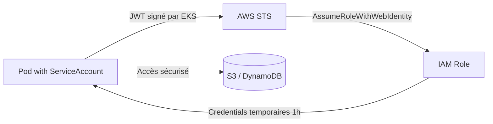
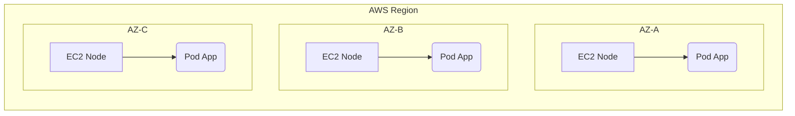

# 07 - Production on AWS EKS (Elastic Kubernetes Service)

In a company, you will rarely manage a K8s cluster "from scratch". You will use a managed service like **AWS EKS**. This lesson covers what a DevOps candidate needs to know about EKS for an interview.

## 1. What AWS Manages for You (and What You Manage)

| Component | Managed by AWS? |
| :--- | :--- |
| **Control Plane** (API Server, etcd, Scheduler) | ✅ Yes, patched and scaled automatically. You don't have direct access. |
| **etcd** | ✅ Yes, backed up and secured transparently. |
| **Worker Nodes** | ❌ No (except with Fargate) — you manage the EC2 instances, or you let EKS manage them partially via **Managed Node Groups**. |

!!! info "To Remember by Heart"
    **EKS = Control Plane managed by AWS + Worker Nodes that you provision** (classic EC2, Managed Node Groups, or serverless Fargate). This is the first distinction to give in an interview.

### The 3 Ways to Run Worker Nodes on EKS

1.  **Self-Managed Nodes:** you create and manage the EC2 instances yourself (Auto Scaling Group). Full control, but more maintenance.
2.  **Managed Node Groups:** AWS automates the creation/update/rotation of EC2 instances for you. **The most common in enterprises.**
3.  **Fargate:** serverless mode, no VM management at all — each Pod runs in its own "micro-VM". No DaemonSet possible here (limitation to know).

---

## 2. Networking: The VPC CNI

EKS uses the **Amazon VPC CNI** plugin by default. Unlike a classic overlay CNI (Flannel), each Pod gets a **real VPC IP address** (natively routable, no encapsulation).

!!! warning "The Classic Trap to Know: IP Exhaustion"
    Each EC2 instance has a maximum number of IPs it can assign to Pods (depending on its instance type). On a cluster that scales a lot, you can run out of available IPs in the subnet → Pods stay in `Pending` with the error `FailedCreatePodSandBox`.
    **Simple solution to mention:** use sufficiently large subnets, or enable **secondary IPs in "prefix delegation" mode** to increase Pod density per node.

---

## 3. Security: IRSA (IAM Roles for Service Accounts)

**This is THE most frequently asked security topic in EKS interviews.** How does a Pod access an S3 bucket or a DynamoDB table securely, without hardcoded access keys?

!!! danger "The Absolute Anti-Pattern"
    **Never** hardcode `AWS_ACCESS_KEY_ID` / `AWS_SECRET_ACCESS_KEY` in a Kubernetes Secret or ConfigMap.

**The solution: IRSA.**

1. Create an **IAM Role** with the necessary permissions (e.g., read on an S3 bucket).
2. Link this IAM Role to a **Kubernetes ServiceAccount** via an **OIDC** identity provider (the EKS cluster exposes its own OIDC endpoint).
3. Only Pods using this ServiceAccount can obtain temporary AWS credentials (via `AssumeRoleWithWebIdentity`).



### Example: ServiceAccount with IRSA

```yaml
apiVersion: v1
kind: ServiceAccount
metadata:
  name: s3-reader-sa
  namespace: production
  annotations:
    # ARN du rôle IAM créé au préalable, lié via OIDC
    eks.amazonaws.com/role-arn: "arn:aws:iam::123456789012:role/S3ReaderRole"
---
apiVersion: apps/v1
kind: Deployment
metadata:
  name: report-generator
  namespace: production
spec:
  replicas: 2
  selector:
    matchLabels:
      app: report-generator
  template:
    metadata:
      labels:
        app: report-generator
    spec:
      serviceAccountName: s3-reader-sa   # Le Pod hérite automatiquement des credentials AWS temporaires
      containers:
      - name: app
        image: internal-registry/report-generator:v1.0
```

!!! success "What You Need to Say in an Interview"
    "IRSA eliminates the need for static keys: the Pod obtains a JWT signed by the cluster, exchanges it for temporary AWS credentials (1h) via STS, without ever storing a permanent secret."

---

## 4. Exposing an Application: AWS Load Balancer Controller

On EKS, a classic `Service` of type `LoadBalancer` creates a basic **Classic/Network Load Balancer**. For real HTTP control (path-based routing, TLS certificates, WAF), install the **AWS Load Balancer Controller**, which translates Kubernetes `Ingress` objects into **Application Load Balancer (ALB)** on AWS.

### Example: Ingress with ALB

```yaml
apiVersion: networking.k8s.io/v1
kind: Ingress
metadata:
  name: payment-ingress
  namespace: production
  annotations:
    kubernetes.io/ingress.class: alb
    alb.ingress.kubernetes.io/scheme: internet-facing
    alb.ingress.kubernetes.io/target-type: ip
spec:
  rules:
  - http:
      paths:
      - path: /api/payments
        pathType: Prefix
        backend:
          service:
            name: payment-service
            port:
              number: 80
```

!!! info "Remember"
    `type: LoadBalancer` alone = basic NLB/CLB. **AWS Load Balancer Controller + Ingress** = ALB with advanced L7 routing. This is the production best practice.

---

## 5. Multi-AZ High Availability

EKS Worker Nodes must be spread across multiple **Availability Zones (AZs)**. Without an explicit constraint, all Pods of an app can end up in the same AZ → no resilience if that zone fails.

**Solution: Topology Spread Constraints** (already covered in lesson 04), with `topologyKey: topology.kubernetes.io/zone`.



---

## 6. Node Auto-scaling: Cluster Autoscaler vs Karpenter

- **Cluster Autoscaler:** adds/removes EC2 instances by acting on existing Auto Scaling Groups. This is the legacy tool.
- **Karpenter:** the modern tool recommended by AWS. It directly provisions the best-suited EC2 instances (instance type, AZ) according to the actual needs of pending Pods, without going through an Auto Scaling Group.

!!! success "Interview Bonus"
    Mentioning **Karpenter** shows you follow the AWS state of the art. It has become the recommended standard, faster and more flexible than the classic Cluster Autoscaler.

---

## 7. Essential Commands to Know

```bash
# Créer un cluster EKS rapidement (via eksctl, l'outil CLI officiel simplifié)
eksctl create cluster --name mon-cluster --region eu-west-1 --nodes 3

# Configurer kubectl pour pointer vers le cluster EKS
aws eks update-kubeconfig --name mon-cluster --region eu-west-1

# Lister les Node Groups managés
eksctl get nodegroup --cluster mon-cluster

# Vérifier l'endpoint OIDC du cluster (nécessaire pour configurer IRSA)
aws eks describe-cluster --name mon-cluster --query "cluster.identity.oidc.issuer"

# Associer un fournisseur OIDC IAM au cluster (étape obligatoire pour IRSA)
eksctl utils associate-iam-oidc-provider --cluster mon-cluster --approve

# Créer un ServiceAccount lié à IRSA directement via eksctl
eksctl create iamserviceaccount \
  --cluster mon-cluster \
  --namespace production \
  --name s3-reader-sa \
  --attach-policy-arn arn:aws:iam::aws:policy/AmazonS3ReadOnlyAccess \
  --approve

# Vérifier la répartition des nœuds par AZ
kubectl get nodes -L topology.kubernetes.io/zone
```

---

## 8. What You Must Know BY HEART for the EKS Interview

!!! question "Q: What does EKS manage for you, and what do you manage?"
    AWS manages the Control Plane (API Server, etcd, Scheduler) in a fully managed way. You manage (or partially delegate via Managed Node Groups) the Worker Nodes.

!!! question "Q: What are the options for running Worker Nodes on EKS?"
    Self-Managed Nodes (manually managed EC2), Managed Node Groups (AWS automates the lifecycle), and Fargate (serverless, no VM management).

!!! question "Q: What is IRSA and why is it important?"
    IAM Roles for Service Accounts. It allows a Pod to obtain temporary AWS credentials via a ServiceAccount linked to an IAM Role, without ever storing hardcoded access keys. It is THE security best practice on EKS.

!!! question "Q: What is the difference between a classic LoadBalancer Service and an Ingress with AWS Load Balancer Controller?"
    A LoadBalancer Service creates a basic NLB/CLB (layer 4). Ingress + AWS Load Balancer Controller creates an ALB with advanced HTTP routing (by path, TLS, WAF) at the application layer (layer 7).

!!! question "Q: What is the difference between Cluster Autoscaler and Karpenter?"
    Cluster Autoscaler adjusts the size of existing Auto Scaling Groups. Karpenter directly provisions the EC2 instances best suited to the actual needs of Pods, without depending on an ASG — this is the modern approach recommended by AWS.

!!! question "Q: What happens if the CNI runs out of available IPs in the VPC?"
    New Pods remain stuck in `Pending` with the error `FailedCreatePodSandBox`. You need to enlarge the subnet or use "prefix delegation" mode to increase IP density per node.

!!! question "Q: Why spread Worker Nodes across multiple AZs?"
    For high availability: if one AZ goes down (AWS outage), Pods in the other AZs continue to serve traffic. Topology Spread Constraints are used to enforce this distribution.
