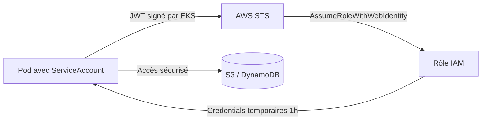
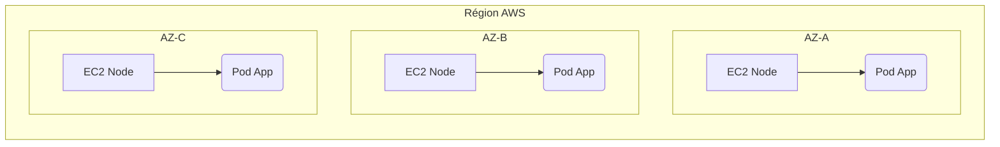

# 07 - Production sur AWS EKS (Elastic Kubernetes Service)

En entreprise, vous gérerez rarement un cluster K8s "from scratch". Vous utiliserez un service managé comme **AWS EKS**. Ce cours couvre ce qu'un candidat DevOps doit savoir sur EKS pour un entretien.

## 1. Ce qu'AWS gère pour vous (et ce que vous gérez)

| Composant | Géré par AWS ? |
| :--- | :--- |
| **Control Plane** (API Server, etcd, Scheduler) | ✅ Oui, patché et scalé automatiquement. Vous n'y avez pas accès direct. |
| **etcd** | ✅ Oui, sauvegardé et sécurisé de façon transparente. |
| **Worker Nodes** | ❌ Non (sauf avec Fargate) — vous gérez les EC2, ou vous laissez EKS les gérer partiellement via **Managed Node Groups**. |

!!! info "À retenir par cœur"
    **EKS = Control Plane managé par AWS + Worker Nodes que vous provisionnez** (EC2 classiques, Managed Node Groups, ou Fargate serverless). C'est la première distinction à donner en entretien.

### Les 3 façons de faire tourner des Worker Nodes sur EKS

1.  **Self-Managed Nodes :** vous créez et gérez vous-même les EC2 (Auto Scaling Group). Contrôle total, mais plus de maintenance.
2.  **Managed Node Groups :** AWS automatise la création/mise à jour/rotation des EC2 pour vous. **Le plus courant en entreprise.**
3.  **Fargate :** mode serverless, pas de gestion de VM du tout — chaque Pod tourne dans sa propre "micro-VM". Pas de DaemonSet possible ici (limitation à connaître).

---

## 2. Le réseau : le VPC CNI

EKS utilise par défaut le plugin **Amazon VPC CNI**. Contrairement à un CNI overlay classique (Flannel), chaque Pod reçoit une **vraie adresse IP du VPC** (routable nativement, pas d'encapsulation).

!!! warning "Le piège classique à connaître : l'épuisement d'IP"
    Chaque instance EC2 a un nombre maximal d'IPs qu'elle peut attribuer aux Pods (selon son type d'instance). Sur un cluster qui scale beaucoup, on peut manquer d'IPs disponibles dans le subnet → les Pods restent en `Pending` avec l'erreur `FailedCreatePodSandBox`.
    **Solution simple à citer :** utiliser des subnets suffisamment larges, ou activer les **IP secondaires en mode "prefix delegation"** pour augmenter la densité de Pods par nœud.

---

## 3. Sécurité : IRSA (IAM Roles for Service Accounts)

**C'est LE sujet de sécurité le plus posé en entretien EKS.** Comment un Pod accède-t-il à un bucket S3 ou une table DynamoDB de façon sécurisée, sans clé d'accès en dur ?

!!! danger "L'anti-pattern absolu"
    Ne **jamais** mettre `AWS_ACCESS_KEY_ID` / `AWS_SECRET_ACCESS_KEY` en dur dans un Secret ou ConfigMap Kubernetes.

**La solution : IRSA.**

1. On crée un **Rôle IAM** avec les permissions nécessaires (ex: lecture sur un bucket S3).
2. On lie ce Rôle IAM à un **ServiceAccount Kubernetes** via un fournisseur d'identité **OIDC** (le cluster EKS expose son propre endpoint OIDC).
3. Seuls les Pods utilisant ce ServiceAccount peuvent obtenir des credentials AWS temporaires (via `AssumeRoleWithWebIdentity`).



### Exemple : ServiceAccount avec IRSA

```yaml
apiVersion: v1
kind: ServiceAccount
metadata:
  name: s3-reader-sa
  namespace: production
  annotations:
    # ARN du rôle IAM créé au préalable, lié via OIDC
    eks.amazonaws.com/role-arn: "arn:aws:iam::123456789012:role/S3ReaderRole"
---
apiVersion: apps/v1
kind: Deployment
metadata:
  name: report-generator
  namespace: production
spec:
  replicas: 2
  selector:
    matchLabels:
      app: report-generator
  template:
    metadata:
      labels:
        app: report-generator
    spec:
      serviceAccountName: s3-reader-sa   # Le Pod hérite automatiquement des credentials AWS temporaires
      containers:
      - name: app
        image: internal-registry/report-generator:v1.0
```

!!! success "Ce qu'il faut savoir dire en entretien"
    "IRSA élimine le besoin de clés statiques : le Pod obtient un JWT signé par le cluster, l'échange contre des credentials AWS temporaires (1h) via STS, sans jamais stocker de secret permanent."

---

## 4. Exposer une application : AWS Load Balancer Controller

Sur EKS, un `Service` de type `LoadBalancer` classique crée un **Classic/Network Load Balancer** basique. Pour un vrai contrôle HTTP (routage par chemin, certificats TLS, WAF), on installe le **AWS Load Balancer Controller**, qui traduit les objets `Ingress` Kubernetes en **Application Load Balancer (ALB)** AWS.

### Exemple : Ingress avec ALB

```yaml
apiVersion: networking.k8s.io/v1
kind: Ingress
metadata:
  name: payment-ingress
  namespace: production
  annotations:
    kubernetes.io/ingress.class: alb
    alb.ingress.kubernetes.io/scheme: internet-facing
    alb.ingress.kubernetes.io/target-type: ip
spec:
  rules:
  - http:
      paths:
      - path: /api/payments
        pathType: Prefix
        backend:
          service:
            name: payment-service
            port:
              number: 80
```

!!! info "À retenir"
    `type: LoadBalancer` seul = NLB/CLB basique. **AWS Load Balancer Controller + Ingress** = ALB avec routage L7 avancé. C'est la bonne pratique en production.

---

## 5. Haute disponibilité Multi-AZ

Les Worker Nodes EKS doivent être répartis sur plusieurs **Availability Zones (AZ)**. Sans contrainte explicite, tous les Pods d'une app peuvent finir sur la même AZ → aucune résilience en cas de panne de zone.

**Solution : Topology Spread Constraints** (déjà vu au cours 04), avec `topologyKey: topology.kubernetes.io/zone`.



---

## 6. Auto-scaling des nœuds : Cluster Autoscaler vs Karpenter

- **Cluster Autoscaler :** ajoute/supprime des EC2 en agissant sur des Auto Scaling Groups existants. C'est l'outil historique.
- **Karpenter :** l'outil moderne recommandé par AWS. Il provisionne directement les EC2 les mieux adaptées (type d'instance, AZ) selon les besoins réels des Pods en attente, sans passer par un Auto Scaling Group.

!!! success "Bonus entretien"
    Mentionner **Karpenter** montre que vous suivez l'état de l'art AWS. C'est devenu le standard recommandé, plus rapide et plus flexible que le Cluster Autoscaler classique.

---

## 7. Commandes essentielles à connaître

```bash
# Créer un cluster EKS rapidement (via eksctl, l'outil CLI officiel simplifié)
eksctl create cluster --name mon-cluster --region eu-west-1 --nodes 3

# Configurer kubectl pour pointer vers le cluster EKS
aws eks update-kubeconfig --name mon-cluster --region eu-west-1

# Lister les Node Groups managés
eksctl get nodegroup --cluster mon-cluster

# Vérifier l'endpoint OIDC du cluster (nécessaire pour configurer IRSA)
aws eks describe-cluster --name mon-cluster --query "cluster.identity.oidc.issuer"

# Associer un fournisseur OIDC IAM au cluster (étape obligatoire pour IRSA)
eksctl utils associate-iam-oidc-provider --cluster mon-cluster --approve

# Créer un ServiceAccount lié à IRSA directement via eksctl
eksctl create iamserviceaccount \
  --cluster mon-cluster \
  --namespace production \
  --name s3-reader-sa \
  --attach-policy-arn arn:aws:iam::aws:policy/AmazonS3ReadOnlyAccess \
  --approve

# Vérifier la répartition des nœuds par AZ
kubectl get nodes -L topology.kubernetes.io/zone
```

---

## 8. Ce qu'il faut savoir PAR CŒUR pour l'entretien EKS

!!! question "Q: Qu'est-ce qu'EKS gère pour vous, et qu'est-ce que vous gérez ?"
    AWS gère le Control Plane (API Server, etcd, Scheduler) de façon totalement managée. Vous gérez (ou déléguez partiellement via Managed Node Groups) les Worker Nodes.

!!! question "Q: Quelles sont les options pour faire tourner des Worker Nodes sur EKS ?"
    Self-Managed Nodes (EC2 gérés manuellement), Managed Node Groups (AWS automatise le cycle de vie), et Fargate (serverless, pas de gestion de VM).

!!! question "Q: Qu'est-ce qu'IRSA et pourquoi c'est important ?"
    IAM Roles for Service Accounts. Ça permet à un Pod d'obtenir des credentials AWS temporaires via un ServiceAccount lié à un rôle IAM, sans jamais stocker de clé d'accès en dur. C'est LA bonne pratique de sécurité sur EKS.

!!! question "Q: Quelle est la différence entre un Service LoadBalancer classique et un Ingress avec AWS Load Balancer Controller ?"
    Le Service LoadBalancer crée un NLB/CLB basique (couche 4). L'Ingress + AWS Load Balancer Controller crée un ALB avec du routage HTTP avancé (par chemin, TLS, WAF) au niveau applicatif (couche 7).

!!! question "Q: Quelle est la différence entre Cluster Autoscaler et Karpenter ?"
    Cluster Autoscaler ajuste la taille des Auto Scaling Groups existants. Karpenter provisionne directement les instances EC2 les mieux adaptées aux besoins réels des Pods, sans dépendre d'un ASG — c'est l'approche moderne recommandée par AWS.

!!! question "Q: Que se passe-t-il si le CNI n'a plus d'IPs disponibles dans le VPC ?"
    Les nouveaux Pods restent bloqués en `Pending` avec l'erreur `FailedCreatePodSandBox`. Il faut agrandir le subnet ou utiliser le mode "prefix delegation" pour augmenter la densité d'IPs par nœud.

!!! question "Q: Pourquoi répartir les Worker Nodes sur plusieurs AZ ?"
    Pour la haute disponibilité : si une AZ tombe (panne AWS), les Pods des autres AZ continuent de servir le trafic. On utilise les Topology Spread Constraints pour forcer cette répartition.