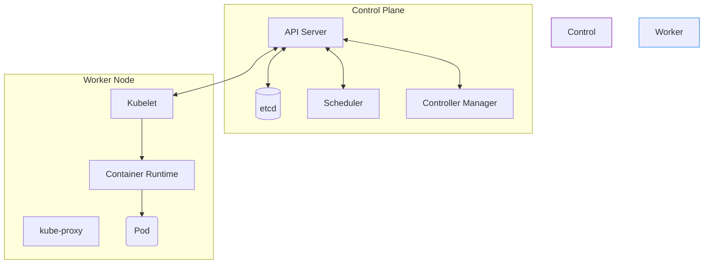

# 00 - Architecture & Fundamentals

Kubernetes (K8s) is a **container orchestrator**. Its core principle: you describe the desired state (Desired State) in a YAML file, and Kubernetes continuously ensures that the actual state of the cluster matches that desired state.

## 1. Cluster Overview

A K8s cluster = **Control Plane** (the brain, which decides) + **Worker Nodes** (the muscles, which execute).



## 2. Control Plane Components

| Component | Role in one sentence |
|---|---|
| **kube-apiserver** | Single entry point to the cluster. Everything (kubectl, internal components) goes through it. It is the only component that talks directly to etcd. |
| **etcd** | Key-value database that stores **the entire cluster state**. |
| **kube-scheduler** | Chooses which Node to place a new Pod on (based on available CPU/RAM, constraints). |
| **kube-controller-manager** | Runs reconciliation loops: if you want 3 replicas and a Pod dies, it recreates one. |

!!! danger "Classic Interview Trap"
    **"What happens if we lose etcd?"** → The cluster is dead, nothing can be read or written anymore. Hence the importance of regular etcd backups (snapshots).

## 3. Worker Node Components

| Component | Role in one sentence |
|---|---|
| **kubelet** | Agent running on each node, ensuring that the containers described in the Pods are properly started and healthy. |
| **kube-proxy** | Manages the node's network rules (iptables/IPVS) to route traffic to the right Pods. |
| **Container Runtime** | Actually runs containers (containerd, CRI-O). Docker is no longer used natively since K8s 1.24. |

## 4. Essential Commands to Know

```bash
kubectl get nodes                  # Liste les nœuds du cluster
kubectl get pods -A                # Liste tous les Pods, tous namespaces
kubectl describe pod <nom>         # Détails/events d'un Pod
kubectl get --raw='/readyz?verbose'  # Vérifie la santé du Control Plane
```

## 5. Interview Questions to Prepare

!!! question "Q: What happens if etcd goes down?"
    The Control Plane can no longer read/write the cluster state. Pods already running continue to run on Worker Nodes (the kubelet manages them locally), but no creation/modification/scaling is possible until etcd is restored.

!!! question "Q: What is the difference between kubelet and kube-proxy?"
    The **kubelet** manages the container lifecycle on the node (startup, health). The **kube-proxy** only handles networking (routing traffic to Pods).

!!! question "Q: Why doesn't the Scheduler itself launch Pods?"
    It only **chooses the Node**. The kubelet of the chosen Node is responsible for actually starting the container via the Container Runtime.

!!! question "Q: How many etcd nodes are required at minimum in production?"
    3 (odd number), to guarantee quorum even if one node fails.
