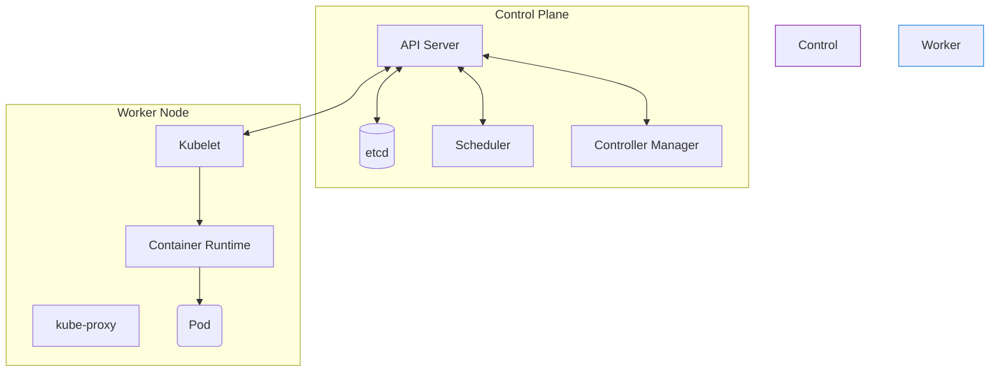

# 00 - Architecture et Fondamentaux

Kubernetes (K8s) est un **orchestrateur de conteneurs**. Son principe de base : vous décrivez l'état souhaité (Desired State) dans un fichier YAML, et Kubernetes fait en sorte que l'état réel du cluster corresponde en permanence à cet état souhaité.

## 1. Vue d'ensemble du Cluster

Un cluster K8s = **Control Plane** (le cerveau, qui décide) + **Worker Nodes** (les muscles, qui exécutent).



## 2. Les composants du Control Plane

| Composant | Rôle en une phrase |
|---|---|
| **kube-apiserver** | Point d'entrée unique du cluster. Tout (kubectl, composants internes) passe par lui. C'est le seul à parler directement à etcd. |
| **etcd** | Base de données clé-valeur qui stocke **tout l'état du cluster**. |
| **kube-scheduler** | Choisit sur quel Node placer un nouveau Pod (selon CPU/RAM dispo, contraintes). |
| **kube-controller-manager** | Fait tourner les boucles de réconciliation : si vous voulez 3 réplicas et qu'un Pod meurt, c'est lui qui en recrée un. |

!!! danger "Question piège classique"
    **"Que se passe-t-il si on perd etcd ?"** → Le cluster est mort, plus rien ne peut être lu ni écrit. D'où l'importance des backups (snapshots) réguliers d'etcd.

## 3. Les composants du Worker Node

| Composant | Rôle en une phrase |
|---|---|
| **kubelet** | Agent qui tourne sur chaque nœud, s'assure que les conteneurs décrits dans les Pods sont bien lancés et en bonne santé. |
| **kube-proxy** | Gère les règles réseau du nœud (iptables/IPVS) pour router le trafic vers les bons Pods. |
| **Container Runtime** | Exécute réellement les conteneurs (containerd, CRI-O). Docker n'est plus utilisé nativement depuis K8s 1.24. |

## 4. Commandes de base à connaître

```bash
kubectl get nodes                  # Liste les nœuds du cluster
kubectl get pods -A                # Liste tous les Pods, tous namespaces
kubectl describe pod <nom>         # Détails/events d'un Pod
kubectl get --raw='/readyz?verbose'  # Vérifie la santé du Control Plane
```

## 5. Questions d'entretien à préparer

!!! question "Q: Que se passe-t-il si etcd tombe ?"
    Le Control Plane ne peut plus lire/écrire l'état du cluster. Les Pods déjà en cours d'exécution continuent de tourner sur les Worker Nodes (le kubelet gère localement), mais plus aucune création/modification/scaling n'est possible tant qu'etcd n'est pas restauré.

!!! question "Q: Quelle est la différence entre kubelet et kube-proxy ?"
    Le **kubelet** gère le cycle de vie des conteneurs sur le nœud (démarrage, santé). Le **kube-proxy** gère uniquement le réseau (routage du trafic vers les Pods).

!!! question "Q: Pourquoi le Scheduler ne lance-t-il pas lui-même les Pods ?"
    Il ne fait que **choisir le Node**. C'est le kubelet du Node choisi qui se charge de démarrer réellement le conteneur via le Container Runtime.

!!! question "Q: Combien de nœuds etcd faut-il minimum en production ?"
    3 (nombre impair), pour garantir un quorum même si un nœud tombe.