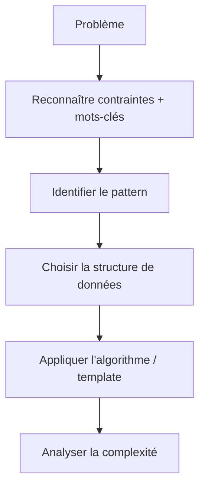

# LeetCode Problem-Solving Patterns

**Interview objective:** recognize the underlying algorithmic pattern from the statement, constraints and expected output — *before* writing code.

## 1. The central idea

LeetCode problems almost never require inventing an algorithm from scratch. Most come down to a small set of recurring algorithmic patterns.

The real skill to work on in an interview is this:

**Example :**

> "Find two numbers whose sum is *target*"
> → **Hash Map**

But if we add a constraint:

> "Find two numbers whose sum is *target*, the array is sorted"
> → **Two Pointers**

The same problem statement can therefore have a different optimal pattern depending on the given constraints.

## 2. Pattern recognition cheat sheet

| Pattern | Typical clues | Main problems |
|---|---|---|
| Hash Map / Set | Déjà vu, duplicate, frequency, complement | Two Sum, Anagrams |
| Two Pointers | Sorted array, even, left/right | 2Sum II, 3Sum |
| Sliding Window | Contiguous substring/subarray, longer/shorter | Longest Substring |
| Binary Search | Sorted, minimum/maximum possible, monotonic | Koko, Rotated Array |
| Stack | Match, nest, precedent, undo | Valid Parentheses |
| Monotonic Stack | Next biggest/smallest | Daily Temperatures |
| Heap | Kth, Top K, closest, min/max repeated | Kth Largest |
| BFS | Level by level, unweighted shortest path | Rotting Oranges |
| DFS | Explore a connected structure | Islands |
| Backtracking | All the possibilities, permutations, combinations | Subsets |
| Tree DFS | Depth, height, subtree, path | Tree problems |
| Fast/Slow Pointers | Cycle, middle of a linked list | Linked List Cycle |
| Intervals | Ranges, overlap, meetings | Merge Intervals |
| Prefix Sum | Sum over range, sum of subarray | Subarray Sum K |
| Trie | Prefix, dictionary, autocompletion | Word Search II |
| Graph | Nodes + edges, connectivity | Clone Graph |
| Topological Sort | Dependencies, prerequisites | Course Schedule |
| Union Find | Related components, merging groups | Redundant Connection |
| Dynamic Programming | Max/min, number of ways, repeated decisions | Coin Change |
| Greedy | Locally optimal decision | Jump Game |
| Dijkstra | Weighted shortest path | Network Delay |
| MST | Connect all nodes at minimum cost | Min Cost Connection |
| Bit Manipulation | XOR, binary, powers of 2 | Single Number |

## How to navigate this documentation

Each pattern page (01 to 22) follows the same structure:

- **When to think about it** — trigger keywords
- **Idea / Intuition** — conceptual reasoning
- **Example** — a concrete case step by step
- **Recognition rule** — the condensed rule
- **Typical problems** — the list of classic exercises

The page **[23 — Pattern Combinations](23-pattern-combinations.md)** covers problems that combine several patterns, and the page **[24 — Interview Cheatsheet](24-cheatsheet-entretien.md)** brings together the complete decision tree and the "20-second" version for use in real conditions.