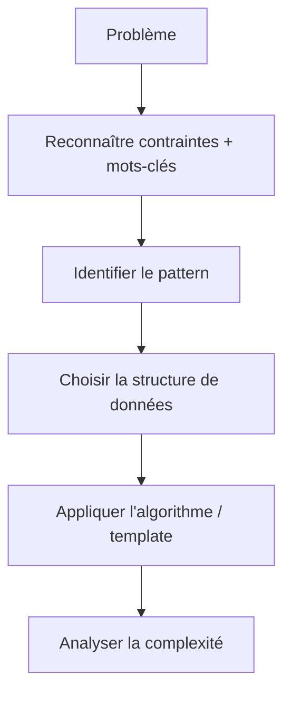

# LeetCode Problem-Solving Patterns

**Objectif d'entretien :** reconnaître le pattern algorithmique sous-jacent à partir de l'énoncé, des contraintes et de la sortie attendue — *avant* d'écrire du code.

## 1. L'idée centrale

Les problèmes LeetCode ne demandent presque jamais d'inventer un algorithme from scratch. La plupart se ramènent à un petit ensemble de patterns algorithmiques récurrents.

La vraie compétence à travailler en entretien est celle-ci :

**Exemple :**

> "Trouver deux nombres dont la somme vaut *target*"
> → **Hash Map**

Mais si on ajoute une contrainte :

> "Trouver deux nombres dont la somme vaut *target*, le tableau est trié"
> → **Two Pointers**

Le même énoncé de problème peut donc avoir un pattern optimal différent selon les contraintes données.

## 2. Cheat sheet de reconnaissance de patterns

| Pattern | Indices typiques | Problèmes principaux |
|---|---|---|
| Hash Map / Set | Déjà vu, doublon, fréquence, complément | Two Sum, Anagrams |
| Two Pointers | Tableau trié, paire, gauche/droite | 2Sum II, 3Sum |
| Sliding Window | Sous-chaîne/sous-tableau contigu, plus long/court | Longest Substring |
| Binary Search | Trié, minimum/maximum possible, monotone | Koko, Rotated Array |
| Stack | Correspondance, imbrication, précédent, annulation | Valid Parentheses |
| Monotonic Stack | Prochain plus grand/petit | Daily Temperatures |
| Heap | Kième, Top K, plus proche, min/max répété | Kth Largest |
| BFS | Niveau par niveau, plus court chemin non pondéré | Rotting Oranges |
| DFS | Explorer une structure connectée | Islands |
| Backtracking | Toutes les possibilités, permutations, combinaisons | Subsets |
| Tree DFS | Profondeur, hauteur, sous-arbre, chemin | Tree problems |
| Fast/Slow Pointers | Cycle, milieu d'une liste chaînée | Linked List Cycle |
| Intervals | Plages, chevauchement, réunions | Merge Intervals |
| Prefix Sum | Somme sur une plage, somme de sous-tableau | Subarray Sum K |
| Trie | Préfixe, dictionnaire, autocomplétion | Word Search II |
| Graph | Nœuds + arêtes, connectivité | Clone Graph |
| Topological Sort | Dépendances, prérequis | Course Schedule |
| Union Find | Composantes connexes, fusion de groupes | Redundant Connection |
| Dynamic Programming | Max/min, nombre de façons, décisions répétées | Coin Change |
| Greedy | Décision localement optimale | Jump Game |
| Dijkstra | Plus court chemin pondéré | Network Delay |
| MST | Connecter tous les nœuds à coût minimal | Min Cost Connection |
| Bit Manipulation | XOR, binaire, puissances de 2 | Single Number |

## Comment naviguer cette documentation

Chaque page de pattern (01 à 22) suit la même structure :

- **Quand y penser** — les mots-clés déclencheurs
- **Idée / Intuition** — le raisonnement conceptuel
- **Exemple** — un cas concret pas à pas
- **Règle de reconnaissance** — la règle condensée
- **Problèmes typiques** — la liste des exercices classiques

La page **[23 — Pattern Combinations](23-pattern-combinations.md)** couvre les problèmes qui combinent plusieurs patterns, et la page **[24 — Cheatsheet entretien](24-cheatsheet-entretien.md)** rassemble l'arbre de décision complet et la version "20 secondes" à utiliser en conditions réelles.