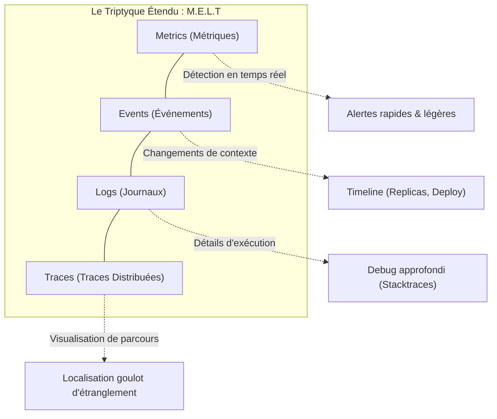
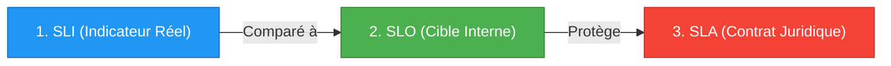
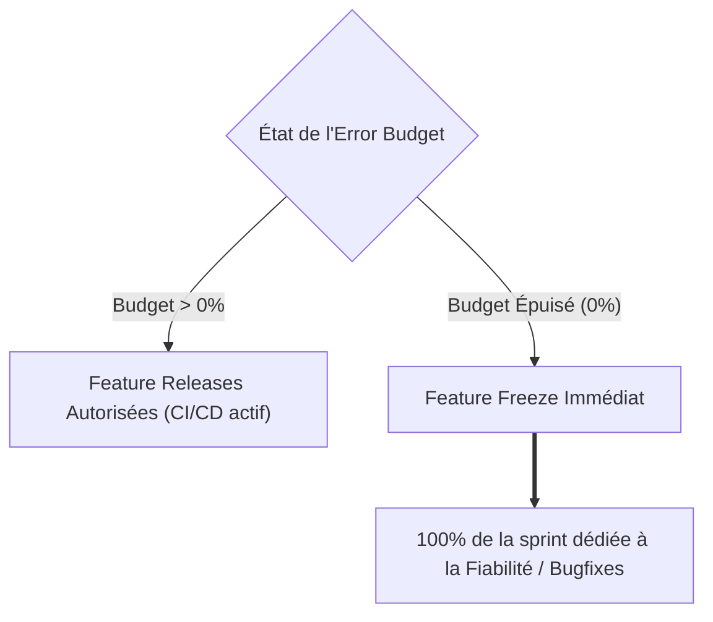
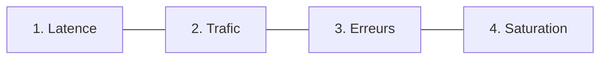

# 01 - Fundamentals of Observability & SRE Triptych

In a technical interview, the recruiter will inevitably ask you this question: *"If our average latency is 150ms and the CPU is at 40%, how do you know that users are not experiencing an outage?"*. This chapter gives you the concepts to answer them with the authority of a production engineer.

---

## 1. The M.E.L.T Model: The 4 Pillars

Any information collected on a distributed system belongs to one of these 4 families:

### Operational Summary of the 4 Pillars

| Pillar | Data type | Storage cost | Main role in production |
|---|---|---|---|
| **Metrics** | Time-stamped digital data | Very weak | Detect anomalies and trigger immediate alerts. |
| **Events** | One-time event with metadata | Weak | Provide the context of an incident (e.g. a pod killed, a rollout). |
| **Logs** | Timestamped text (preferably JSON) | Very high | Understand the precise origin of an exception in the code. |
| **Traces** | Traversing a query with `TraceID` | Moderate | Track a request end-to-end across 10 microservices. |

!!! info "The Pyramid of Investigation"
1. **Metrics** sounds the alarm (“5xx error rate exceeds 2%”*).
    2. **The Trace** targets the culprit (“It’s the call to the payment service that expires”*).
    3. **The Log** gives the exact reason (*"Database timeout on payment_table: connection refused"*).

---

## 2. The SRE Triptych: SLI, SLO and SLA

These three acronyms define how tech giants measure the reliability of their services without paralyzing innovation.

### 1. SLI (Service Level Indicator)
It is the real-time quantitative measurement of the service provided.
It's always a ratio:

$$
	ext{SLI} = rac{ ext{Number of valid events}}{ ext{Total number of events}} imes 100
$$

> **Example:** The percentage of `POST /orders` HTTP requests responded with a `< 500` code in less than 300ms over the last 5 minutes.

### 2. SLO (Service Level Objective)
This is the internal target objective that the technical team undertakes to respect over a given period (e.g. 30 rolling days).

- **Example:** 99.9% of requests must be valid according to the SLI.
- The SLO is set by the Product and SRE teams. It is **always stricter than the SLA**.

### 3. SLA (Service Level Agreement)
This is the official contract signed with clients.

- **Example:** 99.5% monthly availability.
- **Consequence:** If the SLA is broken, the company pays direct financial penalties (billing penalties, AWS/Cloud credits, legal clauses).

---

## 3. The Error Budget (Budget d'Erreur)

The fundamental concept of Site Reliability Engineering: **100% availability does not exist and is too expensive**. The Error Budget represents the amount of failure tolerated.

$$
	ext{Error Budget} = 100\% - 	ext{SLO}
$$

For a service receiving 10,000,000 requests per month with an SLO of 99.9%:

- **Error Budget:** 0.1% = 10,000 failed requests allowed per month.

!!! success "Why do recruiters love Error Budget?"
Because it resolves the historical conflict between **Developers** (who want to push code quickly) and **Operators/SREs** (who want stability). The Error Budget becomes the justice of the peace: as long as there is budget, we deploy; when it is consumed, it stabilizes.

---

## 4. The 4 Golden Signals (Google SRE)

If you need to create a dashboard for a service and you don't know what to display, you must display these 4 metrics:

### 1. Latency
The time taken to process a request.

- **Vital rule:** You must separate the latency of successful requests from that of failed requests. A 500 error returned immediately in 2ms will artificially lower your overall latency while the service is broken.

### 2. Traffic (Traffic)
The overall demand placed on the system.

- Requests per second (RPS) for a REST API.
- Messages per second for an Apache Kafka cluster.
- Concurrent sessions for a WebSockets application.

### 3. Errors
The rate of failed queries.

- **Explicit errors:** HTTP 5xx codes, uncaught exceptions.
- **Implicit errors:** An HTTP 200 response containing `{"status": "error", "message": "auth failed"}`.

### 4. Saturation
How close your component is to its maximum usage limits.

- Systems often degrade exponentially before crashing when approaching 100% saturation.
- Examples: Filling SQL connection pool, allocated JVM memory, open Linux file descriptors.

---

## 5. Frequently Asked Interview Questions (Entry-Level)

!!! question "Q: Why should latency never be measured with an arithmetic average?"
The average completely hides the tail of the distribution (*Long Tail Latency*). If 99 queries run in 10ms and 1 query takes 10 seconds, the average will be around 110ms, which looks great on a graph. Yet 1% of your customers experience an unacceptable 10-second hang. In production, we use the percentiles (P95, P99).

!!! question "Q: What is the fundamental difference between an SLO and an SLA?"
The SLO is an internal objective defined between engineering teams to measure quality and manage the pace of deliveries via the Error Budget. The SLA is a commercial and contractual agreement with the customer which provides for financial penalties if it is not met. The SLO is always stricter than the SLA to serve as an alert buffer zone.

!!! question "Q: What do you do if a microservice's Error Budget drops to zero in the middle of the month?"
The standard SRE governance policy imposes a temporary freeze on new features (*Feature Freeze*). All non-critical deployments are suspended, and development teams are working on stability fixes, infrastructure resiliency, and root cause resolution of recent incidents as a top priority.