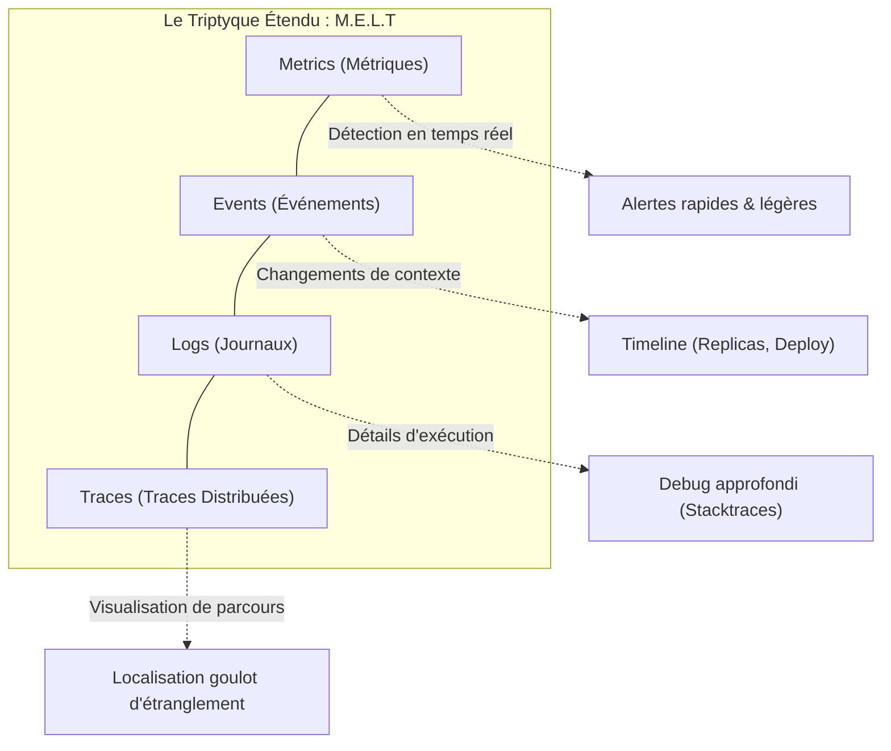
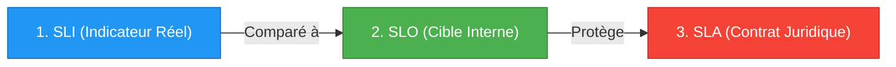
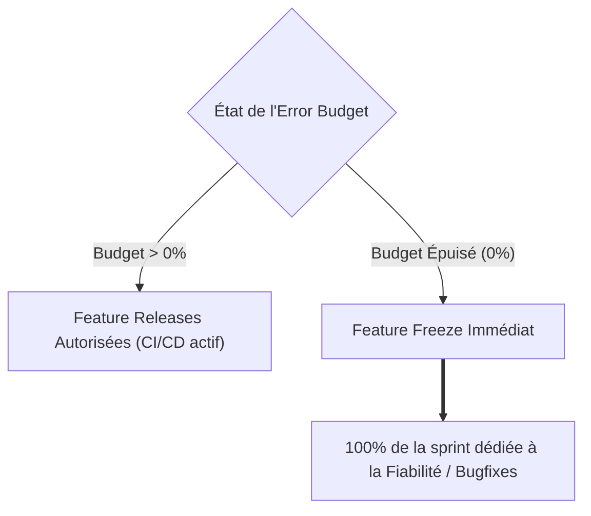
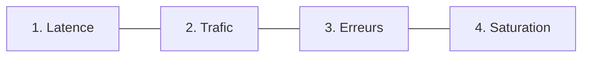

# 01 - Fondamentaux de l'Observabilité & Triptyque SRE

En entretien technique, le recruteur vous posera immanquablement cette question : *"Si notre latence moyenne est de 150ms et que le CPU est à 40%, comment savez-vous que des utilisateurs ne sont pas en train de subir une panne ?"*. Ce chapitre vous donne les concepts pour y répondre avec l'autorité d'un ingénieur de production.

---

## 1. Le Modèle M.E.L.T : Les 4 Piliers

Toute information collectée sur un système distribué appartient à l'une de ces 4 familles :

### Synthèse Opérationnelle des 4 Piliers

| Pilier | Type de donnée | Coût de stockage | Rôle principal en production |
|---|---|---|---|
| **Metrics** | Données numériques horodatées | Très faible | Détecter les anomalies et déclencher des alertes immédiates. |
| **Events** | Événement ponctuel avec métadonnées | Faible | Fournir le contexte d'un incident (ex. un pod tué, un rollout). |
| **Logs** | Texte horodaté (préférablement JSON) | Très élevé | Comprendre l'origine précise d'une exception dans le code. |
| **Traces** | Parcours d'une requête avec `TraceID` | Modéré | Suivre une requête de bout en bout à travers 10 microservices. |

!!! info "La Pyramide de l'Investigation"
    1. **La Métrique** sonne l'alarme (*"Le taux d'erreurs 5xx dépasse 2%"*).
    2. **La Trace** cible le coupable (*"C'est l'appel au service de paiement qui expire"*).
    3. **Le Log** donne la raison exacte (*"Database timeout on payment_table: connection refused"*).

---

## 2. Le Triptyque SRE : SLI, SLO et SLA

Ces trois acronymes définissent comment les géants de la tech mesurent la fiabilité de leurs services sans paralyser l'innovation.

### 1. SLI (Service Level Indicator)
C'est la mesure quantitative en temps réel du service fourni.
C'est toujours un ratio :

$$
\text{SLI} = \frac{\text{Nombre d'événements valides}}{\text{Nombre total d'événements}} \times 100
$$

> **Exemple :** Le pourcentage de requêtes HTTP `POST /orders` ayant répondu avec un code `< 500` en moins de 300ms au cours des 5 dernières minutes.

### 2. SLO (Service Level Objective)
C'est l'objectif cible interne que l'équipe technique s'engage à respecter sur une période donnée (ex. 30 jours glissants).

- **Exemple :** 99.9% des requêtes doivent être valides selon le SLI.
- Le SLO est fixé par les équipes Produit et SRE. Il est **toujours plus strict que le SLA**.

### 3. SLA (Service Level Agreement)
C'est le contrat officiel signé avec les clients.

- **Exemple :** 99.5% de disponibilité mensuelle.
- **Conséquence :** Si le SLA est brisé, l'entreprise paie des pénalités financières directes (pénalités de facturation, crédits AWS/Cloud, clauses juridiques).

---

## 3. L'Error Budget (Budget d'Erreur)

Le concept fondamental du Site Reliability Engineering : **le 100% de disponibilité n'existe pas et coûte trop cher**. L'Error Budget représente la part d'échec tolérée.

$$
\text{Error Budget} = 100\% - \text{SLO}
$$

Pour un service recevant 10 000 000 de requêtes par mois avec un SLO à 99.9% :

- **Error Budget :** 0.1% = 10 000 requêtes en échec autorisées par mois.

!!! success "Pourquoi les recruteurs adorent l'Error Budget ?"
    Parce qu'il résout le conflit historique entre les **Développeurs** (qui veulent pousser du code rapidement) et les **Opérateurs / SRE** (qui veulent de la stabilité). L'Error Budget devient le juge de paix : tant qu'il y a du budget, on déploie ; quand il est consommé, on stabilise.

---

## 4. Les 4 Golden Signals (Google SRE)

Si vous devez créer un dashboard pour un service et que vous ne savez pas quoi afficher, affichez impérativement ces 4 métriques :

### 1. Latence (Latency)
Le temps nécessaire pour traiter une requête.

- **Règle vitale :** Vous devez séparer la latence des requêtes réussies de celle des requêtes échouées. Une erreur 500 renvoyée immédiatement en 2ms fera baisser artificiellement votre latence globale alors que le service est cassé.

### 2. Trafic (Traffic)
La demande globale exercée sur le système.

- Requêtes par seconde (RPS) pour une API REST.
- Messages par seconde pour un cluster Apache Kafka.
- Sessions concurrentes pour une application WebSockets.

### 3. Erreurs (Errors)
Le taux de requêtes qui échouent.

- **Erreurs explicites :** Codes HTTP 5xx, exceptions non capturées.
- **Erreurs implicites :** Une réponse HTTP 200 contenant `{"status": "error", "message": "auth failed"}`.

### 4. Saturation (Saturation)
À quel point votre composant est proche de ses limites maximales d'utilisation.

- Les systèmes se dégradent souvent de façon exponentielle avant de crasher lorsqu'ils approchent de 100% de saturation.
- Exemples : Remplissage du pool de connexions SQL, mémoire JVM allouée, descripteurs de fichiers Linux ouverts.

---

## 5. Questions d'Entretien Fréquentes (Niveau Entry-Level)

!!! question "Q: Pourquoi ne doit-on jamais mesurer la latence avec une moyenne arithmétique ?"
    La moyenne masque complètement la queue de distribution (*Long Tail Latency*). Si 99 requêtes s'exécutent en 10ms et 1 requête prend 10 secondes, la moyenne sera d'environ 110ms, ce qui paraît excellent sur un graphique. Pourtant, 1% de vos clients subissent un blocage inacceptable de 10 secondes. En production, on utilise les percentiles (P95, P99).

!!! question "Q: Quelle est la différence fondamentale entre un SLO et un SLA ?"
    Le SLO est un objectif interne défini entre les équipes d'ingénierie pour mesurer la qualité et gérer le rythme des livraisons via l'Error Budget. Le SLA est un accord commercial et contractuel avec le client qui prévoit des pénalités financières s'il n'est pas tenu. Le SLO est toujours plus strict que le SLA pour servir de zone tampon d'alerte.

!!! question "Q: Que faites-vous si l'Error Budget d'un microservice tombe à zéro au milieu du mois ?"
    La politique de gouvernance SRE standard impose un gel temporaire des nouvelles fonctionnalités (*Feature Freeze*). Tous les déploiements non critiques sont suspendus, et les équipes de développement travaillent en priorité absolue sur les correctifs de stabilité, la résilience de l'infrastructure et la résolution des causes racines des incidents récents.