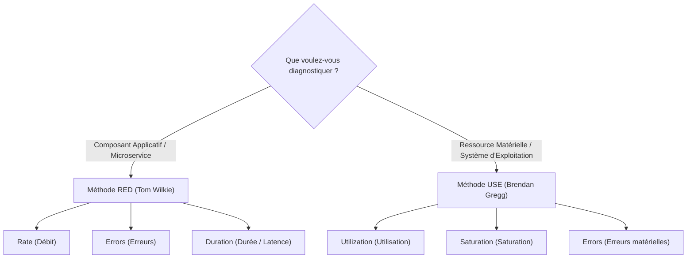
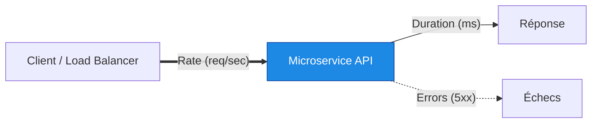
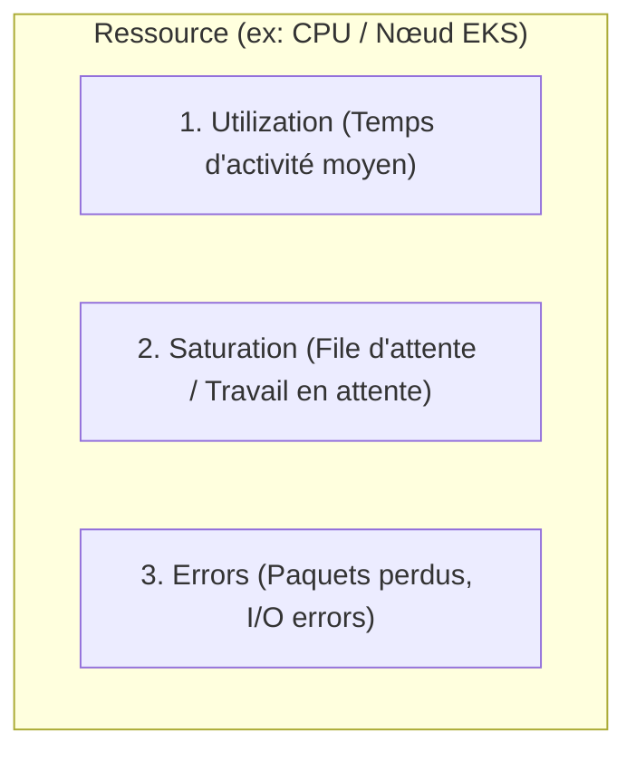

# 02 - Analysis Methods: USE & RED Frameworks

In a job interview, when faced with a live incident question ("The API is slow, where do you start?"*), a junior candidate tends to throw commands at random (`top`, `kubectl logs`, etc.). A senior engineer uses a systematic mental framework. This chapter presents the two key methodologies in production: **USE** for infrastructure and **RED** for microservices.

---

## 1. Overview: Know Which Method to Choose

The choice of framework directly depends on what you analyze in your technology stack:



| Criteria | RED method | USE method |
|---|---|---|
| **Target** | Requests, HTTP endpoints, gRPC, message queues. | CPU, Memory, Disk (I/O), Network Interfaces. |
| **Perspective** | **User-oriented** (*Work-oriented*). | **Machine / Node** oriented (*Resource-oriented*). |
| **Origin** | Tom Wilkie (Grafana Labs/Causal). | Brendan Gregg (Netflix / Linux kernel expert). |
| **Objective** | Measure user experience and application bottlenecks. | Identify the saturated or failing hardware component. |

---

## 2. The RED Method (For Microservices)

The RED method derives directly from Google's 4 Golden Signals, focusing on application traffic.



### 1. Rate
* **Definition:** The number of requests processed per unit of time (usually per second).
* **Typical metric:** `http_requests_total`
* **PromQL example:**```promql
  sum(rate(http_requests_total{job="api-backend"}[5m]))
  ```

### 2. Errors
* **Definition:** The number of requests that fail per second.
* **Typical metric:** `http_requests_total{status=~"5.."}`
* **Calculation of the application error rate:**```promql
  sum(rate(http_requests_total{status=~"5.."}[5m])) 
  / 
  sum(rate(http_requests_total[5m])) * 100
  ```

### 3. Duration (Duration / Latency)
* **Definition:** The time taken for requests to be processed end-to-end.
* **Typical metric:** `http_request_duration_seconds_bucket` (Prometheus Histogram).
* **Calculation of P95 in PromQL:**```promql
  histogram_quantile(0.95, sum(rate(http_request_duration_seconds_bucket[5m])) by (le))
  ```

!!! tip "The Golden Rule RED"
Every microservice in your Kubernetes cluster should have a Grafana dashboard showing these **exact three charts** on the same row. If `Rate` increases and `Duration` skyrockets simultaneously, the service begins to saturate its workers.

---

## 3. The USE Method (For System Resources & Nodes)

For each hardware or logical resource (CPU, RAM, Disk, Network), you must systematically check:



### 1. Utilization
* **Definition:** The average percentage of time the resource was active over a given interval.
* **Example:** The processor is occupied at 85% of its capacity.

### 2. Saturation
* **Definition:** The amount of additional work that cannot be processed immediately and is queued (*queue*).
* **Key indicator:** Saturation can occur **even before 100% utilization** if the requests are asynchronous or concurrent.
* **Example:** The system load (*Load Average* > number of CPU cores), the memory swap that is activated, or CPU Throttling in Kubernetes.

### 3. Errors
* **Definition:** The absolute count of hardware or low-level errors.
* **Example:** Dropped network packets on `eth0`, bad disk sectors, unhandled kernel interrupts.

---

## 4. Practical Comparison: Diagnosing Linux Resources

In direct intervention on a Linux server or a Kubernetes Worker Node, here is how to translate the USE method into commands:

| Resource | Utilization (Utilisation) | Saturation (Saturation) | Errors |
|---|---|---|---|
| **CPU** | `top` / `mpstat 1` (%usr + %sys) | `uptime` (Load Average vs nproc) | chdmesg yu| grep -i cpu` |
| **Memory** | `free -m` (Used vs Total) | `vmstat 1` (Columns `si` / `so` for swap) | chdmesg yu| grep -i oom` |
| **Dial I/O** | `iostat -xz 1` (%util) | `iostat -xz 1` (avgqu-sz > 1) | chdmesg yu| grep -i "I/O error"` |
| **Network** | `sar -n DEV 1` (rxkB/s, txkB/s) | `netstat -s` / `ss -s` (listen drops) | `ip -s link` (errors / dropped) |

!!! danger "Beware of the Usage vs. Saturation trap"
A disk may be at 60% average utilization but have a full I/O queue (`avgqu-sz` high) due to slow blocks. Never rely on usage alone to decree that a machine is fine.

---

## 5. Frequently Asked Interview Questions

!!! question "Q: A developer tells you: 'My container is slow, increase the CPU'. What do you do according to the USE method?"
I don't immediately touch on resource limits. I first apply the USE method:
    1. I check the actual **Usage** of the container (`container_cpu_usage_seconds_total`).
    2. I look at **Saturation**, specifically *CPU Throttling* (`container_cpu_cfs_throttled_periods_total`) caused by the Linux scheduler.
    3. If the CPU is neither saturated nor throttled, the bottleneck is elsewhere (disk I/O, application thread lock or waiting for a network response from the database).

!!! question "Q: In what order do you apply RED and USE during a production incident?"
We first apply **RED** at the top of the stack (at the service or Ingress level) to measure the direct impact on end users (fall in Rate, increase in 5xx errors, explosion in P95).  
    Once the faulty microservice has been identified, we go down a level and apply **USE** on the underlying infrastructure (pods, containers and Worker Nodes) to understand which physical resource or system is causing the blockage.