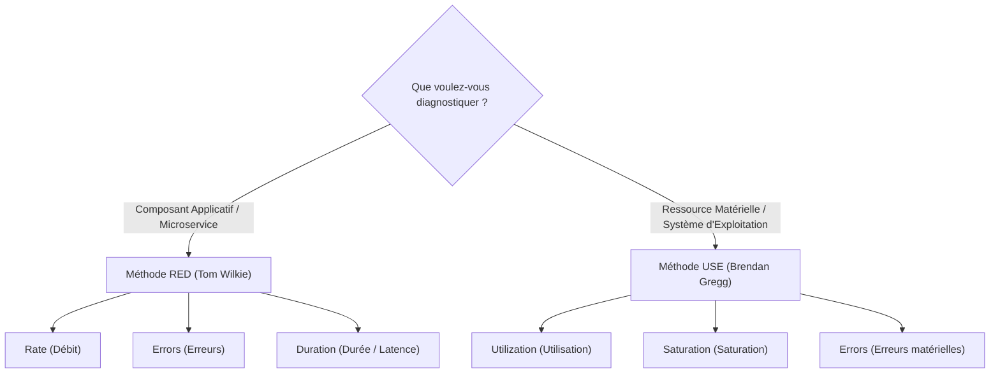
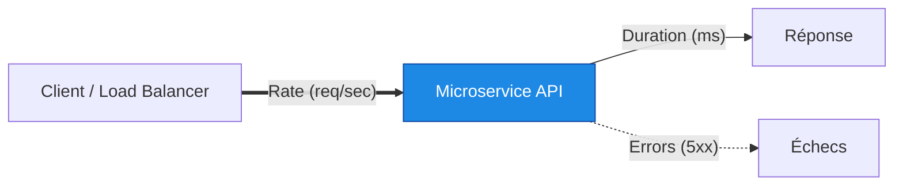
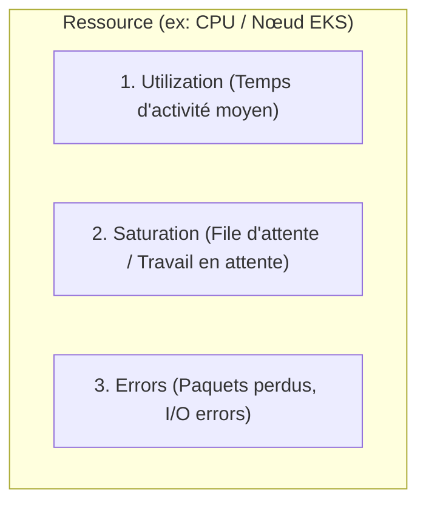

# 02 - Méthodes d'Analyse : USE & RED Frameworks

En entretien d'embauche, face à une question d'incident en direct (*"L'API est lente, par où commencez-vous ?"*), un candidat junior a tendance à lancer des commandes au hasard (`top`, `kubectl logs`, etc.). Un ingénieur senior utilise un framework mental systématique. Ce chapitre présente les deux méthodologies reines en production : **USE** pour l'infrastructure et **RED** pour les microservices.

---

## 1. Vue d'Ensemble : Savoir Quelle Méthode Choisir

Le choix du framework dépend directement de ce que vous analysez dans votre pile technologique :



| Critère | Méthode RED | Méthode USE |
|---|---|---|
| **Cible** | Requêtes, endpoints HTTP, gRPC, files de messages. | CPU, Mémoire, Disque (I/O), Interfaces Réseau. |
| **Perspective** | Orientée **Utilisateur** (*Work-oriented*). | Orientée **Machine / Nœud** (*Resource-oriented*). |
| **Origine** | Tom Wilkie (Grafana Labs / Kausal). | Brendan Gregg (Netflix / expert noyau Linux). |
| **Objectif** | Mesurer l'expérience utilisateur et les goulets applicatifs. | Identifier le composant matériel saturé ou défaillant. |

---

## 2. La Méthode RED (Pour les Microservices)

La méthode RED dérive directement des 4 Golden Signals de Google, en se focalisant sur le trafic applicatif.



### 1. Rate (Taux / Débit)
* **Définition :** Le nombre de requêtes traitées par unité de temps (généralement par seconde).
* **Métrique type :** `http_requests_total`
* **Exemple PromQL :**
  ```promql
  sum(rate(http_requests_total{job="api-backend"}[5m]))
  ```

### 2. Errors (Erreurs)
* **Définition :** Le nombre de requêtes qui échouent par seconde.
* **Métrique type :** `http_requests_total{status=~"5.."}`
* **Calcul du taux d'erreur applicatif :**
  ```promql
  sum(rate(http_requests_total{status=~"5.."}[5m])) 
  / 
  sum(rate(http_requests_total[5m])) * 100
  ```

### 3. Duration (Durée / Latence)
* **Définition :** Le temps mis par les requêtes pour être traitées de bout en bout.
* **Métrique type :** `http_request_duration_seconds_bucket` (Histogramme Prometheus).
* **Calcul du P95 en PromQL :**
  ```promql
  histogram_quantile(0.95, sum(rate(http_request_duration_seconds_bucket[5m])) by (le))
  ```

!!! tip "La Règle d'Or RED"
    Chaque microservice de votre cluster Kubernetes doit posséder un tableau de bord Grafana exposant ces **trois graphiques exacts** sur la même ligne. Si `Rate` augmente et que `Duration` grimpe en flèche simultanément, le service commence à saturer ses workers.

---

## 3. La Méthode USE (Pour les Ressources Système & Nœuds)

Pour chaque ressource matérielle ou logique (CPU, RAM, Disque, Réseau), vous devez systématiquement vérifier :



### 1. Utilization (Utilisation)
* **Définition :** Le pourcentage de temps moyen pendant lequel la ressource a été active sur un intervalle donné.
* **Exemple :** Le processeur est occupé à 85% de sa capacité.

### 2. Saturation (Saturation)
* **Définition :** La quantité de travail supplémentaire qui ne peut pas être traitée immédiatement et qui est mise en file d'attente (*queue*).
* **Indicateur clé :** La saturation peut intervenir **avant même 100% d'utilisation** si les requêtes sont asynchrones ou concurrentes.
* **Exemple :** La charge système (*Load Average* > nombre de cœurs CPU), la swap mémoire qui s'active, ou le CPU Throttling dans Kubernetes.

### 3. Errors (Erreurs)
* **Définition :** Le décompte absolu des erreurs matérielles ou de bas niveau.
* **Exemple :** Dropped packets réseau sur `eth0`, secteurs défectueux disque, interruptions kernel non traitées.

---

## 4. Comparatif Pratique : Diagnostiquer les Ressources Linux

En intervention directe sur un serveur Linux ou un Worker Node Kubernetes, voici comment traduire la méthode USE en commandes :

| Ressource | Utilization (Utilisation) | Saturation (Saturation) | Errors (Erreurs) |
|---|---|---|---|
| **CPU** | `top` / `mpstat 1` (%usr + %sys) | `uptime` (Load Average vs nproc) | `dmesg \| grep -i cpu` |
| **Mémoire** | `free -m` (Used vs Total) | `vmstat 1` (Colonnes `si` / `so` pour swap) | `dmesg \| grep -i oom` |
| **Disque I/O** | `iostat -xz 1` (%util) | `iostat -xz 1` (avgqu-sz > 1) | `dmesg \| grep -i "I/O error"` |
| **Réseau** | `sar -n DEV 1` (rxkB/s, txkB/s) | `netstat -s` / `ss -s` (listen drops) | `ip -s link` (errors / dropped) |

!!! danger "Attention au piège de l'Utilisation vs Saturation"
    Un disque peut être à 60% d'utilisation moyenne mais avoir une file d'attente d'I/O saturée (`avgqu-sz` élevé) à cause de blocs lents. Ne vous fiez jamais à l'utilisation seule pour décréter qu'une machine va bien.

---

## 5. Questions d'Entretien Fréquentes

!!! question "Q: Un développeur vous dit : 'Mon conteneur est lent, augmentez le CPU'. Que faites-vous selon la méthode USE ?"
    Je ne touche pas immédiatement aux limites de ressources. J'applique d'abord la méthode USE :
    1. Je vérifie l'**Utilisation** réelle du conteneur (`container_cpu_usage_seconds_total`).
    2. Je regarde la **Saturation**, spécifiquement le *CPU Throttling* (`container_cpu_cfs_throttled_periods_total`) causé par le scheduler Linux.
    3. Si le CPU n'est ni saturé ni throttlé, le goulet d'étranglement est ailleurs (I/O disque, thread lock applicatif ou attente de réponse réseau de la base de données).

!!! question "Q: Dans quel ordre appliquez-vous RED et USE lors d'un incident de production ?"
    On applique d'abord **RED** en haut de la pile (au niveau du service ou de l'Ingress) pour mesurer l'impact direct sur les utilisateurs finaux (chute du Rate, montée des erreurs 5xx, explosion du P95).  
    Une fois le microservice fautif identifié, on descend d'un niveau et on applique **USE** sur l'infrastructure sous-jacente (les pods, les conteneurs et les Worker Nodes) pour comprendre quelle ressource physique ou système provoque le blocage.