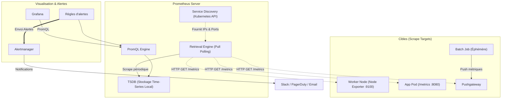
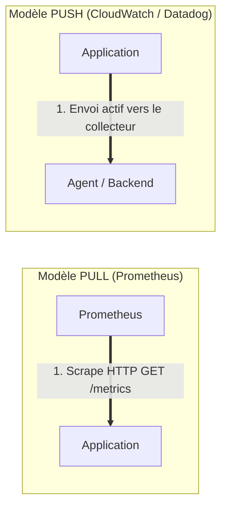
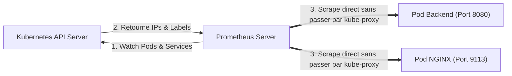

# 03 - Prometheus Architecture & Service Discovery

Prometheus is the de facto standard for monitoring in the Cloud Native ecosystem. In a DevOps interview, the question is not about installing Prometheus via Helm, but about its internal mechanisms: its TSDB storage engine, its collection cycle (*Pull model*) and how it dynamically discovers targets within a Kubernetes cluster.

---

## 1. Global Architecture of Prometheus

Prometheus is not a monolithic system; it is built around a set of complementary components orchestrated by its central server:



---

## 2. The Interview Debate: PULL Model vs PUSH Model

This is one of the most frequent comparisons in architectural interviews.



| Property | PULL model (Prometheus) | PUSH Model (Traditional) |
|---|---|---|
| **Load control** | **Total by server:** Prometheus decides when and at what rate it collects. The server cannot be flooded by its targets. | **Controlled by targets:** During a traffic spike, applications send millions of metrics and can overload the collector. |
| **Fault detection (*Liveness*)** | **Immediate:** If the scrape fails (timeout / target unreachable), Prometheus passes the `up == 0` metric. | **Ambiguous:** If an agent is not sending anything, has it crashed or is there simply no data to send? |
| **Network Security** | Targets must expose a listening port accessible to the Prometheus server. | Applications don't listen, they send their stream to a single exit point. |
| **NAT / Firewall Traversal** | Complex if applications are behind isolated private networks. | Natural (simple HTTPS outgoing traffic). |

!!! warning "The Exception: Why does the Pushgateway exist?"
Prometheus works in Pull. However, a container running a **Job Cron batch** can start, run its script in 4 seconds, and shut down before the scrape cycle (e.g. 15 seconds) has taken place.  
    **Solution:** The batch job pushes (*push*) its counters to the **Pushgateway**, which remains alive and which Prometheus scrapes at its own pace.

---

## 3. Stockage Interne : La TSDB (Time Series Database)

Prometheus writes its data to local disk in a way optimized for digital time series:

```text
/data (Dépôt TSDB)
├── 01BKGV7JC0HX... (Bloc de données de 2 heures)
│   ├── meta.json   (Métadonnées du bloc)
│   ├── index       (Index inversé des labels)
│   └── chunks/     (Échantillons compressés via Gorilla)
├── wal/            (Write-Ahead Log pour la résilience aux crashs)
│   └── 0000000X
```

### High performance mechanisms:
1. **Gorilla Compression:** Timestamps and float values (float64) are compressed by delta-of-deltas, reducing the average space to approximately **1.37 bytes per sample**.
2. **Write-Ahead Log (WAL):** Incoming writes are immediately logged to the on-disk WAL before being committed to RAM, ensuring zero data loss in the event of a hard server crash.
3. **Block immutability:** Every 2 hours, memory is compacted into an immutable block on disk.

!!! danger "Production Rule: Prometheus is not designed for long-term archiving"
By default, Prometheus stores its data on a local disk for 15 days (`--storage.tsdb.retention.time=15d`). For durable, multi-year, multi-cluster storage, companies connect a **Long-Term Storage (LTS)** solution like **Thanos**, **Cortex**, or **Mimir** via the `remote_write` interface.

---

## 4. Kubernetes Service Discovery (SD)

On Kubernetes, pods are constantly born and die with dynamic IP addresses. Static address configuration is not possible. Prometheus uses the Kubernetes API to dynamically scale:



### The Two Methods of Discovery:

#### Approach A: Annotations in Pods / Services
Prometheus scans Kubernetes manifests for standard annotations:```yaml
apiVersion: v1
kind: Pod
metadata:
  name: mon-api
  annotations:
    prometheus.io/scrape: "true"
    prometheus.io/path: "/actuator/prometheus"
    prometheus.io/port: "8080"
```

#### Approach B: The Prometheus Operator & `ServiceMonitors` (Industrial Standard)
In a managed cluster, we use the **Prometheus Operator**. Instead of annotations, we declare a Kubernetes Custom Resource Definition (CRD) named `ServiceMonitor`:

```yaml
apiVersion: [monitoring.coreos.com/v1](https://monitoring.coreos.com/v1)
kind: ServiceMonitor
metadata:
  name: backend-monitor
  namespace: production
  labels:
    release: prometheus-stack
spec:
  selector:
    matchLabels:
      app: backend-api
  endpoints:
    - port: http-metrics
      path: /metrics
      interval: 15s
```

*The Prometheus Operator detects this manifest, automatically reconfigures the internal `prometheus.yml` file and hot reloads Prometheus without any reboot.*

---

## 5. Frequently Asked Interview Questions

!!! question "Q: Why does Prometheus use the Pull model rather than the Push model to monitor a fleet of containers?"
The Pull model offers three critical advantages in production:
    1. **Denial of Service Protection:** Prometheus regulates ingestion throughput itself and cannot collapse under a deluge of metrics in the event of an application incident.
    2. **Passive fault detection:** If the scrape fails, Prometheus immediately knows that the service is unreachable (`up == 0`). In Push mode, the absence of data is ambiguous.
    3. **Decoupled architecture:** Applications do not need to know the IP address of the monitoring server, they just make a standard HTTP endpoint accessible.

!!! question "Q: What is Pushgateway and when should (or should NOT) be used?"
The Pushgateway serves as a temporary buffer to collect metrics from **job batches or ephemeral scripts** that complete before the next Prometheus scrape loop.  
    **What not to do:** Use it as a central collector for long-running web services. This turns Prometheus into a push model, creates a single point of failure (*Single Point of Failure*) and prevents reliable detection of service unavailability.

!!! question "Q: How does Prometheus ensure that it does not lose data in the event of a power outage or forced node reboot?"
Prometheus relies on its **Write-Ahead Log (WAL)**. Each new metric sample is first sequentially written to disk in the WAL log before being persisted to random access memory (RAM). In the event of a hard reboot, Prometheus replays the WAL at startup to reconstruct the exact state of the TSDB without corruption.