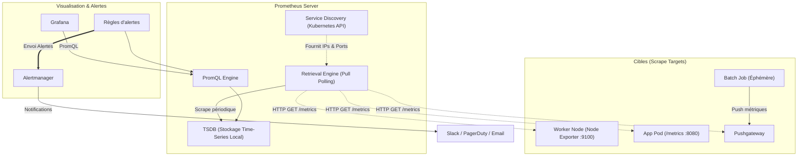
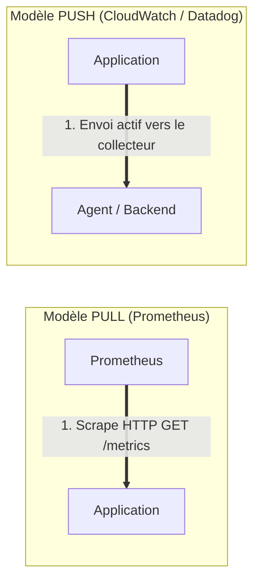
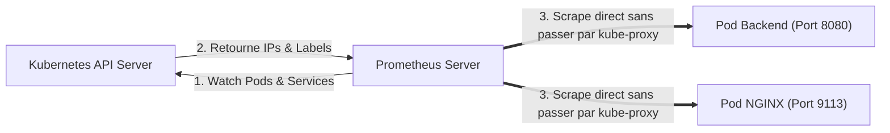

# 03 - Prometheus Architecture & Service Discovery

Prometheus est le standard de facto du monitoring dans l'écosystème Cloud Native. En entretien DevOps, la question ne porte pas sur l'installation de Prometheus via Helm, mais sur ses mécanismes internes : son moteur de stockage TSDB, son cycle de collecte (*Pull model*) et la façon dont il découvre dynamiquement les cibles au sein d'un cluster Kubernetes.

---

## 1. Architecture Globale de Prometheus

Prometheus n'est pas un système monolithique ; il s'articule autour d'un ensemble de composants complémentaires orchestrés par son serveur central :



---

## 2. Le Débat d'Entretien : Modèle PULL vs Modèle PUSH

C'est l'un des comparatifs les plus fréquents en entretien d'architecture.



| Propriété | Modèle PULL (Prometheus) | Modèle PUSH (Traditionnel) |
|---|---|---|
| **Contrôle de charge** | **Total par le serveur :** Prometheus décide quand et à quel rythme il collecte. Le serveur ne peut pas être floodé par ses cibles. | **Contrôlé par les cibles :** En cas de pic de trafic, les applications envoient des millions de métriques et peuvent surcharger le collecteur. |
| **Détection de panne (*Liveness*)** | **Immédiate :** Si le scrape échoue (timeout / target unreachable), Prometheus passe la métrique `up == 0`. | **Ambiguë :** Si un agent n'envoie rien, est-il tombé en panne ou n'y a-t-il simplement pas de données à émettre ? |
| **Sécurité réseau** | Les cibles doivent exposer un port d'écoute accessible au serveur Prometheus. | Les applications n'écoutent pas, elles envoient leur flux vers un point de sortie unique. |
| **Traversée de NAT / Pare-feu** | Complexe si les applications sont derrière des réseaux privés isolés. | Naturelle (simple trafic sortant HTTPS). |

!!! warning "L'Exception : Pourquoi la Pushgateway existe-t-elle ?"
    Prometheus fonctionne en Pull. Cependant, un conteneur qui exécute un **Job Cron batch** peut démarrer, exécuter son script en 4 secondes, et s'éteindre avant que le cycle de scrape (ex: 15 secondes) n'ait eu lieu.  
    **Solution :** Le batch job pousse (*push*) ses compteurs à la **Pushgateway**, qui reste vivante et que Prometheus vient scraper à son propre rythme.

---

## 3. Stockage Interne : La TSDB (Time Series Database)

Prometheus écrit ses données sur le disque local de manière optimisée pour les séries temporelles numériques :

```text
/data (Dépôt TSDB)
├── 01BKGV7JC0HX... (Bloc de données de 2 heures)
│   ├── meta.json   (Métadonnées du bloc)
│   ├── index       (Index inversé des labels)
│   └── chunks/     (Échantillons compressés via Gorilla)
├── wal/            (Write-Ahead Log pour la résilience aux crashs)
│   └── 0000000X
```

### Mécanismes de haute performance :
1. **Compression Gorilla :** Les timestamps et les valeurs flottantes (float64) sont compressés par delta-of-deltas, réduisant l'espace moyen à environ **1,37 octet par échantillon**.
2. **Write-Ahead Log (WAL) :** Les écritures entrantes sont immédiatement journalisées dans le WAL sur disque avant d'être validées en RAM, garantissant zéro perte de données en cas de crash brutal du serveur.
3. **Immutabilité des blocs :** Toutes les 2 heures, la mémoire est compactée en un bloc immuable sur disque.

!!! danger "Règle de Production : Prometheus n'est pas conçu pour l'archivage long-terme"
    Par défaut, Prometheus stocke ses données sur un disque local pendant 15 jours (`--storage.tsdb.retention.time=15d`). Pour un stockage durable multi-années et multi-clusters, les entreprises branchent une solution de **Long-Term Storage (LTS)** comme **Thanos**, **Cortex**, ou **Mimir** via l'interface `remote_write`.

---

## 4. Kubernetes Service Discovery (SD)

Sur Kubernetes, les pods naissent et meurent en permanence avec des adresses IP dynamiques. Une configuration d'adresses statiques est impossible. Prometheus utilise l'API Kubernetes pour s'adapter dynamiquement :



### Les Deux Méthodes de Découverte :

#### Approche A : Les Annotations dans les Pods / Services
Prometheus scanne les manifestes Kubernetes à la recherche d'annotations standard :
```yaml
apiVersion: v1
kind: Pod
metadata:
  name: mon-api
  annotations:
    prometheus.io/scrape: "true"
    prometheus.io/path: "/actuator/prometheus"
    prometheus.io/port: "8080"
```

#### Approche B : Le Prometheus Operator & les `ServiceMonitors` (Standard Industriel)
Dans un cluster managé, on utilise le **Prometheus Operator**. Au lieu d'annotations, on déclare une Custom Resource Definition (CRD) Kubernetes nommée `ServiceMonitor` :

```yaml
apiVersion: [monitoring.coreos.com/v1](https://monitoring.coreos.com/v1)
kind: ServiceMonitor
metadata:
  name: backend-monitor
  namespace: production
  labels:
    release: prometheus-stack
spec:
  selector:
    matchLabels:
      app: backend-api
  endpoints:
    - port: http-metrics
      path: /metrics
      interval: 15s
```

*Le Prometheus Operator détecte ce manifeste, reconfigure automatiquement le fichier `prometheus.yml` interne et recharge Prometheus à chaud sans aucun redémarrage.*

---

## 5. Questions d'Entretien Fréquentes

!!! question "Q: Pourquoi Prometheus utilise-t-il le modèle Pull plutôt que le modèle Push pour monitorer une flotte de conteneurs ?"
    Le modèle Pull offre trois avantages critiques en production :
    1. **Protection contre le déni de service :** Prometheus régule lui-même le débit d'ingestion et ne peut pas s'effondrer sous un déluge de métriques en cas d'incident applicatif.
    2. **Détection passive des pannes :** Si le scrape échoue, Prometheus sait immédiatement que le service est injoignable (`up == 0`). En mode Push, l'absence de données est ambiguë.
    3. **Architecture découplée :** Les applications n'ont pas besoin de connaître l'adresse IP du serveur de monitoring, elles se contentent de rendre accessible un point de terminaison HTTP standard.

!!! question "Q: Qu'est-ce que la Pushgateway et quand doit-on (ou ne doit-on PAS) l'utiliser ?"
    La Pushgateway sert de tampon temporaire pour collecter les métriques issues de **jobs batchs ou scripts éphémères** qui se terminent avant la prochaine boucle de scrape de Prometheus.  
    **Ce qu'il ne faut pas faire :** L'utiliser comme un collecteur central pour des services web longue durée. Cela transforme Prometheus en modèle Push, crée un point unique de défaillance (*Single Point of Failure*) et empêche la détection fiable de l'indisponibilité des services.

!!! question "Q: Comment Prometheus s'assure-t-il de ne pas perdre de données en cas de panne de courant ou de reboot forcé du nœud ?"
    Prometheus s'appuie sur son **Write-Ahead Log (WAL)**. Chaque nouvel échantillon de métrique est d'abord écrit de manière séquentielle sur disque dans le journal WAL avant d'être conservé en mémoire vive (RAM). En cas de redémarrage brutal, Prometheus rejoue le WAL au démarrage pour reconstruire l'état exact de la TSDB sans corruption.