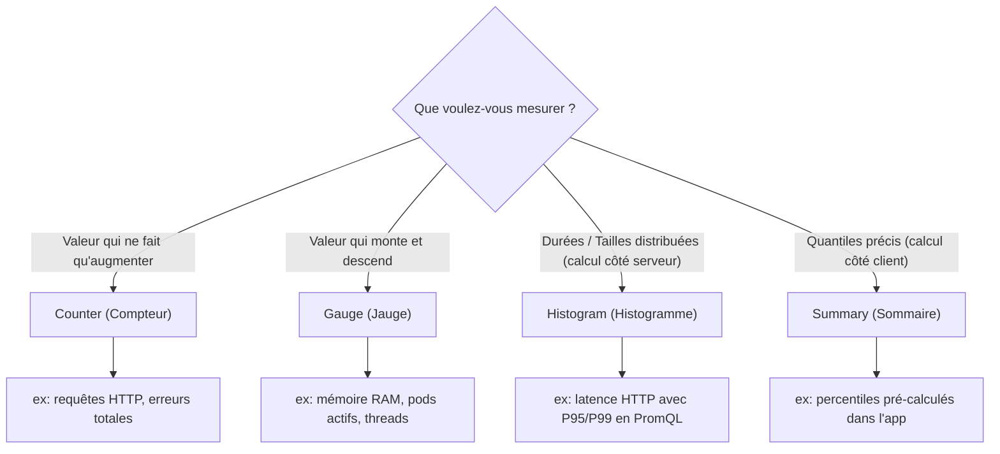
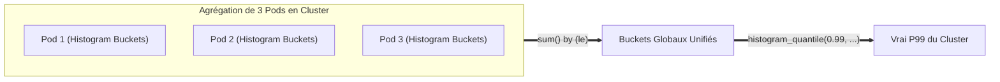
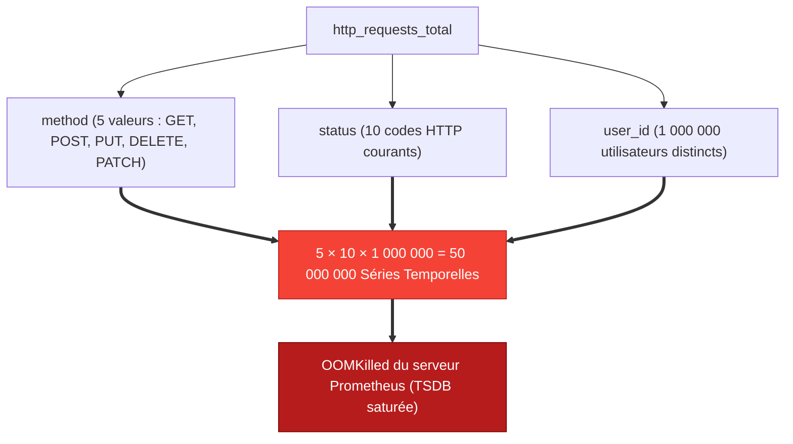

#04 - Prometheus Metrics: Counter, Gauge, Histogram & Summary

To instrument a service or analyze a dashboard, knowing the name of a metric is not enough. In a DevOps engineering interview, we test your ability to choose the right type of metric for a specific need and to avoid the death trap of **high cardinality**.

---

## 1. The 4 Fundamental Types of Metrics

Prometheus structures its data model around four fundamental types:



---

## 2. Detailed Study & Practical Cases

### 1. Counter
A counter is a cumulative value that can only **increase** or be **reset to zero** during a process restart.

* **Use case:** Number of requests received, number of tasks completed, total errors 500.
* **Absolute rule:** We never use the raw value of a Counter on a graph; we always apply a rate of variation function (`rate()` or `increase()`).

```text
# Format texte brut exposé sur /metrics
# TYPE http_requests_total counter
http_requests_total{method="POST",handler="/checkout"} 10423
```

### 2. Gauge
A gauge represents an instantaneous state. Its value can **go up, down or remain stable**.

* **Use case:** Memory usage (GB), CPU temperature, number of open connections, number of replicated pods.
* **Associated functions:** We can directly plot the instantaneous value, take averages (`avg_over_time()`) or observe derivatives (`deriv()`).

```text
# TYPE node_memory_MemAvailable_bytes gauge
node_memory_MemAvailable_bytes{instance="node-01"} 8452145152
```

---

### 3. Histogram
A histogram samples observations (usually durations or payload sizes) and classifies them into configurable buckets (**cumulative buckets**).

A histogram named `http_request_duration_seconds` automatically generates 3 time series:

1. `<nom>_bucket{le="<limite_superieure>"}`: Counter of requests whose duration is $\le$ limit.
2. `<nom>_sum`: Total sum of all observed durations.
3. `<nom>_count`: Total number of observations (equivalent to `_bucket{le="+Inf"}`).

```text
# TYPE http_request_duration_seconds histogram
http_request_duration_seconds_bucket{le="0.1"} 2400
http_request_duration_seconds_bucket{le="0.5"} 3100
http_request_duration_seconds_bucket{le="1.0"} 3150
http_request_duration_seconds_bucket{le="+Inf"} 3200
http_request_duration_seconds_sum 540.2
http_request_duration_seconds_count 3200
```

!!! success "Why is Histogram the standard for latency?"
Since buckets are cumulative and stored as counters, Prometheus can **aggregate** the histograms of 50 replicas of the same pod and dynamically calculate an overall P99 percentile via the PromQL `histogram_quantile()` function.

---

### 4. Summary
Like the histogram, the Summary measures durations or sizes, but it directly calculates the quantiles (ex: $\phi=0.99$) **in the application client's memory** before even exposing the metric to Prometheus.

```text
# TYPE http_request_duration_seconds summary
http_request_duration_seconds{quantile="0.5"} 0.052
http_request_duration_seconds{quantile="0.99"} 0.812
http_request_duration_seconds_sum 540.2
http_request_duration_seconds_count 3200
```

---

## 3. Histogram vs. Summary: The Interview Duel

This is a classic discriminating question for infrastructure and SRE oriented positions:

| Criteria | Histogram | Summary |
|---|---|---|
| **Calculation of quantiles** | Performed **server side** by Prometheus via PromQL (`histogram_quantile`). | Performed **client side** by the application (tracing/monitoring SDK). |
| **Multi-instance aggregation** | **Yes (perfect):** We can add up the buckets of 100 pods for an overall P99. | **No:** We cannot mathematically average several quantiles. |
| **CPU cost** | Weak on the application side, carried over to the PromQL engine during queries. | High client side (in-memory data structures for streaming quantiles). |
| **Configuration** | Requires judiciously predefining bucket intervals (`le`). | Predefine the desired percentiles (e.g. 0.5, 0.95, 0.99). |



!!! danger “Architectural Conclusion”
    In a Kubernetes environment with autoscaling (HPA), use **exclusively Histograms** to monitor application latency, because Summary prevents cluster-wide aggregation.

---

## 4. The Scourge of High Cardinality

Cardinality represents the total number of unique time series generated by the combination of all labels of a metric.

$$ ext{Single series} = \prod ( ext{Number of possible values per label})$$



!!! danger "What to NEVER inject into a metric label"
- A user ID (`user_id`, `email`)
    - A public client IP address
    - A randomly generated UUID/GUID
    - A bank card number or session token

*If you need to analyze these fine values, they belong to **Logs** or **OpenTelemetry Traces**, never to Prometheus metrics.*

---

## 5. Frequently Asked Interview Questions

!!! question "Q: If your application process restarts, the Counter value drops to 0. How does Prometheus handle this without distorting the calculations?"
Prometheus natively handles this scenario using the `rate()` function. As soon as it detects a sudden drop in the value of a monotonic time series, the function interprets this as a counter reset (*Counter Reset*) and automatically compensates by adding the new value to the previous series without producing a negative rate.

!!! question "Q: Why can't we average the percentiles of a Summary from multiple nodes?"
A percentile is not a linear value, but a statistical rank in a distribution. The arithmetic average of several percentiles has no mathematical meaning (e.g. the P99 of instance A with 10 requests and the P99 of instance B with 1,000,000 requests do not weigh the same). To aggregate multi-pod percentiles, you must use Histograms.