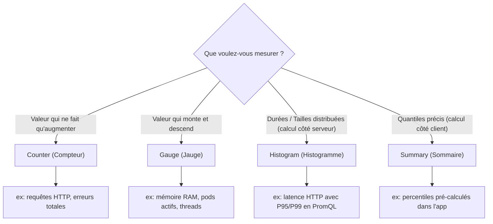
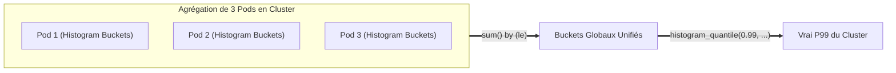
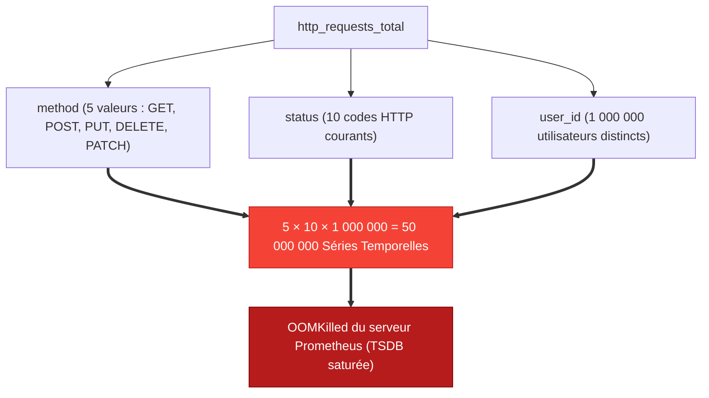

# 04 - Métriques Prometheus : Counter, Gauge, Histogram & Summary

Pour instrumenter un service ou analyser un tableau de bord, connaître le nom d'une métrique ne suffit pas. En entretien d'ingénierie DevOps, on teste votre capacité à choisir le bon type de métrique pour un besoin précis et à éviter le piège mortel de la **haute cardinalité** (*high cardinality*).

---

## 1. Les 4 Types Fondamentaux de Métriques

Prometheus structure son modèle de données autour de quatre types fondamentaux :



---

## 2. Étude Détaillée & Cas Pratiques

### 1. Counter (Compteur)
Un compteur est une valeur cumulative qui ne peut que **croître** ou être **réinitialisée à zéro** lors d'un redémarrage du processus.

* **Cas d'usage :** Nombre de requêtes reçues, nombre de tâches terminées, total d'erreurs 500.
* **Règle absolue :** On n'utilise jamais la valeur brute d'un Counter sur un graphique ; on applique toujours une fonction de taux de variation (`rate()` ou `increase()`).

```text
# Format texte brut exposé sur /metrics
# TYPE http_requests_total counter
http_requests_total{method="POST",handler="/checkout"} 10423
```

### 2. Gauge (Jauge)
Une jauge représente un état instantané. Sa valeur peut **monter, descendre ou rester stable**.

* **Cas d'usage :** Utilisation mémoire (Go), température CPU, nombre de connexions ouvertes, nombre de pods répliqués.
* **Fonctions associées :** On peut tracer directement la valeur instantanée, faire des moyennes (`avg_over_time()`) ou observer des dérivées (`deriv()`).

```text
# TYPE node_memory_MemAvailable_bytes gauge
node_memory_MemAvailable_bytes{instance="node-01"} 8452145152
```

---

### 3. Histogram (Histogramme)
Un histogramme échantillonne des observations (généralement des durées ou des tailles de charge utile) et les classe dans des compartiments configurables (**buckets cumulatifs**).

Un histogramme nommé `http_request_duration_seconds` génère automatiquement 3 séries temporelles :

1. `<nom>_bucket{le="<limite_superieure>"}` : Compteur de requêtes dont la durée est $\le$ limite.
2. `<nom>_sum` : Somme totale de toutes les durées observées.
3. `<nom>_count` : Nombre total d'observations (équivalent à `_bucket{le="+Inf"}`).

```text
# TYPE http_request_duration_seconds histogram
http_request_duration_seconds_bucket{le="0.1"} 2400
http_request_duration_seconds_bucket{le="0.5"} 3100
http_request_duration_seconds_bucket{le="1.0"} 3150
http_request_duration_seconds_bucket{le="+Inf"} 3200
http_request_duration_seconds_sum 540.2
http_request_duration_seconds_count 3200
```

!!! success "Pourquoi l'Histogram est la norme pour la latence ?"
    Les buckets étant cumulatifs et stockés sous forme de compteurs, Prometheus peut **agréger** les histogrammes de 50 réplicas d'un même pod et calculer dynamiquement un percentile P99 global via la fonction PromQL `histogram_quantile()`.

---

### 4. Summary (Sommaire)
Comme l'histogramme, le Summary mesure des durées ou des tailles, mais il calcule directement les quantiles (ex: $\phi=0.99$) **dans la mémoire du client applicatif** avant même d'exposer la métrique à Prometheus.

```text
# TYPE http_request_duration_seconds summary
http_request_duration_seconds{quantile="0.5"} 0.052
http_request_duration_seconds{quantile="0.99"} 0.812
http_request_duration_seconds_sum 540.2
http_request_duration_seconds_count 3200
```

---

## 3. Histogram vs. Summary : Le Duel d'Entretien

C'est une question discriminante classique pour les postes orientés infrastructure et SRE :

| Critère | Histogram | Summary |
|---|---|---|
| **Calcul des quantiles** | Effectué **côté serveur** par Prometheus via PromQL (`histogram_quantile`). | Effectué **côté client** par l'application (SDK de tracing/monitoring). |
| **Agrégation multi-instances** | **Oui (parfait) :** On peut sommer les buckets de 100 pods pour un P99 global. | **Non :** On ne peut mathématiquement pas faire la moyenne de plusieurs quantiles. |
| **Coût CPU** | Faible côté application, reporté sur le moteur PromQL lors des requêtes. | Élevé côté client (structures de données en mémoire pour streaming quantiles). |
| **Configuration** | Nécessite de prédéfinir judicieusement les intervalles des buckets (`le`). | Prédéfinir les percentiles souhaités (ex. 0.5, 0.95, 0.99). |



!!! danger "Conclusion d'Architecture"
    En environnement Kubernetes avec autoscaling (HPA), utilisez **exclusivement des Histograms** pour surveiller la latence applicative, car le Summary empêche toute agrégation à l'échelle du cluster.

---

## 4. Le Fléau de la Haute Cardinalité (High Cardinality)

La cardinalité représente le nombre total de séries temporelles uniques générées par la combinaison de tous les labels d'une métrique.

$$\text{Séries uniques} = \prod (\text{Nombre de valeurs possibles par label})$$



!!! danger "Ce qu'il ne faut JAMAIS injecter dans un label de métrique"
    - Un identifiant utilisateur (`user_id`, `email`)
    - Une adresse IP publique client
    - Un UUID / GUID généré aléatoirement
    - Un numéro de carte bancaire ou token de session

    *Si vous devez analyser ces valeurs fines, elles appartiennent aux **Logs** ou aux **Traces OpenTelemetry**, jamais aux métriques Prometheus.*

---

## 5. Questions d'Entretien Fréquentes

!!! question "Q: Si le processus de votre application redémarre, la valeur du Counter retombe à 0. Comment Prometheus gère-t-il cela sans fausser les calculs ?"
    Prometheus gère nativement ce scénario grâce à la fonction `rate()`. Dès qu'elle détecte une baisse soudaine de la valeur d'une série temporelle monotone, la fonction interprète cela comme une réinitialisation du compteur (*Counter Reset*) et compense automatiquement en ajoutant la nouvelle valeur à la série précédente sans produire de taux négatif.

!!! question "Q: Pourquoi ne peut-on pas moyenner les percentiles d'un Summary provenant de plusieurs nœuds ?"
    Un percentile n'est pas une valeur linéaire, mais un rang statistique dans une distribution. La moyenne arithmétique de plusieurs percentiles n'a aucun sens mathématique (ex. le P99 de l'instance A avec 10 requêtes et le P99 de l'instance B avec 1 000 000 requêtes ne pèsent pas le même poids). Pour agréger des centiles multi-pods, il faut utiliser des Histogrammes.