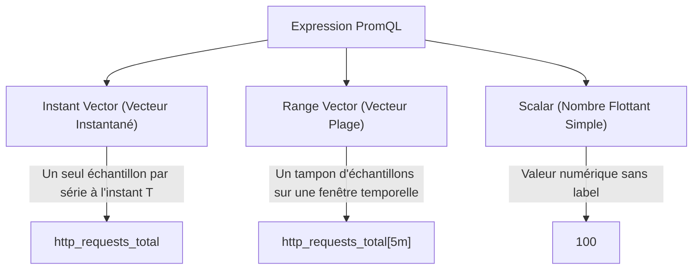
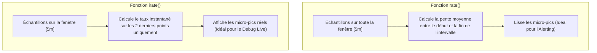
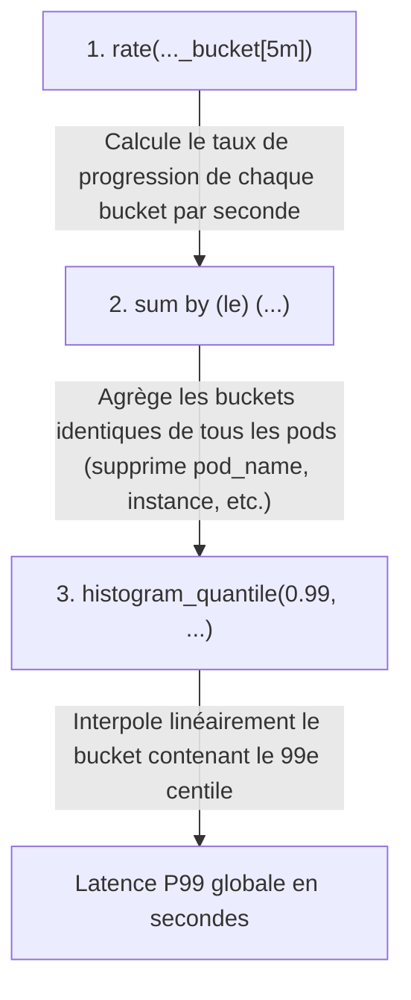

# 05 - PromQL Advanced Query: Vectors, rate() & histogram_quantile()

PromQL (*Prometheus Query Language*) is the functional language used to populate Grafana dashboards and trigger infrastructure alerts. In technical interviews, theoretical questions give way to practice: you will be asked to write or correct queries on the fly.

---

## 1. Fundamental PromQL Data Types

Any PromQL expression manipulates or returns one of these three types:



| Type | Syntax | Displayable directly in Grafana? | Usage principal |
|---|---|---|---|
| **Instant Vector** | `up{job="node"}` | **Yes** (Time graph or gauge) | Direct visualization, threshold alerts. |
| **Range Vector** | `node_cpu_seconds_total[5m]` | **No** (Rejected by Grafana for a standard chart) | Mandatory input for rate functions (`rate()`, `increase()`). |
| **Scalar** | `0.95` or `42` | **Yes** (Static threshold value) | Arithmetic operations, percentage calculations. |

---

## 2. Le Duel Crucial : `rate()` vs. `irate()`

These two functions take a *Range Vector* as input and return an *Instant Vector* representing a rate per second.



### When to use one or the other?

* **`rate(v[5m])` :** Calculates the average rate per second over the entire 5 minute window.
  * **Use case:** Alertmanager and SLO calculations. It avoids false positives caused by a half-second peak.
* **`irate(v[5m])` :** Calculates the instantaneous rate based on the last two points collected in the range.
  * **Use case:** High-resolution troubleshooting dashboards to observe the exact arrival of a load.

!!! danger "Golden rule of window size"
The time window `[duree]` passed to `rate()` must be worth **at least 4 times your scrape interval** (ex: for a scrape of 15s, use at least `[1m]`). If the window is too short, a failed scrape prevents the function from having at least two points, returning an empty value (`No Data`).

---

## 3. Latency Calculation: `histogram_quantile()` Dissected

This is the most requested request during SRE technical tests:

```promql
histogram_quantile(
  0.99,
  sum by (le) (rate(http_request_duration_seconds_bucket{job="backend-api"}[5m]))
)
```



!!! warning "The Eliminating Error in Interview"
If you write `sum(rate(...)) by (le, pod)`, you calculate P99 **per individual pod**.  
    If you forget to include the `le` label in your `by (le)`, the `histogram_quantile()` function fails or returns `NaN` because it needs the dimension `le` (*less than or equal*) to order the buckets.

---

## 4. Filtering and Multi-Dimensional Aggregations

### Label Operators (Matches)
* `=`: Strict equality (`status="500"`)
* `!=`: Inequality (`method!="GET"`)
* `=~`: Positive Regex (`status=~"500|502|503"`)
* `!~`: Negative Regex (`handler!~"/actuator/.*"`)

### Clauses `by` and `without`
* **`by (...)` :** Keeps only the listed labels and aggregates the rest.```promql
  # Taux de requêtes par code HTTP
  sum by (status) (rate(http_requests_total[5m]))
  ```* **`without (...)` :** Removes the listed labels and keeps all others.```promql
  # Supprime les labels d'instances pour garder une vue d'ensemble par application
  sum without (instance, pod) (rate(http_requests_total[5m]))
  ```

---

## 5. Examples of Production Ready Queries

### 1. Actual CPU usage of a Pod on Kubernetes (%)```promql
sum(rate(container_cpu_usage_seconds_total{container="mon-app", image!=""}[5m])) by (pod)
/
sum(container_spec_cpu_quota{container="mon-app"} / 100000) by (pod) * 100
```

### 2. Relative 5xx Error Rate (%)```promql
(
  sum(rate(http_requests_total{status=~"5.."}[5m]))
  /
  sum(rate(http_requests_total[5m]))
) * 100
```

### 3. Memory Saturation of a Linux Node (%)```promql
(
  1 - (node_memory_MemAvailable_bytes / node_memory_MemTotal_bytes)
) * 100
```

---

## 6. Frequently Asked Interview Questions

!!! question "Q: Why should you never use `irate()` in an Alertmanager alert rule?"
`irate()` only looks at the last two sample points. If an extremely brief and isolated error spike occurs on two consecutive points, `irate()` will instantly reach 100% and trigger an alert flapping (*alert flapping*). `rate()` smooths the evolution over the configured interval, guaranteeing that the alert is only triggered if the anomaly persists over time.

!!! question "Q: Your request `sum(http_requests_total)` returns a value, but `sum(http_requests_total[5m])` produces a syntax error. For what ?"
Because `sum()` is an aggregation operator designed to operate on **Instant Vectors**. Adding `[5m]` transforms the metric into **Range Vector**. To aggregate a temporal range with `sum()`, you must first convert this Range Vector into an Instant Vector via a temporal calculation function like `rate()` or `increase()` (eg: `sum(rate(http_requests_total[5m]))`).