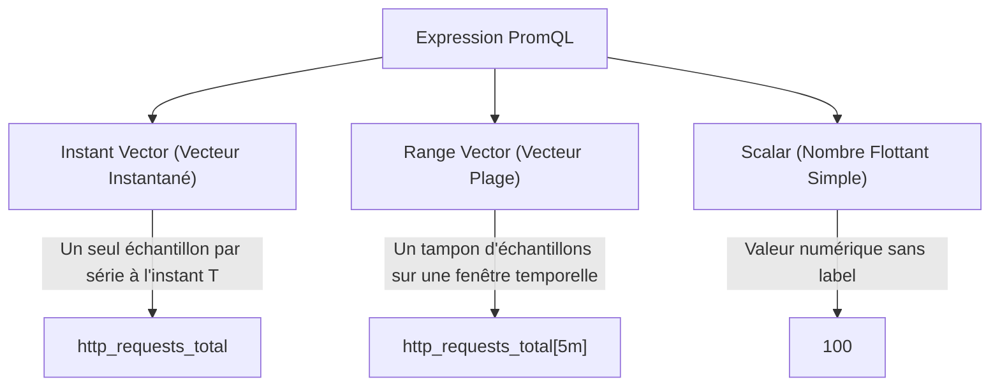
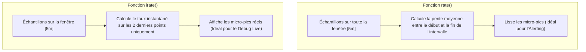
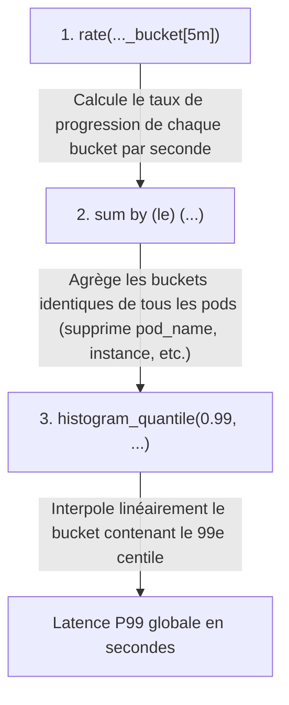

# 05 - Requêtage Avancé PromQL : Vecteurs, rate() & histogram_quantile()

PromQL (*Prometheus Query Language*) est le langage fonctionnel utilisé pour alimenter les dashboards Grafana et déclencher les alertes d'infrastructure. En entretien technique, les questions théoriques cèdent la place à la pratique : on vous demandera d'écrire ou de corriger des requêtes à la volée.

---

## 1. Types de Données PromQL Fondamentaux

Toute expression PromQL manipule ou renvoie l'un de ces trois types :



| Type | Syntaxe | Affichable directement dans Grafana ? | Usage principal |
|---|---|---|---|
| **Instant Vector** | `up{job="node"}` | **Oui** (Graphique temporel ou jauge) | Visualisation directe, alertes seuil. |
| **Range Vector** | `node_cpu_seconds_total[5m]` | **Non** (Rejeté par Grafana pour un graphique standard) | Entrée obligatoire pour les fonctions de taux (`rate()`, `increase()`). |
| **Scalar** | `0.95` ou `42` | **Oui** (Valeur seuil statique) | Opérations arithmétiques, calculs de pourcentages. |

---

## 2. Le Duel Crucial : `rate()` vs. `irate()`

Ces deux fonctions prennent un *Range Vector* en entrée et retournent un *Instant Vector* représentant un taux par seconde.



### Quand utiliser l'un ou l'autre ?

* **`rate(v[5m])` :** Calcule le taux moyen par seconde sur l'ensemble de la fenêtre de 5 minutes.
  * **Cas d'usage :** Alertmanager et calculs de SLO. Elle évite les faux positifs provoqués par un pic d'une demi-seconde.
* **`irate(v[5m])` :** Calcule le taux instantané basé sur les deux derniers points collectés dans la plage.
  * **Cas d'usage :** Tableaux de bord de troubleshooting haute résolution pour observer l'arrivée exacte d'une charge.

!!! danger "Règle d'or de la taille de fenêtre"
    La fenêtre de temps `[duree]` passée à `rate()` doit valoir **au minimum 4 fois votre intervalle de scrape** (ex: pour un scrape de 15s, utilisez au minimum `[1m]`). Si la fenêtre est trop courte, un scrape raté empêche la fonction d'avoir au moins deux points, retournant une valeur vide (`No Data`).

---

## 3. Calcul de Latence : `histogram_quantile()` Décortiqué

C'est la requête la plus demandée lors des tests techniques SRE :

```promql
histogram_quantile(
  0.99,
  sum by (le) (rate(http_request_duration_seconds_bucket{job="backend-api"}[5m]))
)
```



!!! warning "L'Erreur Éliminatoire en Entretien"
    Si vous écrivez `sum(rate(...)) by (le, pod)`, vous calculez le P99 **par pod individuel**.  
    Si vous oubliez d'inclure le label `le` dans votre `by (le)`, la fonction `histogram_quantile()` échoue ou renvoie `NaN` car elle a besoin de la dimension `le` (*less than or equal*) pour ordonner les compartiments.

---

## 4. Filtrage et Agrégations Multi-Dimensionnelles

### Opérateurs de Labels (Matchs)
* `=` : Égalité stricte (`status="500"`)
* `!=` : Inégalité (`method!="GET"`)
* `=~` : Regex positive (`status=~"500|502|503"`)
* `!~` : Regex négative (`handler!~"/actuator/.*"`)

### Clauses `by` et `without`
* **`by (...)` :** Conserve uniquement les labels listés et agrège le reste.
  ```promql
  # Taux de requêtes par code HTTP
  sum by (status) (rate(http_requests_total[5m]))
  ```
* **`without (...)` :** Supprime les labels listés et conserve tous les autres.
  ```promql
  # Supprime les labels d'instances pour garder une vue d'ensemble par application
  sum without (instance, pod) (rate(http_requests_total[5m]))
  ```

---

## 5. Exemples de Requêtes Prêtes pour la Production

### 1. Utilisation CPU réelle d'un Pod sur Kubernetes (%)
```promql
sum(rate(container_cpu_usage_seconds_total{container="mon-app", image!=""}[5m])) by (pod)
/
sum(container_spec_cpu_quota{container="mon-app"} / 100000) by (pod) * 100
```

### 2. Taux d'Erreurs 5xx relatif (%)
```promql
(
  sum(rate(http_requests_total{status=~"5.."}[5m]))
  /
  sum(rate(http_requests_total[5m]))
) * 100
```

### 3. Saturation Mémoire d'un Nœud Linux (%)
```promql
(
  1 - (node_memory_MemAvailable_bytes / node_memory_MemTotal_bytes)
) * 100
```

---

## 6. Questions d'Entretien Fréquentes

!!! question "Q: Pourquoi ne faut-il jamais utiliser `irate()` dans une règle d'alerte Alertmanager ?"
    `irate()` ne regarde que les deux derniers points d'échantillonnage. Si un pic d'erreur extrêmement bref et isolé survient sur deux points consécutifs, `irate()` atteindra instantanément 100% et déclenchera une alerte fugitive (*alert flapping*). `rate()` lisse l'évolution sur l'intervalle configuré, garantissant que l'alerte ne se déclenche que si l'anomalie persiste dans le temps.

!!! question "Q: Votre requête `sum(http_requests_total)` renvoie une valeur, mais `sum(http_requests_total[5m])` produit une erreur de syntaxe. Pourquoi ?"
    Parce que `sum()` est un opérateur d'agrégation conçu pour opérer sur des **Instant Vectors**. Ajouter `[5m]` transforme la métrique en **Range Vector**. Pour agréger une plage temporelle avec `sum()`, il faut d'abord convertir ce Range Vector en Instant Vector via une fonction de calcul temporel comme `rate()` ou `increase()` (ex: `sum(rate(http_requests_total[5m]))`).