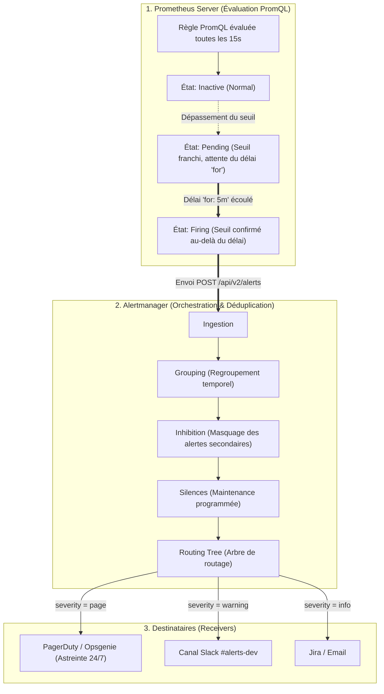
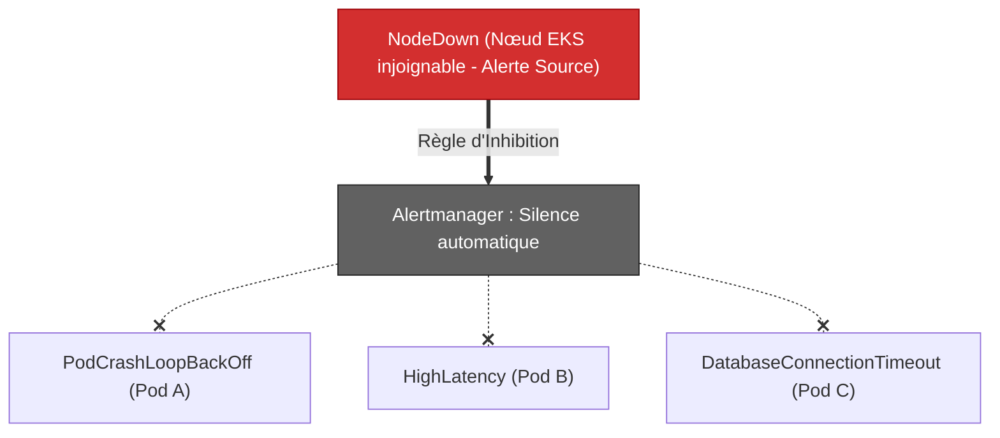
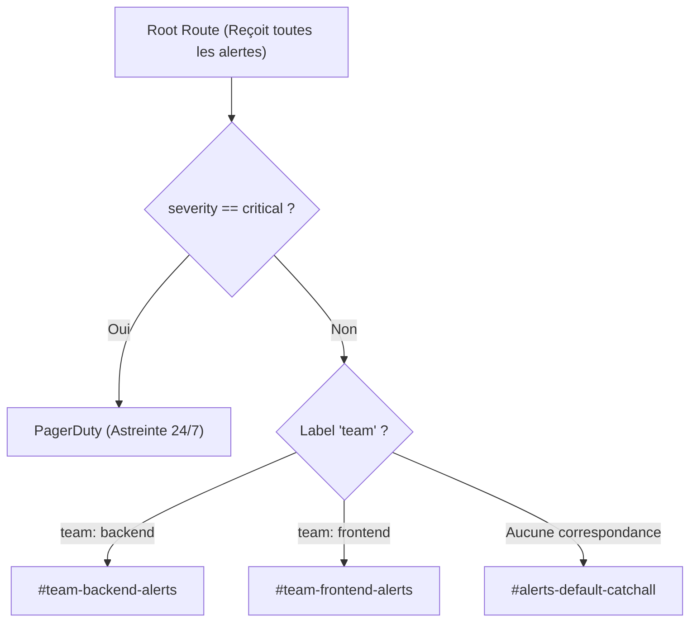

# 06 - Alertmanager : Architecture, Routing, Inhibition & Silences

In production, the worst enemy of an engineering team is not the absence of alerts, but **Alert Fatigue**. If an engineer receives 40 Slack notifications a night for false positives, no one will look at the alerts the day the database actually collapses. This chapter details how **Alertmanager** intelligently filters, deduplicates and routes alerts.

---

## 1. Alert Life Cycle: From Prometheus to PagerDuty

An alert never goes directly from Prometheus to your phone. Prometheus calculates logical rules, then delegates all operational management to **Alertmanager**.



---

## 2. Anatomy of an Alert Rule (`PrometheusRule`)

Here is an alert rule declared as a Custom Resource Definition (CRD) for the Prometheus Operator Kubernetes:

```yaml
apiVersion: [monitoring.coreos.com/v1](https://monitoring.coreos.com/v1)
kind: PrometheusRule
metadata:
  name: backend-alerts
  namespace: monitoring
  labels:
    role: alert-rules
spec:
  groups:
    - name: api-workload-alerts
      interval: 30s
      rules:
        - alert: HighHttpErrorRate5xx
          expr: |
            (
              sum(rate(http_requests_total{status=~"5.."}[5m]))
              /
              sum(rate(http_requests_total[5m]))
            ) * 100 > 5
          for: 5m
          labels:
            severity: critical
            team: backend
          annotations:
            summary: "Taux d'erreurs 5xx supérieur à 5% sur {{ $labels.job }}"
            description: "Le service subit actuellement {{ printf \"%.2f\" $value }}% d'erreurs HTTP 5xx depuis plus de 5 minutes."
            runbook_url: "[https://wiki.corp/runbooks/api-5xx](https://wiki.corp/runbooks/api-5xx)"
```

!!! danger "The Vital Importance of Delay `for: 5m`"
Never remove the `for` field on a traffic alert. Without this parameter, a simple transient error spike lasting 3 seconds will instantly switch the alert to `Firing` status and wake up the on-call engineer for no valid reason (*Alert Flapping*).

---

## 3. The Three Key Mechanisms of Alertmanager

Alertmanager uses three distinct features to filter noise:

### 1. Grouping
When a Kubernetes node goes down, 20 pods can crash simultaneously. Without grouping, you would receive 20 separate notifications.
* **`group_by` :** Merges alerts sharing the same labels (eg: `['alertname', 'cluster', 'service']`) into a single summary message.
* **`group_wait` :** Waiting time (eg: `30s`) before sending the first notification in order to aggregate near-simultaneous alerts.
* **`group_interval` :** Interval (eg: `5m`) before sending a batch of new alerts arriving in the same group.
* **`repeat_interval` :** Delay (ex: `4h`) before sending a reminder notification for an alert that always remains in `Firing` state.

### 2. Inhibition (Cascade Inhibition)
Muting mutes an alert if another, more critical alert, on which it directly depends, is already triggered.



**Configuration example in `alertmanager.yml`:**```yaml
inhibit_rules:
  - source_match:
      alertname: 'NodeDown'
      severity: 'critical'
    target_match:
      severity: 'warning'
    equal: ['node', 'instance']
```*If the physical node is down, all `warning` level alerts coming from this same machine are intercepted and nipped in the bud.*

### 3. Silences (Scheduled Mute)
A silence is a temporary pause of notifications (created via the Alertmanager UI or the `amtool` CLI).
* **Use case:** Major production deployment, database migration or planned hardware maintenance.
* Alerts continue to be evaluated in Prometheus, but Alertmanager cuts transmission to webhooks/Slack.

---

## 4. Configuring a Multi-Team Routing Tree

Alertmanager processes alerts through a hierarchical tree:



```yaml
route:
  receiver: 'slack-default'
  group_by: ['alertname', 'namespace']
  group_wait: 30s
  group_interval: 5m
  repeat_interval: 4h
  
  routes:
    # 1. Alertes critiques acheminées vers PagerDuty
    - match:
        severity: critical
      receiver: 'pagerduty-high-priority'
      continue: true # Continue l'évaluation pour notifier aussi Slack
      
    # 2. Routage par équipe vers leurs canaux Slack dédiés
    - match:
        team: backend
      receiver: 'slack-backend'
      
    - match:
        team: frontend
      receiver: 'slack-frontend'

receivers:
  - name: 'slack-default'
    slack_configs:
      - channel: '#alerts-unassigned'
        send_resolved: true

  - name: 'slack-backend'
    slack_configs:
      - channel: '#alerts-backend'
        send_resolved: true

  - name: 'pagerduty-high-priority'
    pagerduty_configs:
      - service_key: 'SECRET_PAGERDUTY_TOKEN'
        send_resolved: true
```

!!! success "The `send_resolved: true` parameter"
Always configure `send_resolved: true`. This automatically sends a green notification when the incident is closed (`Resolved`), saving your colleagues from having to log in on an issue that has already been resolved.

---

## 5. Frequently Asked Interview Questions

!!! question "Q: What is the purpose of the `continue: true` parameter in the Alertmanager routing tree?"
By default, when an alert matches a subroute, Alertmanager stops and does not evaluate subsequent branches. Adding `continue: true` forces Alertmanager to continue evaluating in the routing tree, allowing for example to simultaneously send a PagerDuty call for a critical alert while posting a summary message to a team Slack channel.

!!! question "Q: How do you test or validate the syntax of your alert rules and routes before pushing them into production?"
We use the official command line tool **`promtool`** in the CI/CD pipeline (eg: `promtool check rules rules.yaml` to test the syntax and run unit tests on PromQL expressions) as well as **`amtool check-config alertmanager.yaml`** to validate the Alertmanager configuration before its deployment.