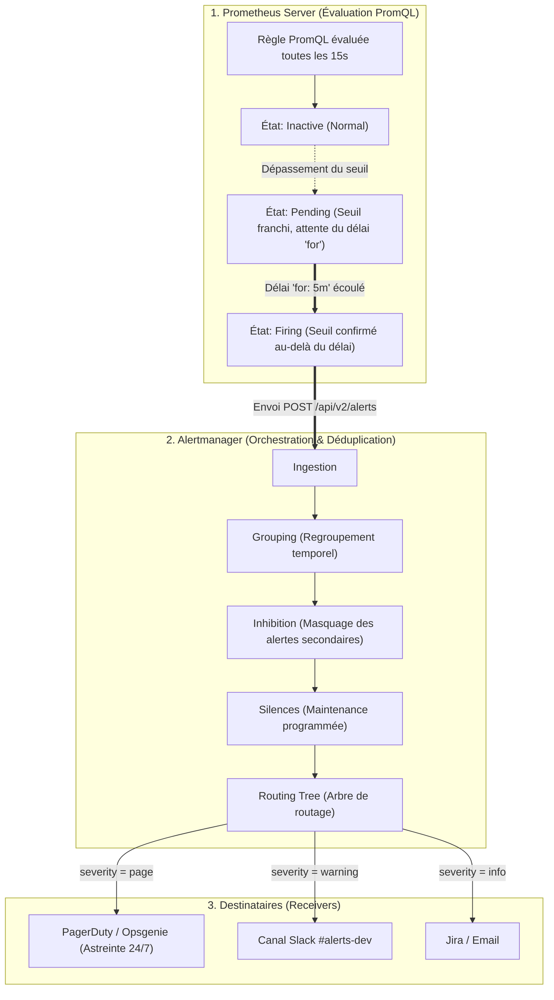
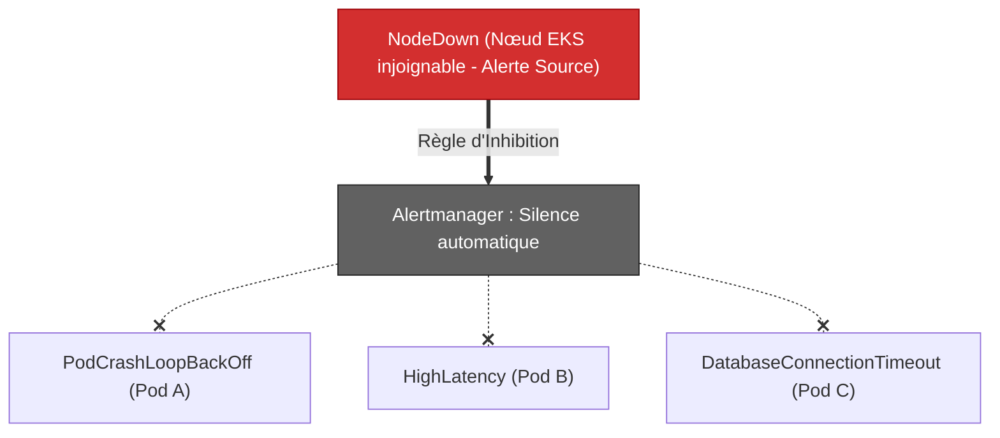
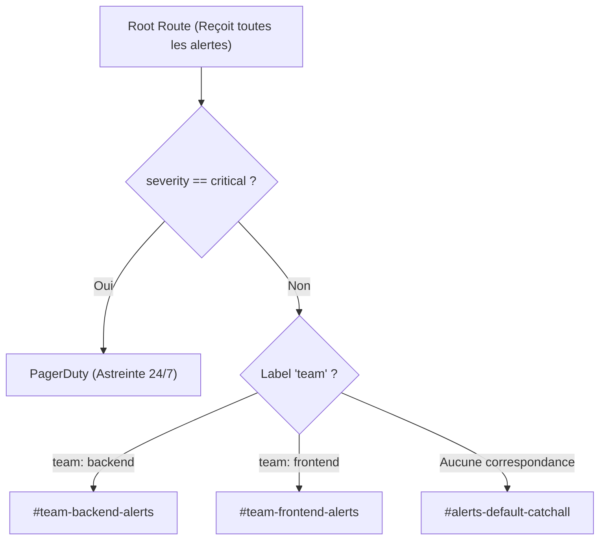

# 06 - Alertmanager : Architecture, Routing, Inhibition & Silences

En production, le pire ennemi d'une équipe d'ingénierie n'est pas l'absence d'alertes, mais la **fatigue d'alerte** (*Alert Fatigue*). Si un ingénieur reçoit 40 notifications Slack par nuit pour des faux positifs, plus personne ne regardera les alertes le jour où la base de données s'effondrera réellement. Ce chapitre détaille comment **Alertmanager** filtre, déduplique et achemine intelligemment les alertes.

---

## 1. Cycle de Vie d'une Alerte : De Prometheus à PagerDuty

Une alerte ne part jamais directement de Prometheus vers votre téléphone. Prometheus calcule des règles logiques, puis délègue toute la gestion opérationnelle à **Alertmanager**.



---

## 2. Anatomie d'une Règle d'Alerte (`PrometheusRule`)

Voici une règle d'alerte déclarée sous forme de Custom Resource Definition (CRD) pour le Prometheus Operator Kubernetes :

```yaml
apiVersion: [monitoring.coreos.com/v1](https://monitoring.coreos.com/v1)
kind: PrometheusRule
metadata:
  name: backend-alerts
  namespace: monitoring
  labels:
    role: alert-rules
spec:
  groups:
    - name: api-workload-alerts
      interval: 30s
      rules:
        - alert: HighHttpErrorRate5xx
          expr: |
            (
              sum(rate(http_requests_total{status=~"5.."}[5m]))
              /
              sum(rate(http_requests_total[5m]))
            ) * 100 > 5
          for: 5m
          labels:
            severity: critical
            team: backend
          annotations:
            summary: "Taux d'erreurs 5xx supérieur à 5% sur {{ $labels.job }}"
            description: "Le service subit actuellement {{ printf \"%.2f\" $value }}% d'erreurs HTTP 5xx depuis plus de 5 minutes."
            runbook_url: "[https://wiki.corp/runbooks/api-5xx](https://wiki.corp/runbooks/api-5xx)"
```

!!! danger "L'Importance Vitale du Délai `for: 5m`"
    Ne supprimez jamais le champ `for` sur une alerte de trafic. Sans ce paramètre, un simple pic d'erreurs transitoire durant 3 secondes basculera instantanément l'alerte en statut `Firing` et réveillera l'ingénieur d'astreinte sans raison valable (*Alert Flapping*).

---

## 3. Les Trois Mécanismes Clés d'Alertmanager

Alertmanager utilise trois fonctionnalités distinctes pour filtrer le bruit :

### 1. Grouping (Regroupement)
Lorsqu'un nœud Kubernetes tombe, 20 pods peuvent crasher simultanément. Sans regroupement, vous recevriez 20 notifications distinctes.
* **`group_by` :** Fusionne les alertes partageant les mêmes labels (ex: `['alertname', 'cluster', 'service']`) dans un seul message récapitulatif.
* **`group_wait` :** Temps d'attente (ex: `30s`) avant d'expédier la première notification afin d'agréger les alertes quasi-simultanées.
* **`group_interval` :** Intervalle (ex: `5m`) avant d'envoyer un lot de nouvelles alertes arrivées dans le même groupe.
* **`repeat_interval` :** Délai (ex: `4h`) avant de renvoyer une notification de rappel pour une alerte qui reste toujours en état `Firing`.

### 2. Inhibition (Inhibition de Cascade)
L'inhibition met en sourdine une alerte si une autre alerte plus critique, dont elle dépend directement, est déjà déclenchée.



**Exemple de configuration dans `alertmanager.yml` :**
```yaml
inhibit_rules:
  - source_match:
      alertname: 'NodeDown'
      severity: 'critical'
    target_match:
      severity: 'warning'
    equal: ['node', 'instance']
```
*Si le nœud physique est tombé, toutes les alertes de niveau `warning` provenant de cette même machine sont interceptées et tues dans l'œuf.*

### 3. Silences (Mise en Sourdine Programmée)
Un silence est une mise en pause temporaire des notifications (créée via l'UI Alertmanager ou la CLI `amtool`).
* **Cas d'usage :** Déploiement majeur en production, migration de base de données ou maintenance matérielle planifiée.
* Les alertes continuent d'être évaluées dans Prometheus, mais Alertmanager coupe la transmission vers les webhooks/Slack.

---

## 4. Configuration d'un Arbre de Routage Multi-Équipes

Alertmanager traite les alertes à travers un arbre hiérarchique :



```yaml
route:
  receiver: 'slack-default'
  group_by: ['alertname', 'namespace']
  group_wait: 30s
  group_interval: 5m
  repeat_interval: 4h
  
  routes:
    # 1. Alertes critiques acheminées vers PagerDuty
    - match:
        severity: critical
      receiver: 'pagerduty-high-priority'
      continue: true # Continue l'évaluation pour notifier aussi Slack
      
    # 2. Routage par équipe vers leurs canaux Slack dédiés
    - match:
        team: backend
      receiver: 'slack-backend'
      
    - match:
        team: frontend
      receiver: 'slack-frontend'

receivers:
  - name: 'slack-default'
    slack_configs:
      - channel: '#alerts-unassigned'
        send_resolved: true

  - name: 'slack-backend'
    slack_configs:
      - channel: '#alerts-backend'
        send_resolved: true

  - name: 'pagerduty-high-priority'
    pagerduty_configs:
      - service_key: 'SECRET_PAGERDUTY_TOKEN'
        send_resolved: true
```

!!! success "Le paramètre `send_resolved: true`"
    Configurez toujours `send_resolved: true`. Cela envoie automatiquement une notification verte lorsque l'incident est clos (`Resolved`), évitant à vos collègues de se connecter sur un problème déjà résolu.

---

## 5. Questions d'Entretien Fréquentes

!!! question "Q: À quoi sert le paramètre `continue: true` dans l'arbre de routage d'Alertmanager ?"
    Par défaut, lorsqu'une alerte correspond à une sous-route, Alertmanager s'arrête et n'évalue pas les branches suivantes. L'ajout de `continue: true` force Alertmanager à poursuivre l'évaluation dans l'arbre de routage, ce qui permet par exemple d'envoyer simultanément un appel PagerDuty pour une alerte critique tout en postant un message récapitulatif dans un canal Slack d'équipe.

!!! question "Q: Comment testez-vous ou validez-vous la syntaxe de vos règles d'alerte et routes avant de les pousser en production ?"
    On utilise l'outil officiel en ligne de commande **`promtool`** dans le pipeline CI/CD (ex: `promtool check rules rules.yaml` pour tester la syntaxe et exécuter des tests unitaires sur les expressions PromQL) ainsi que **`amtool check-config alertmanager.yaml`** pour valider la configuration d'Alertmanager avant son déploiement.