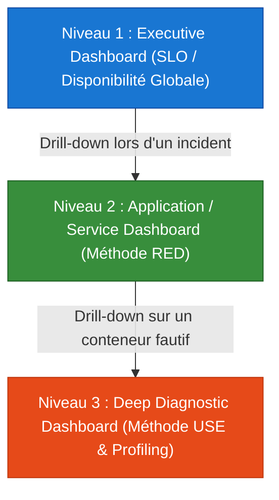
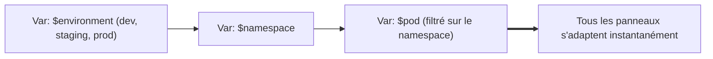
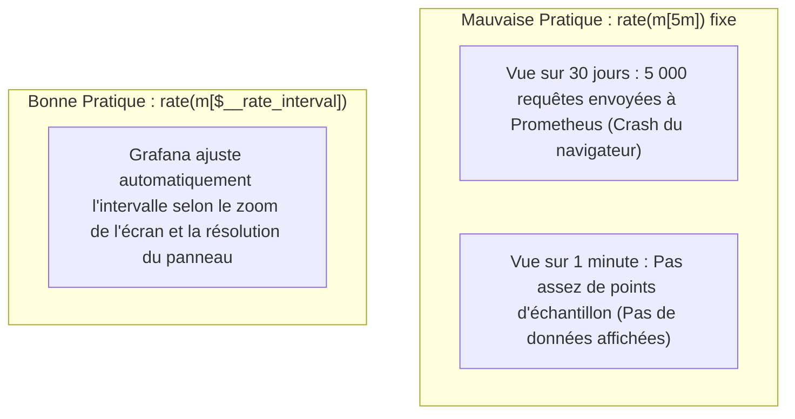
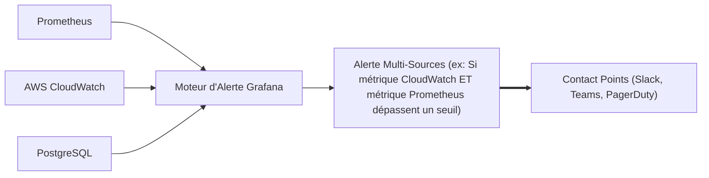

# 07 - Grafana Dashboards & Unified Alerts

Creating a dashboard on Grafana is not about stacking 40 colorful counters. A saturated dashboard slows down browsers, overloads the Prometheus TSDB and makes incident triage unreadable in the middle of a crisis. This chapter addresses the professional design of dashboards: visual hierarchy, PromQL performance optimization and templating variables.

---

## 1. Visual Hierarchy: The 3 Levels of Dashboards

In business, access to information is standardized in three layers of abstraction:



* **Level 1 (Executive / SRE):** Visual intended for managers and on-call staff. Shows overall SLI/SLO, Error Budget consumption, and availability by major AWS region.
* **Level 2 (Service / Dev Team):** Focused on a specific component (ex: `service-paiement`). Structured strictly according to the **RED** (Rate, Errors, Duration) method.
* **Level 3 (Infrastructure & Run):** Intended for deep troubleshooting. Structured according to the **USE** method (CPU Throttling, memory fragmentation, TCP sockets, I/O wait).

---

## 2. Templating Variables: Energize Dashboards

To avoid creating a dashboard by microservice or by environment, we use **Dashboard Variables** to filter on the fly.



### Setting up Variables in Practice:
1. **Variable `$environment` (Custom):** `dev, staging, production`
2. **Variable `$namespace` (Query):**```promql
   label_values(kube_pod_info{environment="$environment"}, namespace)
   ```3. **Variable `$pod` (Dependent Query):**```promql
   label_values(kube_pod_info{namespace="$namespace"}, pod)
   ```

In the dashboard panels, we inject the variables directly into the queries:```promql
sum(rate(container_cpu_usage_seconds_total{namespace="$namespace", pod=~"$pod"}[$__rate_interval])) by (pod)
```

---

## 3. Performance Optimization: The `$__rate_interval` Variable

This is one of the most common traps posed during maintenance on Grafana.



* If you hard-code `[5m]` in your query and zoom out to 90 days, Prometheus will calculate a rate on millions of unnecessary points, freezing the database.
* If you zoom in to 30 seconds, a fixed window of `[5m]` will hide rapid fluctuations.
* **Solution:** Always use `$__rate_interval`. This native Grafana variable is at least `max($__interval + scrape_interval, 4 * scrape_interval)`.

---

## 4. Unified Grafana Alerting (Grafana Alerting)

Historically separate, Grafana now integrates an alert engine capable of evaluating metrics from heterogeneous data sources (Prometheus, CloudWatch, PostgreSQL, Elasticsearch).



### Prometheus Alertmanager vs. Grafana Alerting: Which Tool Should You Choose?

| Criteria | Prometheus Alertmanager | Grafana Alerting |
|---|---|---|
| **Data sources** | Exclusively Prometheus / PromQL. | Multi-sources (CloudWatch, SQL, Loki, Datadog). |
| **GitOps management** | **Ideal:** Simple YAML files versioned via ArgoCD or Helm. | More complex (management via Grafana API or Terraform provider). |
| **Reliability / Architecture** | **Maximum:** Works even if Grafana is completely down. | Dependent on the availability of the Grafana server. |
| **User profile** | DevOps/SRE engineers favoring declarative code. | Product teams or developers preferring a graphical UI. |

!!! tip "Recommended Enterprise Standard"
In production, critical infrastructure alerts (CPU, pod crash, 5xx errors) must be managed directly by **Prometheus and Alertmanager** for resilience reasons. Use Grafana alerts for cross-functional alerts or alerts based on business data (e.g. direct SQL queries on the commercial database).

---

## 5. Frequently Asked Interview Questions

!!! question "Q: Why is it not recommended to enable auto-refresh of a dashboard every 5 seconds in production?"
Each refresh of a complex dashboard re-executes all of the PromQL queries for all its panels on the Prometheus server. If several dozen engineers leave dashboards open to refresh every 5 seconds, this generates an internal denial of service on the Prometheus TSDB, increasing CPU consumption and slowing down the evaluation of priority alert rules. An interval of 30s or 1m is the recommended standard.

!!! question "Q: What is the 'Instant' option in a Grafana panel querying Prometheus?"
By default, Grafana executes *Range Query* type queries (range vectors over the entire duration of the time window to draw curves). By checking the **Instant** option, Grafana sends a simple instantaneous vector query (`/api/v1/query`) at the current time $T$. This is the mandatory and most optimized option for feeding **Stat**, **Gauge** or **Table** type components, avoiding loading the entire time history unnecessarily.