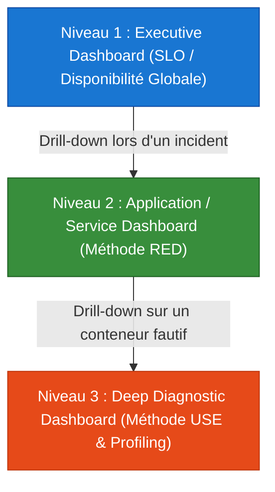
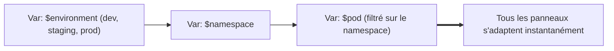
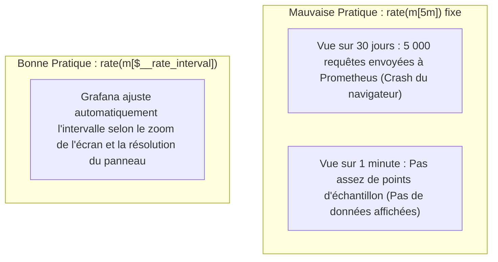
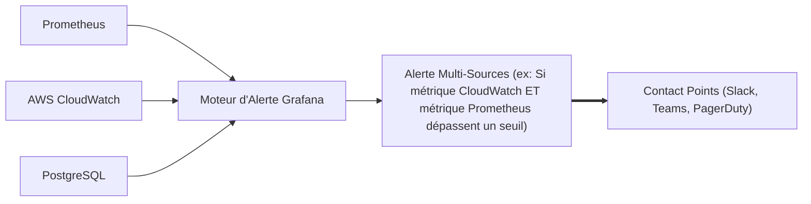

# 07 - Tableaux de Bord Grafana & Alertes Unifiées

Créer un tableau de bord sur Grafana ne consiste pas à empiler 40 compteurs colorés. Un dashboard saturé ralentit les navigateurs, surcharge la TSDB Prometheus et rend le triage d'incident illisible en pleine crise. Ce chapitre aborde la conception professionnelle de dashboards : hiérarchie visuelle, optimisation des performances PromQL et variables de templating.

---

## 1. Hiérarchie Visuelle : Les 3 Niveaux de Dashboards

En entreprise, l'accès à l'information est standardisé en trois couches d'abstraction :



* **Niveau 1 (Executive / SRE) :** Visuel destiné aux managers et aux astreintes. Affiche les SLI/SLO globaux, la consommation de l'Error Budget et la disponibilité par grande région AWS.
* **Niveau 2 (Service / Équipe de dev) :** Centré sur un composant précis (ex: `service-paiement`). Structuré strictement selon la méthode **RED** (Rate, Errors, Duration).
* **Niveau 3 (Infrastructure & Run) :** Destiné au troubleshooting profond. Structuré selon la méthode **USE** (CPU Throttling, fragmentation mémoire, sockets TCP, I/O wait).

---

## 2. Variables de Templating : Dynamiser les Tableaux de Bord

Pour éviter de créer un dashboard par microservice ou par environnement, on utilise les **Variables de Dashboard** afin de filtrer à la volée.



### Configuration des Variables en Pratique :
1. **Variable `$environment` (Custom) :** `dev, staging, production`
2. **Variable `$namespace` (Query) :**
   ```promql
   label_values(kube_pod_info{environment="$environment"}, namespace)
   ```
3. **Variable `$pod` (Query dépendante) :**
   ```promql
   label_values(kube_pod_info{namespace="$namespace"}, pod)
   ```

Dans les panneaux du tableau de bord, on injecte les variables directement dans les requêtes :
```promql
sum(rate(container_cpu_usage_seconds_total{namespace="$namespace", pod=~"$pod"}[$__rate_interval])) by (pod)
```

---

## 3. Optimisation des Performances : La Variable `$__rate_interval`

C'est l'un des pièges les plus fréquents posés en entretien sur Grafana.



* Si vous fixez `[5m]` en dur dans votre requête et que vous dézoomez sur 90 jours, Prometheus va calculer un taux sur des millions de points inutiles, figeant la base de données.
* Si vous zoomez sur 30 secondes, une fenêtre fixe de `[5m]` masquera les fluctuations rapides.
* **Solution :** Toujours utiliser `$__rate_interval`. Cette variable native de Grafana vaut au minimum `max($__interval + scrape_interval, 4 * scrape_interval)`.

---

## 4. Alerting Grafana Unifié (Grafana Alerting)

Historiquement séparé, Grafana intègre désormais un moteur d'alerte capable d'évaluer des métriques provenant de sources de données hétérogènes (Prometheus, CloudWatch, PostgreSQL, Elasticsearch).



### Prometheus Alertmanager vs. Grafana Alerting : Quel Outil Choisir ?

| Critère | Prometheus Alertmanager | Grafana Alerting |
|---|---|---|
| **Sources de données** | Exclusivement Prometheus / PromQL. | Multi-sources (CloudWatch, SQL, Loki, Datadog). |
| **Gestion en GitOps** | **Idéale :** Fichiers YAML simples versionnés via ArgoCD ou Helm. | Plus complexe (gestion via API Grafana ou provider Terraform). |
| **Fiabilité / Architecture** | **Maximale :** Fonctionne même si Grafana est totalement en panne. | Dépendant de la disponibilité du serveur Grafana. |
| **Profil utilisateur** | Ingénieurs DevOps / SRE privilégiant le code déclaratif. | Équipes produit ou développeurs préférant une UI graphique. |

!!! tip "Standard d'Entreprise Recommandé"
    En production, les alertes d'infrastructure critiques (CPU, crash de pods, erreurs 5xx) doivent être gérées directement par **Prometheus et Alertmanager** pour des raisons de résilience. Utilisez les alertes Grafana pour des alertes transverses ou basées sur des données métier (ex: requêtes SQL directes sur la base commerciale).

---

## 5. Questions d'Entretien Fréquentes

!!! question "Q: Pourquoi est-il déconseillé d'activer l'auto-refresh d'un tableau de bord toutes les 5 secondes en production ?"
    Chaque rafraîchissement d'un dashboard complexe réexécute l'intégralité des requêtes PromQL de tous ses panneaux sur le serveur Prometheus. Si plusieurs dizaines d'ingénieurs laissent des dashboards ouverts en rafraîchissement toutes les 5 secondes, cela génère un déni de service interne sur la TSDB de Prometheus, augmentant la consommation CPU et ralentissant l'évaluation des règles d'alerte prioritaires. Un intervalle de 30s ou 1m est le standard recommandé.

!!! question "Q: Qu'est-ce que l'option 'Instant' dans un panneau Grafana interrogeant Prometheus ?"
    Par défaut, Grafana exécute des requêtes de type *Range Query* (vecteurs plages sur toute la durée de la fenêtre temporelle pour tracer des courbes). En cochant l'option **Instant**, Grafana envoie une simple requête vectorielle instantanée (`/api/v1/query`) à l'instant courant $T$. C'est l'option obligatoire et la plus optimisée pour alimenter des composants de type **Stat**, **Gauge** ou **Tableau**, évitant de charger tout l'historique temporel inutilement.