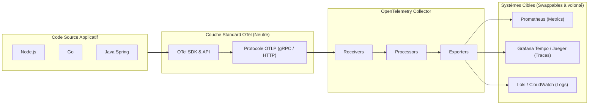
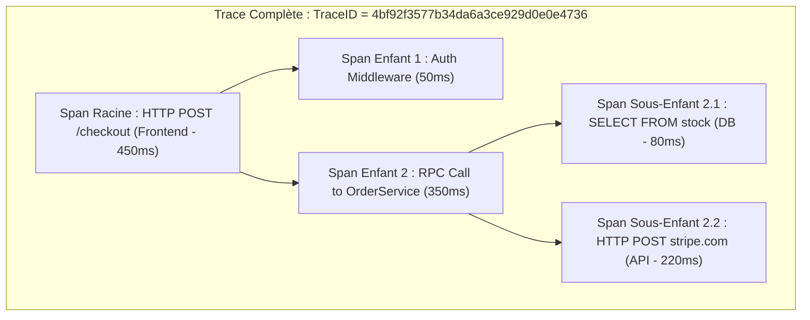
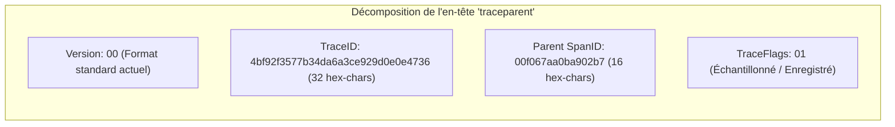
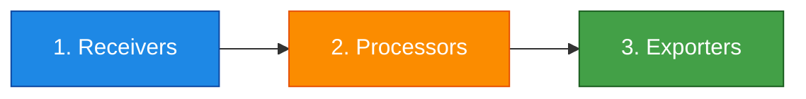
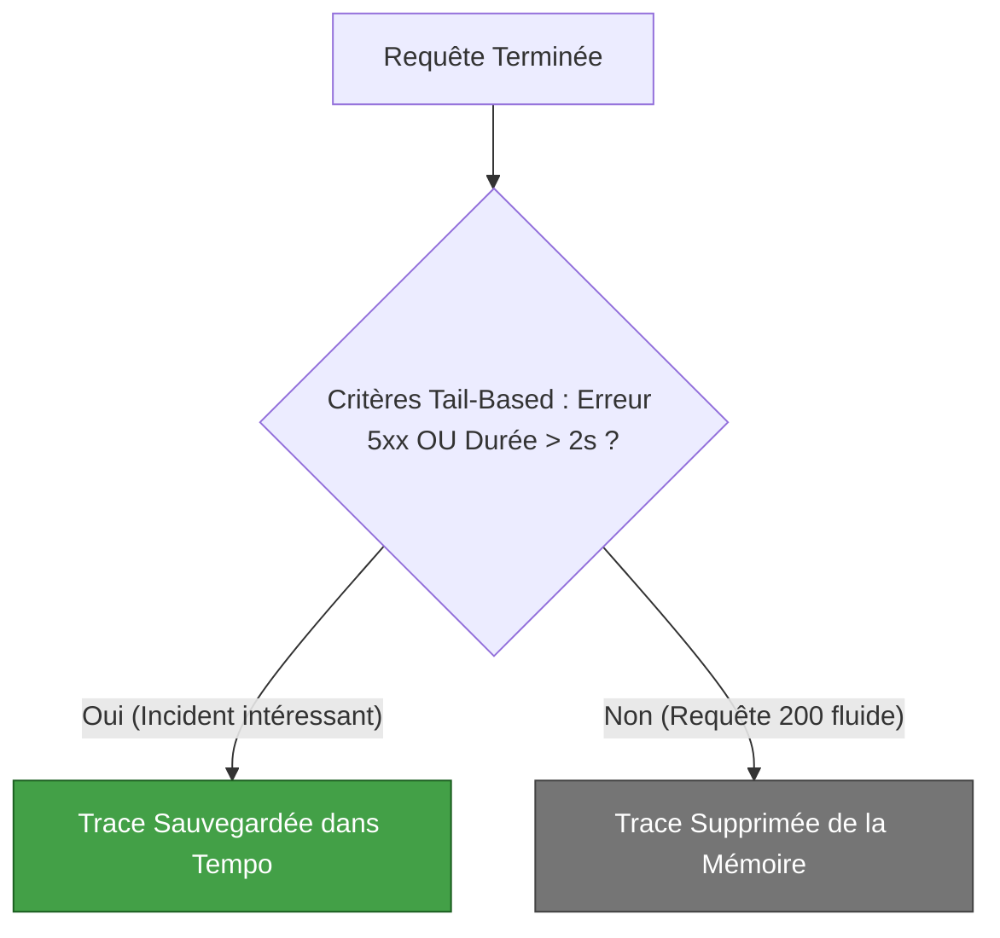

# 08 - OpenTelemetry : Collector, Traces, Spans & Standard W3C

Until recently, instrumenting an application required hard locking: if you were using the New Relic or Datadog agent, changing tools required rewriting the entire telemetry code. **OpenTelemetry (OTel)**, a project incubated by the CNCF resulting from the merger of OpenTracing and OpenCensus, solved this problem. In a Cloud/DevOps interview, you must demonstrate that you understand the strict separation between **code instrumentation** and **data routing**.

---

## 1. Why OpenTelemetry is the New Standard

OpenTelemetry provides an agnostic API and SDK to emit metrics, logs and traces without relying on a software publisher.



!!! success "The OTel Fundamental Principle"
OpenTelemetry **does not store** or **visualize** data. OTel only standardizes the instrumentation, generation and processing pipeline. The data is then exported to your usual backends (Prometheus, Jaeger, CloudWatch, Datadog).

---

## 2. Anatomy of a Distributed Trace: Traces & Spans

A **Trace** represents the complete history of a transaction crossing a distributed network. It is composed of an ordered set of **Spans**.



### What does a Span actually contain?
* **Name:** The operation executed (ex: `SELECT * FROM users WHERE id=?`).
* **TraceID:** Unique global identifier shared by all microservices for this request.
* **SpanID:** Unique identifier specific to this specific operation.
* **ParentSpanID:** Identifier of the span which initiated the call (allows the hierarchical tree to be reconstructed).
* **Timestamps:** Start time and end time (precise measurement of duration).
* **Attributes (Key/Value):** Metadata useful for filtering (eg: `http.status_code=200`, `db.system=postgresql`).
* **Events:** Time-stamped internal milestones (ex: `cache_miss`).

---

## 3. Context Propagation: The W3C Trace Context Standard

For a microservice A to link its trace to microservice B, the `TraceID` must cross network boundaries. The industry uses the **W3C Trace Context** standard injected into HTTP headers:

```text
HTTP/1.1 POST /payment
Host: payment-service.internal
traceparent: 00-4bf92f3577b34da6a3ce929d0e0e4736-00f067aa0ba902b7-01
```



* As soon as the payment microservice reads this `traceparent` header, it knows that it is part of an overall transaction and uses this `TraceID` for its own child spans.

---

## 4. L'Architecture de l'OpenTelemetry Collector

The **OTel Collector** is a standalone binary deployed either as an **Agent (Sidecar / DaemonSet)** on each node, or as a **Central Gateway (Deployment)**.

Its internal pipeline is structured around three inseparable components:



### Example configuration (`otel-collector-config.yaml`):```yaml
receivers:
  otlp:
    protocols:
      grpc:
        endpoint: 0.0.0.0:4317
      http:
        endpoint: 0.0.0.0:4318

processors:
  # Regroupe les données par lot pour réduire la pression réseau
  batch:
    timeout: 1s
    send_batch_size: 1024
  # Filtre ou masque les données sensibles (RGPD / PCI-DSS)
  memory_limiter:
    check_interval: 2s
    limit_percentage: 75
    spike_limit_percentage: 20

exporters:
  # Envoi des métriques à Prometheus
  prometheus:
    endpoint: "0.0.0.0:8889"
  # Envoi des traces distribuées vers Grafana Tempo / Jaeger
  otlp/tempo:
    endpoint: "tempo.monitoring.svc.cluster.local:4317"
    tls:
      insecure: true

service:
  pipelines:
    traces:
      receivers: [otlp]
      processors: [memory_limiter, batch]
      exporters: [otlp/tempo]
    metrics:
      receivers: [otlp]
      processors: [memory_limiter, batch]
      exporters: [prometheus]
```

!!! tip "Why insert a Collector rather than exporting directly?"
The Collector unloads the CPU of your application pods. If your tracing backend (e.g. Datadog or Grafana Tempo) is down, the Collector buffers the data and manages retries without slowing down the business code of your applications.

---

## 5. Échantillonnage : Head-Based vs. Tail-Based Sampling

Tracking 100% of requests from a platform receiving 50,000 requests/second would saturate your disks and explode your cloud bills. **Sampling*** is mandatory.

| Sampling Type | Where does he intervene? | Principe | Inconvenience |
|---|---|---|---|
| **Head-Based Sampling** | Upon entry, through the application SDK. | Decision taken at the start of the request (e.g.: traces 5% of traffic randomly). | **Risk of missing anomalies:** If a rare error occurs in the 95% not tracked, you will never see it. |
| **Tail-Based Sampling** | At the end, by the OTel Collector. | The Collector keeps all spans in buffer and decides to save the trace **only after the response**. | Requires that all spans of the same trace pass through the same Collector node (dedicated router). |



---

## 6. Frequently Asked Interview Questions

!!! question "Q: What is the fundamental difference between OpenTelemetry and Prometheus?"
Prometheus is a complete monitoring system specialized in **numerical metrics**, integrating its own temporal storage (TSDB) and query engine (PromQL). OpenTelemetry is an **ingestion and standardization framework** covering the 3 pillars (metrics, logs and distributed traces). OTel doesn't store data: it collects and converts telemetry before shipping it to storage engines, including Prometheus itself.

!!! question "Q: How does a microservice pass its trace context during an asynchronous call through Apache Kafka?"
The OpenTelemetry SDK serializes the W3C header `traceparent` directly into the Kafka message header metadata when published by the producer. The Kafka consumer extracts these headers when reading the message and starts a new child span having as parent the `SpanID` injected in the message, maintaining the continuity of the trace through the asynchronous files.