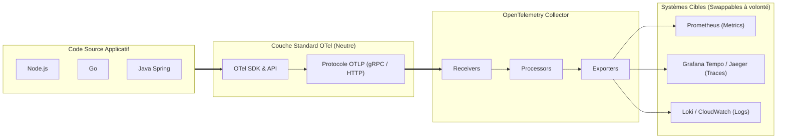
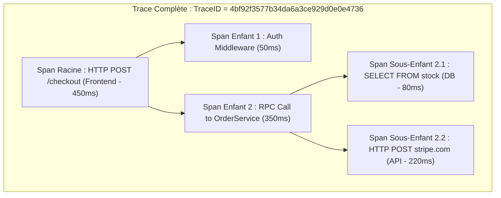
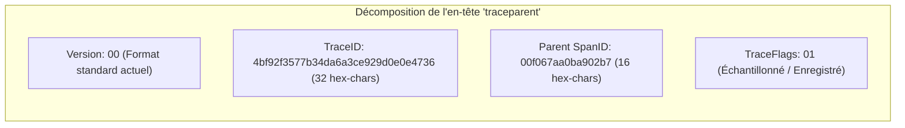
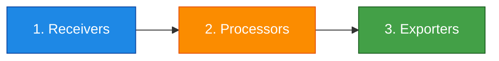
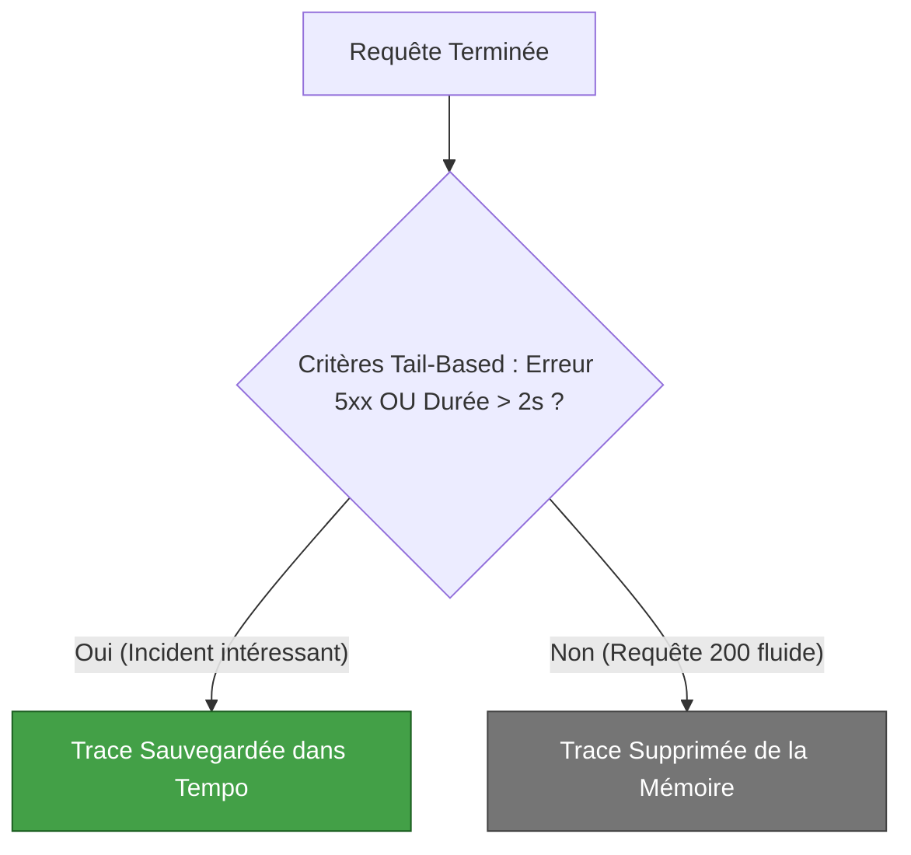

# 08 - OpenTelemetry : Collector, Traces, Spans & Standard W3C

Jusqu'à récemment, instrumenter une application imposait un verrouillage fort : si vous utilisiez l'agent New Relic ou Datadog, changer d'outil exigeait de réécrire l'ensemble du code de télémétrie. **OpenTelemetry (OTel)**, projet incubé par la CNCF issu de la fusion d'OpenTracing et OpenCensus, a résolu ce problème. En entretien Cloud/DevOps, vous devez démontrer que vous comprenez la séparation stricte entre **instrumentation du code** et **routage des données**.

---

## 1. Pourquoi OpenTelemetry est le Nouveau Standard

OpenTelemetry fournit une API et un SDK agnostiques pour émettre métriques, logs et traces sans dépendre d'un éditeur logiciel.



!!! success "Le Principe Fondamental OTel"
    OpenTelemetry **ne stocke pas** et **ne visualise pas** les données. OTel standardise uniquement l'instrumentation, la génération et le pipeline de traitement. Les données sont ensuite exportées vers vos backends habituels (Prometheus, Jaeger, CloudWatch, Datadog).

---

## 2. Anatomie d'une Trace Distribuée : Traces & Spans

Une **Trace** représente l'histoire complète d'une transaction traversant un réseau distribué. Elle est composée d'un ensemble ordonné de **Spans**.



### Qu'est-ce qu'une Span contient concrètement ?
* **Nom :** L'opération exécutée (ex: `SELECT * FROM users WHERE id=?`).
* **TraceID :** Identifiant global unique partagé par tous les microservices pour cette requête.
* **SpanID :** Identifiant unique propre à cette opération spécifique.
* **ParentSpanID :** Identifiant de la span qui a initié l'appel (permet de reconstruire l'arbre hiérarchique).
* **Timestamps :** Heure de début et heure de fin (mesure précise de la durée).
* **Attributes (Key/Value) :** Métadonnées utiles au filtrage (ex: `http.status_code=200`, `db.system=postgresql`).
* **Events :** Jalons internes horodatés (ex: `cache_miss`).

---

## 3. Propagation du Contexte : Le Standard W3C Trace Context

Pour qu'un microservice A puisse lier sa trace au microservice B, le `TraceID` doit franchir les frontières réseau. L'industrie utilise le standard **W3C Trace Context** injecté dans les en-têtes HTTP :

```text
HTTP/1.1 POST /payment
Host: payment-service.internal
traceparent: 00-4bf92f3577b34da6a3ce929d0e0e4736-00f067aa0ba902b7-01
```



* Dès que le microservice de paiement lit cet en-tête `traceparent`, il sait qu'il fait partie d'une transaction globale et utilise ce `TraceID` pour ses propres spans enfants.

---

## 4. L'Architecture de l'OpenTelemetry Collector

L'**OTel Collector** est un binaire autonome déployé soit en tant qu'**Agent (Sidecar / DaemonSet)** sur chaque nœud, soit en tant que **Passerelle Centrale (Deployment)**.

Son pipeline interne s'articule autour de trois composants indissociables :



### Exemple de configuration (`otel-collector-config.yaml`) :
```yaml
receivers:
  otlp:
    protocols:
      grpc:
        endpoint: 0.0.0.0:4317
      http:
        endpoint: 0.0.0.0:4318

processors:
  # Regroupe les données par lot pour réduire la pression réseau
  batch:
    timeout: 1s
    send_batch_size: 1024
  # Filtre ou masque les données sensibles (RGPD / PCI-DSS)
  memory_limiter:
    check_interval: 2s
    limit_percentage: 75
    spike_limit_percentage: 20

exporters:
  # Envoi des métriques à Prometheus
  prometheus:
    endpoint: "0.0.0.0:8889"
  # Envoi des traces distribuées vers Grafana Tempo / Jaeger
  otlp/tempo:
    endpoint: "tempo.monitoring.svc.cluster.local:4317"
    tls:
      insecure: true

service:
  pipelines:
    traces:
      receivers: [otlp]
      processors: [memory_limiter, batch]
      exporters: [otlp/tempo]
    metrics:
      receivers: [otlp]
      processors: [memory_limiter, batch]
      exporters: [prometheus]
```

!!! tip "Pourquoi intercaler un Collector plutôt que d'exporter en direct ?"
    Le Collector décharge le CPU de vos pods applicatifs. Si votre backend de trace (ex: Datadog ou Grafana Tempo) est en panne, le Collector met les données en mémoire tampon et gère les retries sans ralentir le code métier de vos applications.

---

## 5. Échantillonnage : Head-Based vs. Tail-Based Sampling

Tracer 100% des requêtes d'une plateforme recevant 50 000 requêtes/seconde saturerait vos disques et exploserait vos factures cloud. L'**échantillonnage (*Sampling*)** est obligatoire.

| Type d'Échantillonnage | Où intervient-il ? | Principe | Inconvénient |
|---|---|---|---|
| **Head-Based Sampling** | Dès l'entrée, par le SDK applicatif. | Décision prise au début de la requête (ex: trace 5% du trafic au hasard). | **Risque de rater les anomalies :** Si une erreur rare survient sur les 95% non tracés, vous ne la verrez jamais. |
| **Tail-Based Sampling** | À la fin, par l'OTel Collector. | Le Collector garde toutes les spans en tampon et décide de sauvegarder la trace **seulement après la réponse**. | Nécessite que toutes les spans d'une même trace passent par le même nœud Collector (routeur dédié). |



---

## 6. Questions d'Entretien Fréquentes

!!! question "Q: Quelle est la différence fondamentale entre OpenTelemetry et Prometheus ?"
    Prometheus est un système de monitoring complet spécialisé dans les **métriques numériques**, intégrant son propre stockage temporel (TSDB) et son moteur de requête (PromQL). OpenTelemetry est un **framework d'ingestion et de standardisation** couvrant les 3 piliers (métriques, logs et traces distribuées). OTel ne stocke pas les données : il collecte et convertit la télémétrie avant de l'expédier vers des moteurs de stockage, y compris Prometheus lui-même.

!!! question "Q: Comment un microservice transmet-il son contexte de trace lors d'un appel asynchrone via Apache Kafka ?"
    Le SDK OpenTelemetry sérialise l'en-tête W3C `traceparent` directement dans les **métadonnées d'en-tête du message Kafka (Kafka Headers)** lors de la publication par le producer. Le consumer Kafka extrait ces en-têtes à la lecture du message et démarre une nouvelle span enfant ayant pour parent le `SpanID` injecté dans le message, maintenant la continuité de la trace à travers les files asynchrones.