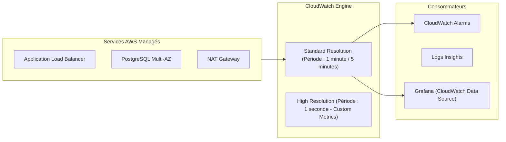
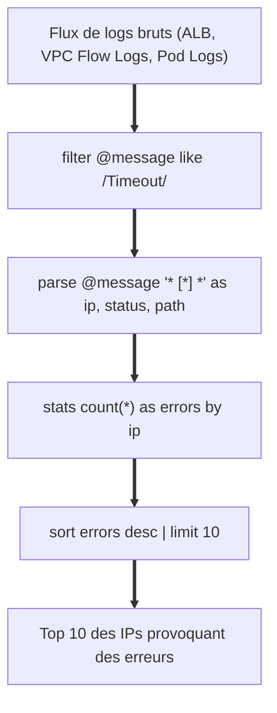
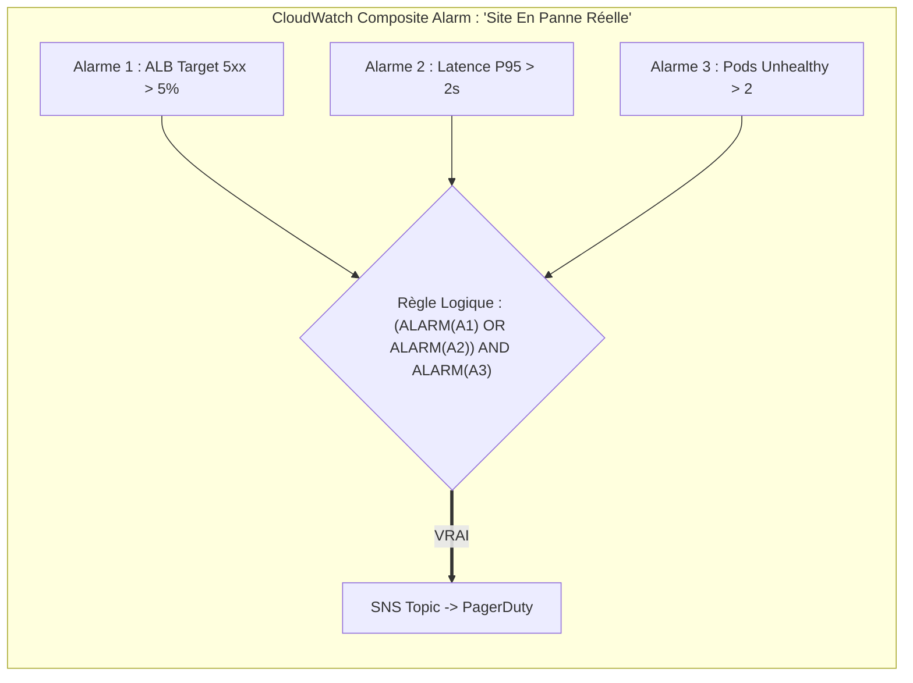
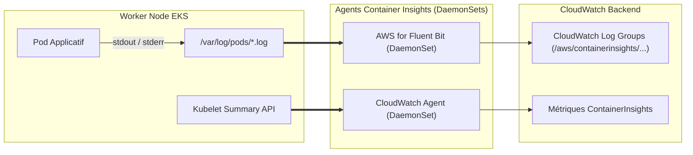

# 09 - Observabilité Native AWS : CloudWatch Metrics, Logs Insights & Alarms

Even if you master the open source stack (Prometheus/Grafana), any Cloud-oriented DevOps position (AWS) requires rigorous operational mastery of **Amazon CloudWatch**. This is the mandatory anchor point for monitoring AWS managed services (ALB, RDS, NAT Gateway, Lambda) whose system guts Prometheus cannot directly scrape.

---

## 1. CloudWatch Metrics: Architecture & Resolution

CloudWatch stores metrics organized by **Namespaces** (e.g.: `AWS/EC2`, `AWS/ApplicationELB`, `AWS/RDS`) and qualified by **Dimensions** (key-value pairs acting as labels).



### Key Metrics to Monitor:

| Service AWS | Critical Metric | Operational Significance | Threshold / Alert type |
|---|---|---|---|
| **ALB** | `HTTPCode_Target_5XX_Count` | Errors generated directly by pods/backends. | > 10 for 2 minutes |
| **ALB** | `HTTPCode_ELB_5XX_Count` | Errors generated by the ALB itself (eg: no healthy targets). | > 0 for 1 minute |
| **RDS** | `CPUUtilization` & `FreeableMemory` | Database instance saturation. | CPU > 80% / RAM < 1 Go |
| **NAT Gateway**| `ErrorPortAllocation` | Exhausting SNAT source ports to egress to the Internet. | > 0 (Critical alert) |

!!! danger "The Classic NAT Gateway Trap in Maintenance"
The NAT Gateway metric `ErrorPortAllocation` indicates that your containers are opening too many simultaneous outgoing connections to the Internet without reusing sockets. New outgoing packets are dropped abruptly, causing silent timeouts on your third-party API calls.

---

## 2. CloudWatch Logs Insights: The Query Language

Raw CloudWatch log files are time-consuming and expensive to navigate through the classic console. **Logs Insights** allows you to run instant interactive queries on terabytes of structured or unstructured logs.



### Essential Logs Insights Queries for Incidents:

#### 1. Extract the 10 slowest requests from the ALB logs```sql
fields @timestamp, request_verb, request_url, target_processing_time
| filter target_processing_time > 1.0
| sort target_processing_time desc
| limit 10
```

#### 2. Detect packet drops in VPC Flow Logs```sql
fields @timestamp, srcAddr, dstAddr, srcPort, dstPort, protocol
| filter action == "REJECT"
| stats count(*) as rejected_packets by srcAddr, dstPort
| sort rejected_packets desc
| limit 20
```

#### 3. Identify SQL connection errors in the logs of an EKS pod```sql
fields @timestamp, @message
| filter @message like /(?i)(connection refused|timeout|pool exhausted)/
| sort @timestamp desc
| limit 50
```

---

## 3. CloudWatch Alarms : Simples vs Composites

CloudWatch alarms control autoscaling and on-call notifications:



### The Two Types of Alarms:
1. **Single Metric Alarm:** Evaluates a single metric against a fixed threshold or dynamic anomaly band (*Anomaly Detection* based on machine learning).
2. **Composite Alarm:** Combines several alarms via Boolean operators (`AND`, `OR`, `NOT`).
   * **Major benefit:** Drastically reduces noise. You only alert the engineer if latency AND error rate increase at the same time.

---

## 4. Container Insights sur EKS (Fluent Bit & CloudWatch Agent)

To monitor an AWS EKS cluster without installing Prometheus, we use the **CloudWatch Container Insights** managed solution.



* **CloudWatch Agent (DaemonSet):** Scrapes low-level metrics from containers (memory, CPU, disk, network) and pushes them as CloudWatch performance metrics.
* **AWS for Fluent Bit (DaemonSet):** Consumes `stdout`/`stderr` streams from all containers written to node disks, enriches the logs with Kubernetes metadata (namespace, pod name, container name) and ships them to CloudWatch Logs.

---

## 5. Frequently Asked Interview Questions

!!! question "Q: On an AWS ALB, what is the vital difference between `HTTPCode_Target_5XX_Count` and `HTTPCode_ELB_5XX_Count`?"
* `HTTPCode_Target_5XX_Count` means that the request was successfully transmitted to your application (pod or container), but **the application code returned a 500, 502 or 503 error**.
    * `HTTPCode_ELB_5XX_Count` means that the problem is **with the ALB itself**. This mainly happens if there are no healthy targets in the Target Group (all pods fail the healthcheck), if the network connection between the ALB and the pods was abruptly cut, or if an associated AWS WAF rule blocked the flow abnormally.

!!! question "Q: How do you prevent storage costs from exploding with CloudWatch Logs in the enterprise?"
By default, CloudWatch Logs keeps logs forever (*Never Expire*), which generates massive bills. Good DevOps practice consists of:
    1. Systematically define an explicit retention policy (eg: 7 to 14 days) via Terraform or AWS CLI on all Log Groups.
    2. Export logs requiring legal or audit archiving to an **Amazon S3** bucket (with transition to Glacier lifecycle), much less expensive than active CloudWatch Logs storage.