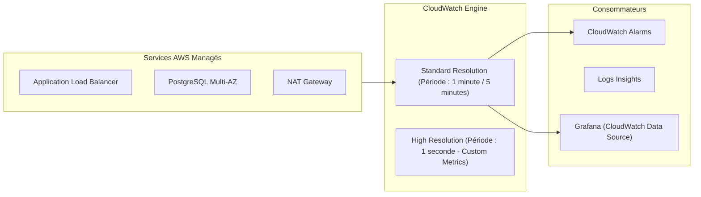
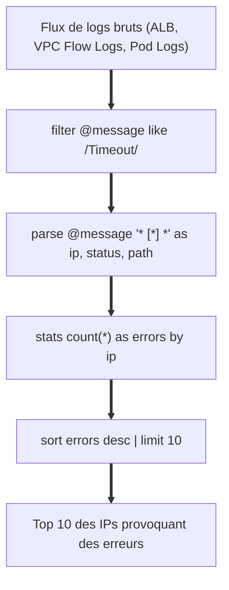
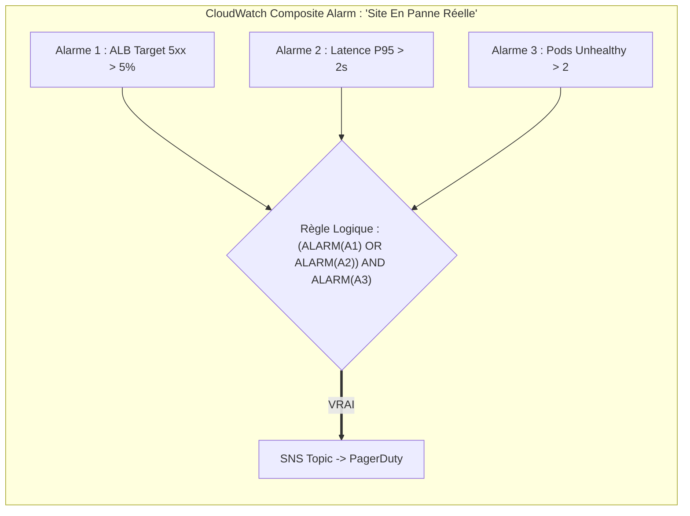
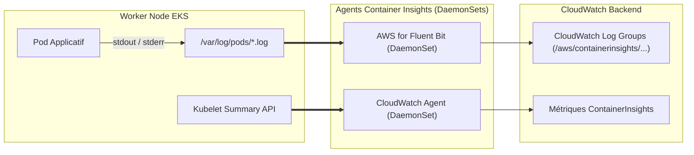

# 09 - Observabilité Native AWS : CloudWatch Metrics, Logs Insights & Alarms

Même si vous maîtrisez la stack open source (Prometheus/Grafana), tout poste DevOps orienté Cloud (AWS) exige une maîtrise opérationnelle rigoureuse d'**Amazon CloudWatch**. C'est le point d'ancrage obligatoire pour surveiller les services managés AWS (ALB, RDS, NAT Gateway, Lambda) dont Prometheus ne peut pas scraper directement les entrailles système.

---

## 1. Métriques CloudWatch : Architecture & Résolution

CloudWatch stocke les métriques organisées par **Namespaces** (ex: `AWS/EC2`, `AWS/ApplicationELB`, `AWS/RDS`) et qualifiées par des **Dimensions** (paires clé-valeur agissant comme des labels).



### Métriques Clés à Surveiller Impérativement :

| Service AWS | Métrique Critique | Signification Opérationnelle | Seuil / Alerte type |
|---|---|---|---|
| **ALB** | `HTTPCode_Target_5XX_Count` | Erreurs générées directement par les pods/backends. | > 10 pendant 2 minutes |
| **ALB** | `HTTPCode_ELB_5XX_Count` | Erreurs générées par l'ALB lui-même (ex: pas de cibles saines). | > 0 pendant 1 minute |
| **RDS** | `CPUUtilization` & `FreeableMemory` | Saturation de l'instance de base de données. | CPU > 80% / RAM < 1 Go |
| **NAT Gateway**| `ErrorPortAllocation` | Épuisement des ports sources SNAT pour sortir vers Internet. | > 0 (Alerte critique) |

!!! danger "Le Piège Classique de la NAT Gateway en Entretien"
    La métrique `ErrorPortAllocation` de la NAT Gateway indique que vos conteneurs ouvrent trop de connexions sortantes simultanées vers Internet sans réutiliser les sockets. Les nouveaux paquets sortants sont rejetés brutalement, causant des timeouts silencieux sur vos appels API tiers.

---

## 2. CloudWatch Logs Insights : Le Langage de Requête

Les fichiers de logs CloudWatch bruts sont longs et coûteux à parcourir via la console classique. **Logs Insights** permet d'exécuter des requêtes interactives instantanées sur des téraoctets de logs structurés ou non structurés.



### Requêtes Logs Insights Indispensables pour les Incidents :

#### 1. Extraire les 10 requêtes les plus lentes depuis les logs d'un ALB
```sql
fields @timestamp, request_verb, request_url, target_processing_time
| filter target_processing_time > 1.0
| sort target_processing_time desc
| limit 10
```

#### 2. Détecter les rejets de paquets dans les VPC Flow Logs
```sql
fields @timestamp, srcAddr, dstAddr, srcPort, dstPort, protocol
| filter action == "REJECT"
| stats count(*) as rejected_packets by srcAddr, dstPort
| sort rejected_packets desc
| limit 20
```

#### 3. Repérer les erreurs de connexions SQL dans les logs d'un pod EKS
```sql
fields @timestamp, @message
| filter @message like /(?i)(connection refused|timeout|pool exhausted)/
| sort @timestamp desc
| limit 50
```

---

## 3. CloudWatch Alarms : Simples vs Composites

Les alarmes CloudWatch pilotent l'autoscaling et les notifications d'astreinte :



### Les Deux Types d'Alarmes :
1. **Alarme Métrique Simple :** Évalue une métrique unique par rapport à un seuil fixe ou une bande d'anomalie dynamique (*Anomaly Detection* basée sur le machine learning).
2. **Alarme Composite :** Combine plusieurs alarmes via des opérateurs booléens (`AND`, `OR`, `NOT`).
   * **Bénéfice majeur :** Réduit drastiquement le bruit. Vous n'alertez l'ingénieur que si la latence ET le taux d'erreur augmentent en même temps.

---

## 4. Container Insights sur EKS (Fluent Bit & CloudWatch Agent)

Pour surveiller un cluster AWS EKS sans installer Prometheus, on utilise la solution managée **CloudWatch Container Insights**.



* **CloudWatch Agent (DaemonSet) :** Scrape les métriques de bas niveau des conteneurs (mémoire, CPU, disque, réseau) et les pousse sous forme de métriques de performance CloudWatch.
* **AWS for Fluent Bit (DaemonSet) :** Consomme les flux `stdout`/`stderr` de tous les conteneurs écrits sur les disques des nœuds, enrichit les logs avec les métadonnées Kubernetes (namespace, pod name, container name) et les expédie vers CloudWatch Logs.

---

## 5. Questions d'Entretien Fréquentes

!!! question "Q: Sur un ALB AWS, quelle est la différence vitale entre `HTTPCode_Target_5XX_Count` et `HTTPCode_ELB_5XX_Count` ?"
    * `HTTPCode_Target_5XX_Count` signifie que la requête a été transmise avec succès à votre application (pod ou conteneur), mais que **le code applicatif a renvoyé une erreur 500, 502 ou 503**.
    * `HTTPCode_ELB_5XX_Count` signifie que le problème se situe **au niveau de l'ALB lui-même**. Cela arrive principalement s'il n'y a aucune cible saine dans le Target Group (tous les pods échouent au healthcheck), si la connexion réseau entre l'ALB et les pods a été coupée brutalement, ou si une règle AWS WAF associée a bloqué le flux de manière anormale.

!!! question "Q: Comment évite-t-on l'explosion des coûts de stockage avec CloudWatch Logs en entreprise ?"
    Par défaut, CloudWatch Logs conserve les logs pour l'éternité (*Never Expire*), ce qui génère des factures massives. La bonne pratique DevOps consiste à :
    1. Définir systématiquement une politique de rétention explicite (ex: 7 à 14 jours) via Terraform ou AWS CLI sur tous les Log Groups.
    2. Exporter les logs nécessitant un archivage légal ou d'audit vers un bucket **Amazon S3** (avec passage en cycle de vie Glacier), beaucoup moins coûteux que le stockage actif de CloudWatch Logs.