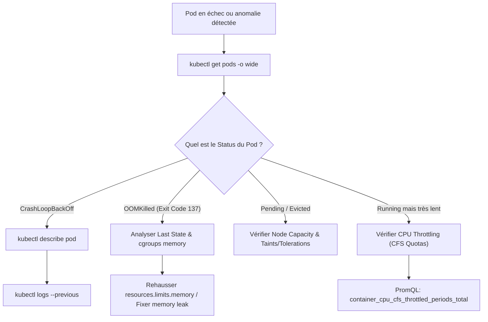
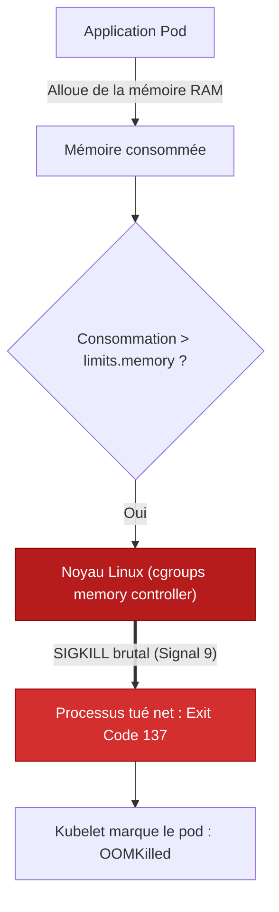
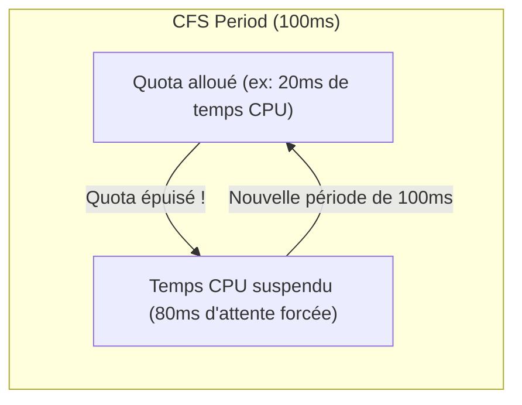

# 10 - Diagnostics Kubernetes : CrashLoopBackOff, OOMKilled & Throttling

In DevOps interview, the examiner rarely tests your ability to recite Kubernetes documentation. It places you in a crisis situation: *"Your pod crashes repeatedly or the application responds 3 seconds late, what is your step by step approach?"*. This chapter dissects the exact anatomy of the three most frequent failures in production.

---

## 1. Kubernetes Diagnostic Decision Tree

When faced with an unstable or faulty pod, systematically follow this investigation sequence:



---

## 2. Anatomy of a CrashLoopBackOff

A pod in **CrashLoopBackOff** is not a container state, but a **Kubelet scheduling state**. The container starts, fails (non-zero exit code), stops, and the Kubelet times out exponentially before restarting it (10s, 20s, 40s... up to 5 minutes).


### Rigorous investigation methodology:

1. **Inspect Pod events:**```bash
   kubectl describe pod <pod-name> -n <namespace>
   ```*Look at the bottom of the `Events:` section. It indicates if a probe (`Liveness probe failed`) forced the pod to stop.*

2. **Read the logs of the container that just collapsed:**```bash
   kubectl logs <pod-name> -n <namespace> --previous
   ```
!!! danger "The `--previous` Trap"
        If you type `kubectl logs <pod-name>` without the `--previous` flag, you read the logs of the instance being restarted, which are often empty or stuck at startup. The `--previous` flag reads the `stdout`/`stderr` outputs from the instance that actually crashed.

3. **The most common root causes in business:**
    - **Missing environment variable:** Bad reference to an `Secret` or an `ConfigMap`.
    - **Network dependency not reachable:** The PostgreSQL database or the Kafka broker is not responding at startup.
    - **File permissions issue:** The container is running with a non-root user (`securityContext.runAsUser: 1000`) and is trying to write to a folder owned by `root`.

---

## 3. OOMKilled: Understanding Exit Code 137

When a container consumes more RAM than the value declared in `resources.limits.memory`, the Linux kernel memory controller (*cgroups*) immediately triggers the **OOM Killer** (Out-Of-Memory Killer).



!!! info "Why is the Exit Code precisely 137?"
Under Linux, when a process is terminated by a POSIX system signal, its exit code is calculated according to the rule:

$$
    	ext{Exit Code} = 128 + ext{Signal Number}
    $$

The OOM Killer sending a **SIGKILL (Signal 9)** signal that cannot be intercepted by the application:

$$
    	ext{Exit Code} = 128 + 9 = 137
    $$

### Detection via PromQL:```promql
# Compteur d'événements OOM par pod
sum(kube_pod_container_status_terminated_reason{reason="OOMKilled"}) by (namespace, pod)
```

---

## 4. CPU Throttling: The Silent Slow Down

Unlike RAM, the CPU is a so-called **compressible** resource. If a container exceeds its memory limit, it is killed. If it exceeds its CPU limit (`resources.limits.cpu`), **it is not killed: it is throttled (restricted)**.



### Internal mechanism: The CFS Quota (Completely Fair Scheduler)
Linux divides processor time into periods of 100 milliseconds (100,000 µs).
* If you define `limits.cpu: "200m"`, you allow the container to use a maximum of 20ms of calculation every 100ms.
* As soon as the container has consumed its 20ms, the Linux kernel **freezes thread execution** for the remaining 80ms.
* **Direct consequence:** The application does not crash, but its latency jumps in an incomprehensible way (eg the P99 goes from 50ms to 350ms).

### Detect Throttling with Prometheus:```promql
# Pourcentage de temps où le conteneur a été bridé
(
  sum(rate(container_cpu_cfs_throttled_periods_total[5m])) by (container, pod)
  /
  sum(rate(container_cpu_cfs_periods_total[5m])) by (container, pod)
) * 100
```

!!! tip "The Engineering Debate: Should we set CPU Limits?"
Many SRE teams recommend setting **`requests.cpu`** (to ensure scheduling on the correct node) but **not setting `limits.cpu`** (or setting them very high) on latency-sensitive microservices, to avoid artificial slowdowns due to CFS quotas.

---

## 5. Summary of Frequent Exit Codes in Maintenance

| Exit Code | Signal Linux | Immediate Meaning | Operational Solution |
|---|---|---|---|
| **0** | None | The process ended successfully (normal for a batch Job, abnormal for a web server). | Verify that the application is not running in the background without a foreground process. |
| **1** | SIGHUP / Generic error | Unhandled application exception, config file not found. | Consult the application logs (`kubectl logs --previous`). |
| **137** | SIGKILL (128 + 9) | OOMKilled (memory overflow) or container forcefully killed by Kubernetes after exceeding the `terminationGracePeriodSeconds`. | Increase `limits.memory` or track down an application memory leak. |
| **143** | TERM (128 + 15) | Clean shutdown requested by Kubernetes (e.g. scaling down, rolling update, rolling restart). | Normal during deployment; ensure that the application manages *Graceful Shutdown*. |

---

## 6. Frequently Asked Interview Questions

!!! question "Q: A Java/Spring Boot pod experiences regular OOMKilled while the Heap JVM (`-Xmx`) is configured under the Kubernetes limit. For what ?"
Because the total memory consumption of a container is not limited to Heap Java. It includes:
    1. The **Non-Heap** zone (Metaspace, Code Cache).
    2. Thread stacks (*Thread Stacks* via `-Xss`).
    3. Native memory allocated via JNI or direct I/O buffers (*Direct ByteBuffers*).  
    If the sum of Heap and native memory exceeds the pod's `resources.limits.memory` value, the Linux kernel kills the entire container via Exit Code 137, even if the JVM's internal Heap memory was not full.

!!! question "Q: How do you distinguish a Liveness Probe failure from a Readiness Probe failure?"
* If the **Liveness Probe** fails, Kubernetes considers the container dead and **restarts the container** (incrementing the restarts counter).
    * If the **Readiness Probe** fails, Kubernetes does NOT restart the container; it immediately removes its IP address from the `Endpoints` of the Kubernetes Service to **stop sending it traffic**, thereby protecting users while it loads its caches or recovers from an overload.