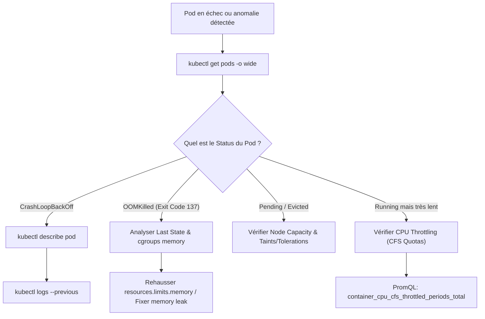
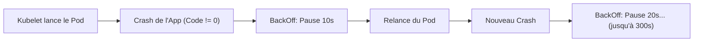
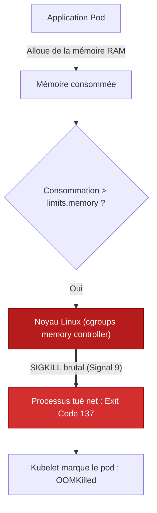
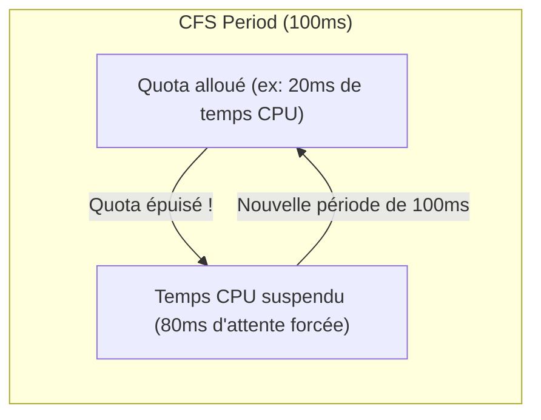

# 10 - Diagnostics Kubernetes : CrashLoopBackOff, OOMKilled & Throttling

En entretien DevOps, l'examinateur teste rarement votre capacité à réciter la documentation Kubernetes. Il vous place en situation de crise : *"Votre pod crashe en boucle ou l'application répond avec 3 secondes de retard, quelle est votre démarche pas à pas ?"*. Ce chapitre décortique l'anatomie exacte des trois pannes les plus fréquentes en production.

---

## 1. Arbre Décisionnel de Diagnostic Kubernetes

Face à un pod instable ou défaillant, suivez systématiquement cette séquence d'investigation :



---

## 2. Anatomie d'un CrashLoopBackOff

Un pod en **CrashLoopBackOff** n'est pas un état de conteneur, mais un **état d'ordonnancement du Kubelet**. Le conteneur démarre, échoue (code de sortie non nul), s'arrête, et le Kubelet temporise exponentiellement avant de le redémarrer (10s, 20s, 40s... jusqu'à 5 minutes).



### Méthodologie d'investigation rigoureuse :

1. **Inspecter les événements du Pod :**
   ```bash
   kubectl describe pod <pod-name> -n <namespace>
   ```
   *Regardez tout en bas la section `Events:`. Elle indique si une sonde (`Liveness probe failed`) a forcé l'arrêt du pod.*

2. **Lire les logs du conteneur qui vient de s'effondrer :**
   ```bash
   kubectl logs <pod-name> -n <namespace> --previous
   ```
   
    !!! danger "Le Piège du `--previous`"
        Si vous tapez `kubectl logs <pod-name>` sans le drapeau `--previous`, vous lisez les logs de l'instance en cours de relance, qui sont souvent vides ou bloqués au démarrage. Le drapeau `--previous` lit les sorties `stdout`/`stderr` de l'instance qui a réellement crashé.

3. **Les causes racines les plus courantes en entreprise :**
    - **Variable d'environnement manquante :** Mauvaise référence vers un `Secret` ou une `ConfigMap`.
    - **Dépendance réseau non joignable :** La base de données PostgreSQL ou le broker Kafka ne répond pas au démarrage.
    - **Problème de permissions de fichiers :** Le conteneur s'exécute avec un utilisateur non root (`securityContext.runAsUser: 1000`) et tente d'écrire sur un dossier appartenant à `root`.

---

## 3. OOMKilled : Comprendre l'Exit Code 137

Lorsqu'un conteneur consomme plus de mémoire vive que la valeur déclarée dans `resources.limits.memory`, le contrôleur mémoire du noyau Linux (*cgroups*) déclenche immédiatement l'**OOM Killer** (Out-Of-Memory Killer).



!!! info "Pourquoi l'Exit Code vaut-il précisément 137 ?"
    Sous Linux, lorsqu'un processus est terminé par un signal système POSIX, son code de sortie est calculé selon la règle :

    $$
    \text{Exit Code} = 128 + \text{Numéro du Signal}
    $$

    L'OOM Killer envoyant un signal **SIGKILL (Signal 9)** non interceptable par l'application :

    $$
    \text{Exit Code} = 128 + 9 = 137
    $$

### Détection via PromQL :
```promql
# Compteur d'événements OOM par pod
sum(kube_pod_container_status_terminated_reason{reason="OOMKilled"}) by (namespace, pod)
```

---

## 4. CPU Throttling : Le Ralentisseur Silencieux

Contrairement à la mémoire vive, le CPU est une ressource dite **compressible**. Si un conteneur dépasse sa limite de mémoire, il est tué. S'il dépasse sa limite de CPU (`resources.limits.cpu`), **il n'est pas tué : il est throttlé (bridé)**.



### Mécanisme interne : Le CFS Quota (Completely Fair Scheduler)
Linux découpe le temps processeur en périodes de 100 millisecondes (100 000 µs).
* Si vous définissez `limits.cpu: "200m"`, vous autorisez le conteneur à utiliser au maximum 20ms de calcul toutes les 100ms.
* Dès que le conteneur a consommé ses 20ms, le noyau Linux **gèle l'exécution des threads** pour les 80ms restantes.
* **Conséquence directe :** L'application ne crashe pas, mais sa latence bondit de façon incompréhensible (ex. le P99 passe de 50ms à 350ms).

### Détecter le Throttling avec Prometheus :
```promql
# Pourcentage de temps où le conteneur a été bridé
(
  sum(rate(container_cpu_cfs_throttled_periods_total[5m])) by (container, pod)
  /
  sum(rate(container_cpu_cfs_periods_total[5m])) by (container, pod)
) * 100
```

!!! tip "Le Débat d'Ingénierie : Faut-il mettre des CPU Limits ?"
    Beaucoup d'équipes SRE recommandent de définir des **`requests.cpu`** (pour garantir l'ordonnancement sur le bon nœud) mais de **ne pas définir de `limits.cpu`** (ou de les fixer très haut) sur des microservices sensibles à la latence, afin d'éviter les ralentissements artificiels dus aux quotas CFS.

---

## 5. Synthèse des Exit Codes Fréquents en Entretien

| Exit Code | Signal Linux | Signification Immédiate | Solution Opérationnelle |
|---|---|---|---|
| **0** | Aucun | Le processus s'est terminé avec succès (normal pour un Job batch, anormal pour un serveur web). | Vérifier que l'application ne s'exécute pas en arrière-plan sans processus foreground. |
| **1** | SIGHUP / Erreur générique | Exception applicative non gérée, fichier de config introuvable. | Consulter les logs de l'application (`kubectl logs --previous`). |
| **137** | SIGKILL (128 + 9) | OOMKilled (dépassement mémoire) ou conteneur tué de force par Kubernetes après dépassement du `terminationGracePeriodSeconds`. | Augmenter `limits.memory` ou traquer une fuite mémoire applicative. |
| **143** | SIGTERM (128 + 15) | Arrêt propre demandé par Kubernetes (ex: scaling down, rolling update, rolling restart). | Normal lors d'un déploiement ; s'assurer que l'application gère le *Graceful Shutdown*. |

---

## 6. Questions d'Entretien Fréquentes

!!! question "Q: Un pod Java/Spring Boot subit un OOMKilled régulier alors que le Heap JVM (`-Xmx`) est configuré sous la limite Kubernetes. Pourquoi ?"
    Parce que la consommation mémoire totale d'un conteneur ne se limite pas au Heap Java. Elle inclut :
    1. La zone **Non-Heap** (Metaspace, Code Cache).
    2. Les piles de threads (*Thread Stacks* via `-Xss`).
    3. La mémoire native allouée via JNI ou les buffers I/O directs (*Direct ByteBuffers*).  
    Si la somme du Heap et de la mémoire native dépasse la valeur `resources.limits.memory` du pod, le noyau Linux tue le conteneur complet via l'Exit Code 137, même si la mémoire Heap interne de la JVM n'était pas pleine.

!!! question "Q: Comment distinguez-vous un échec de Liveness Probe d'un échec de Readiness Probe ?"
    * Si la **Liveness Probe** échoue, Kubernetes considère le conteneur comme mort et **redémarre le conteneur** (incrémentant le compteur de restarts).
    * Si la **Readiness Probe** échoue, Kubernetes ne redémarre PAS le conteneur ; il retire immédiatement son adresse IP des `Endpoints` du Service Kubernetes pour **cesser de lui envoyer du trafic**, protégeant ainsi les utilisateurs pendant qu'il charge ses caches ou qu'il se remet d'une surcharge.