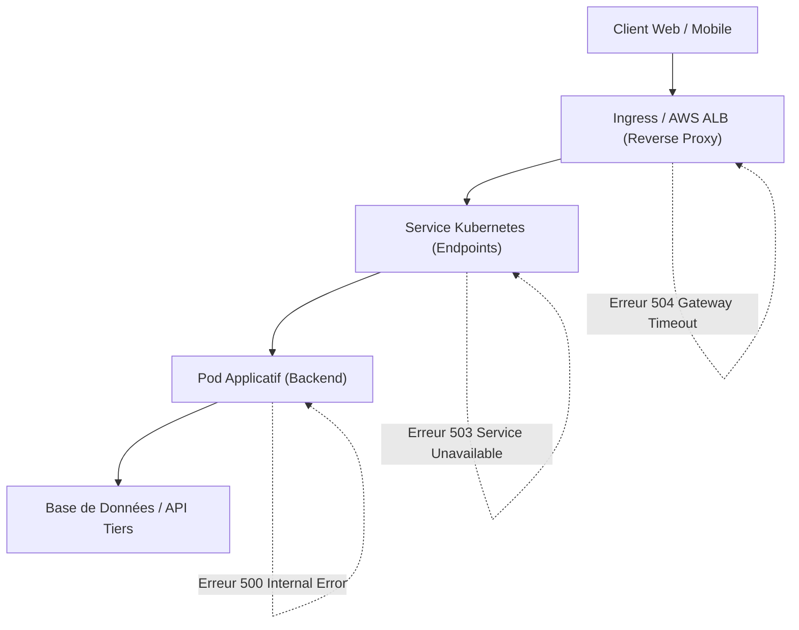
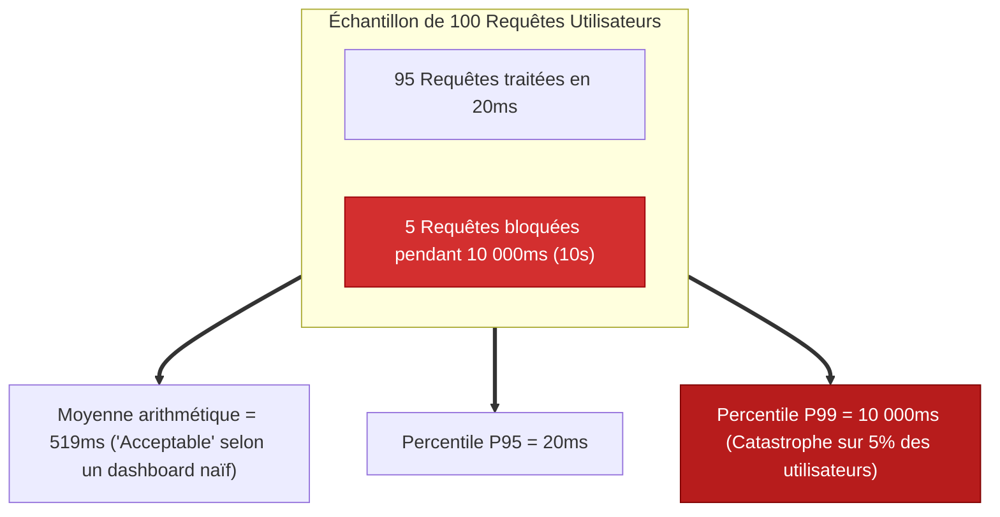
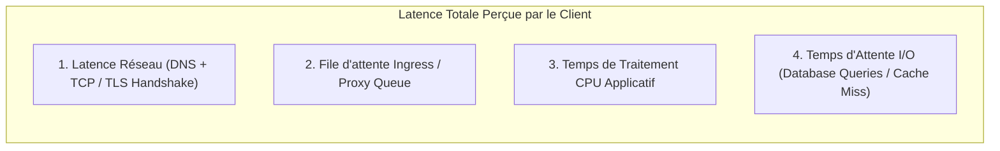
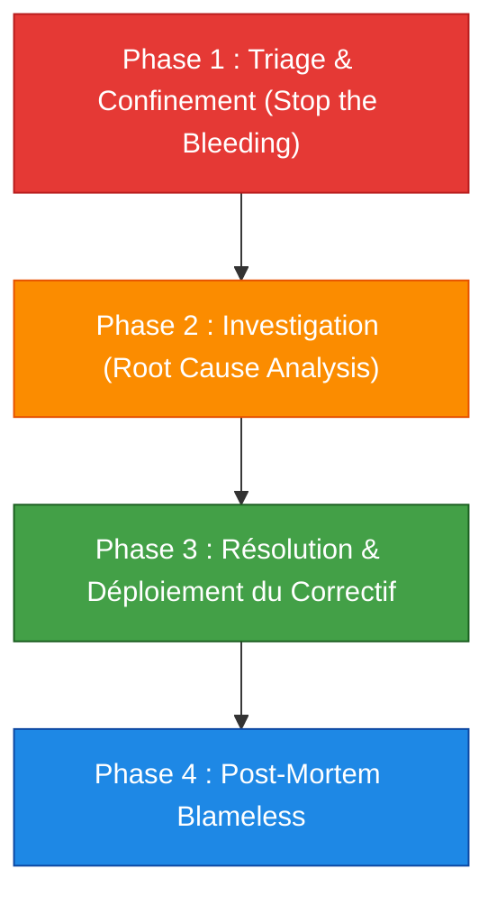

# 11 - Production Triage: P95/P99 Latency, 5xx Codes & Network

During a production incident, a DevOps engineer should not panic. He must act like an emergency doctor: contain the hemorrhage, identify the failing organ, restore service and analyze the root cause cold. This chapter details the mapping of HTTP 5xx error codes and the mathematical method to deconstruct latency degradations.

---

## 1. The HTTP 5xx Error Compass

When a user receives a 5xx error, the framework tells you precisely at which level of the stack the break occurred:



### Typology and Operational Responsibilities

| Code HTTP | Nom | Where is the fault located? | Common Root Cause |
|---|---|---|---|
| **500** | Internal Server Error | **In the application code** | Unhandled exception (`NullPointerException`, script crash, invalid SQL syntax). |
| **502** | Bad Gateway | **At the Reverse Proxy level (ALB/NGINX)** | The pod abruptly closed the TCP connection, crashed during the request, or is not listening on the expected port. |
| **503** | Service Unavailable | **Kubernetes network routing** | Zero pods ready to receive traffic (all pods have failed Readiness Probe or the Service has no endpoints). |
| **504** | Gateway Timeout | **At the Reverse Proxy level (ALB/NGINX)** | The application took longer to respond than the `timeout` configured on the Ingress/ALB (SQL query too slow, external API frozen). |

---

## 2. Deconstructing Latency: Why Average is an Illusion

One of the biggest mistakes in observability is monitoring **average latency**.



### The Role of Percentiles:
* **P50 (Median):** The typical user's experience in the middle of distribution.
* **P95:** 95% of queries run faster than this value. Used for standard navigation SLOs.
* **P99:** 1% of slowest requests (*Long-Tail Latency*). This is often where large customer basket requests, complex synchronizations or thread blockages hide.

### PromQL query to supervise P99:```promql
histogram_quantile(
  0.99,
  sum by (le, service) (rate(http_request_duration_seconds_bucket[5m]))
)
```

---

## 3. Bottleneck Location Matrix

If P99 explodes on an API route, how do we know which link in the chain is responsible?



### Elimination diagnostic protocol:

1. **Check AWS ALB Metrics:**
   * Inspect `TargetResponseTime`: if the time increases, the problem is with the Kubernetes backend. If `TargetResponseTime` is low but the client is waiting, the problem is in the network or TLS termination.
2. **Check the saturation of Workers (Pods):**
   *Are the pods running out of threads? Monitor the application metric of active threads (e.g. `jvm_threads_live_threads` or the Node.js worker pool).
3. **Check the persistence layer:**
   * Is the application waiting for the database? Look at the AWS RDS metrics (`ReadLatency`, `WriteLatency`, `DatabaseConnections`).

---

## 4. Playbook d'Incident Response en 4 Phases

In the event of a critical alert (`P1 / Sev-1`), apply this operational protocol:



### Phase 1: Triage and Containment
* **Objective:** Restore the service immediately for users, even if it means temporarily degrading certain secondary functionalities.
* **Typical actions:** 
  * Do a GitOps rollback to the previous stable commit.
  * Manually increase the number of service replicas (`kubectl scale`).
  * Activate a circuit breaker or deactivate a non-essential feature flag.

### Phase 2: Investigation (Do not erase the evidence!)
* Capture the state of failing pods before destroying them:```bash
  kubectl describe pod <pod-name> > crash-pod-describe.txt
  kubectl logs <pod-name> --previous > crash-pod-logs.txt
  ```* Extract the faulty distributed trace in Grafana Tempo / Jaeger via `TraceID`.

### Phase 3: Resolution
* Apply the patch as Infrastructure as Code (Terraform) or GitOps commit (ArgoCD). Zero manual manipulation on the production cluster.

### Phase 4: Blameless Post-Mortem
* Document the incident chronologically:
  1. *When did the incident start?*
  2. *When was it detected and by what alert?*
  3. *What was the user impact (Error Budget consumption)?*
  4. *What preventive actions (action items) will be taken so that this specific problem becomes impossible to reproduce?*

---

## 5. Frequently Asked Interview Questions

!!! question "Q: Your Ingress NGINX returns 502 errors randomly under heavy load. What is the most common cause?"
The classic cause is a **Keep-Alive Timeout** mismatch between Ingress and the backend application pod. If the backend closes the idle TCP connection after 60 seconds but the Ingress reuses the socket for 65 seconds, the Ingress sends a new request on a connection already closed by the pod, which instantly generates a 502 Bad Gateway error. To correct this, the backend's Keep-Alive Timeout must always be configured with a higher value than that of the Load Balancer / Ingress.

!!! question "Q: Your alerts indicate a global 503 error even though all your pods are in 'Running' status. How is this possible?"
A status `Running` only means that the container is running at the OS level. If the Readiness Probe of these pods fails (for example because the database is no longer responding and the application health check returns an error), Kubernetes immediately removes the IP from all the pods of the `Endpoints` of the Service. Ingress then no longer finds any healthy IP addresses to forward traffic to and responds with an `503 Service Unavailable` error.