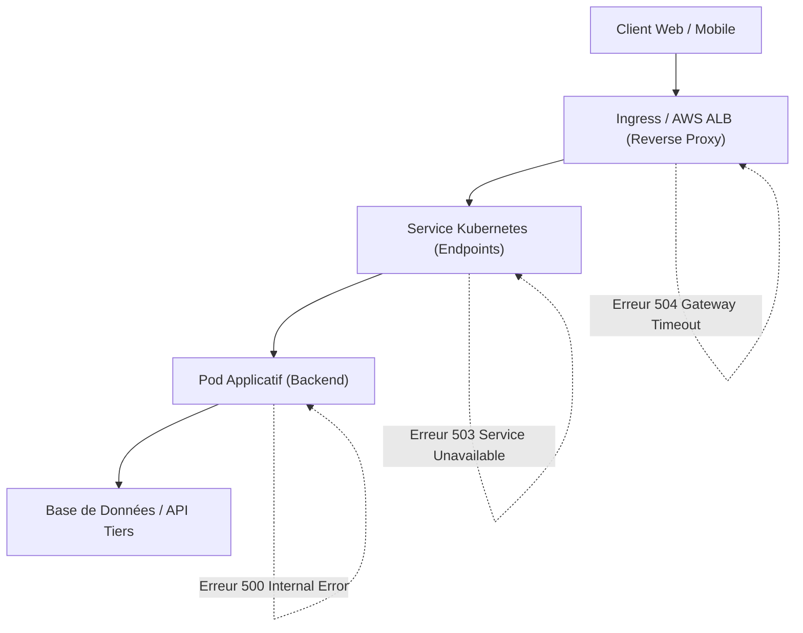
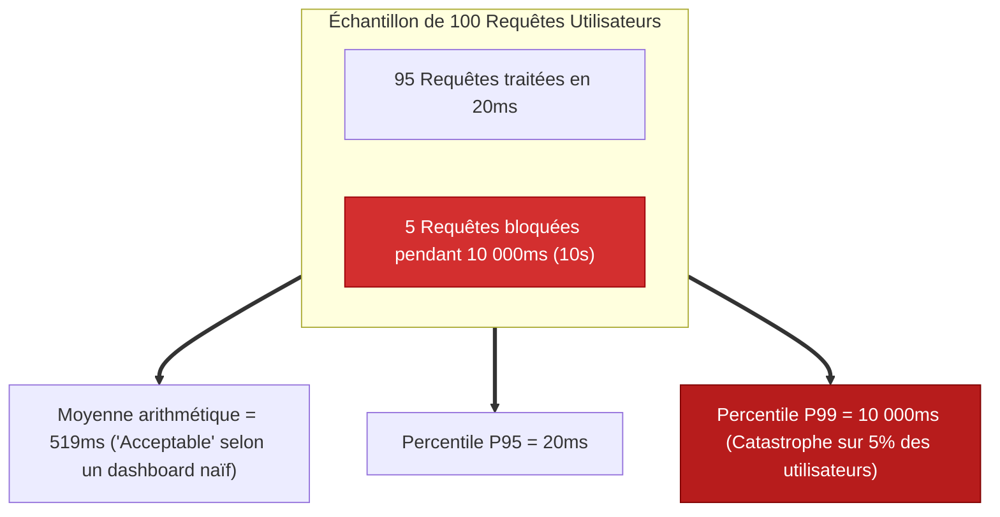
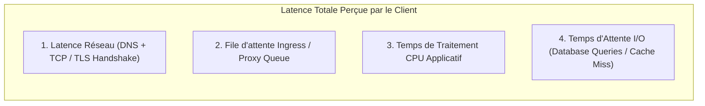
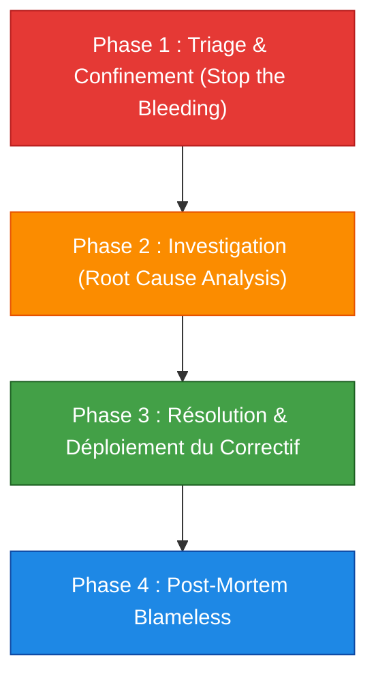

# 11 - Triage de Production : Latence P95/P99, Codes 5xx & Réseau

Lors d'un incident de production, un ingénieur DevOps ne doit pas céder à la panique. Il doit agir comme un urgentiste : contenir l'hémorragie, identifier l'organe défaillant, rétablir le service et analyser la cause racine à froid. Ce chapitre détaille la cartographie des codes d'erreurs HTTP 5xx et la méthode mathématique pour déconstruire les dégradations de latence.

---

## 1. La Boussole des Erreurs HTTP 5xx

Quand un utilisateur reçoit une erreur 5xx, l'infrastructure vous indique précisément à quel niveau de la pile la rupture s'est produite :



### Typologie et Responsabilités Opérationnelles

| Code HTTP | Nom | Où se situe la panne ? | Cause Racine Fréquente |
|---|---|---|---|
| **500** | Internal Server Error | **Dans le code de l'application** | Exception non gérée (`NullPointerException`, crash de script, syntaxe SQL invalide). |
| **502** | Bad Gateway | **Au niveau du Reverse Proxy (ALB/NGINX)** | Le pod a fermé la connexion TCP brutalement, a crashé pendant la requête, ou n'écoute pas sur le port attendu. |
| **503** | Service Unavailable | **Routage réseau Kubernetes** | Zéro pod prêt pour recevoir le trafic (tous les pods sont en échec de Readiness Probe ou le Service n'a pas d'endpoints). |
| **504** | Gateway Timeout | **Au niveau du Reverse Proxy (ALB/NGINX)** | L'application a mis plus de temps à répondre que le `timeout` configuré sur l'Ingress/ALB (requête SQL trop lente, API externe figée). |

---

## 2. Déconstruire la Latence : Pourquoi la Moyenne est une Illusion

L'une des erreurs les plus graves en observabilité consiste à surveiller la **latence moyenne**.



### Le Rôle des Percentiles :
* **P50 (Médiane) :** L'expérience vécue par l'utilisateur type au milieu de la distribution.
* **P95 :** 95% des requêtes s'exécutent plus vite que cette valeur. Utilisé pour les SLOs de navigation standard.
* **P99 :** 1% des requêtes les plus lentes (*Long-Tail Latency*). C'est souvent là que se cachent les requêtes des gros paniers clients, des synchronisations complexes ou des blocages de threads.

### Requête PromQL pour superviser le P99 :
```promql
histogram_quantile(
  0.99,
  sum by (le, service) (rate(http_request_duration_seconds_bucket[5m]))
)
```

---

## 3. Matrice de Localisation des Goulets d'Étranglement

Si le P99 explose sur une route d'API, comment savoir quel maillon de la chaîne est responsable ?



### Protocole de diagnostic par élimination :

1. **Vérifier les métriques de l'ALB AWS :**
   * Inspectez `TargetResponseTime` : si le temps augmente, le problème vient du backend Kubernetes. Si `TargetResponseTime` est faible mais que le client attend, le problème est sur le réseau ou la terminaison TLS.
2. **Vérifier la saturation des Workers (Pods) :**
   * Les pods manquent-ils de threads ? Surveillez la métrique applicative de threads actifs (ex: `jvm_threads_live_threads` ou le worker pool Node.js).
3. **Vérifier la couche de persistance :**
   * L'application attend-elle la base de données ? Regardez les métriques AWS RDS (`ReadLatency`, `WriteLatency`, `DatabaseConnections`).

---

## 4. Playbook d'Incident Response en 4 Phases

En cas d'alerte critique (`P1 / Sev-1`), appliquez ce protocole opérationnel :



### Phase 1 : Triage et Confinement
* **Objectif :** Rétablir le service immédiatement pour les utilisateurs, quitte à dégrader temporairement certaines fonctionnalités secondaires.
* **Actions types :** 
  * Faire un rollback GitOps vers le commit précédent stable.
  * Augmenter manuellement le nombre de réplicas du service (`kubectl scale`).
  * Activer un coupe-circuit (*circuit breaker*) ou désactiver une feature flag non essentielle.

### Phase 2 : Investigation (Ne pas effacer les preuves !)
* Capturer l'état des pods défaillants avant de les détruire :
  ```bash
  kubectl describe pod <pod-name> > crash-pod-describe.txt
  kubectl logs <pod-name> --previous > crash-pod-logs.txt
  ```
* Extraire la trace distribuée fautive dans Grafana Tempo / Jaeger via le `TraceID`.

### Phase 3 : Résolution
* Appliquer le correctif sous forme d'Infrastructure as Code (Terraform) ou de commit GitOps (ArgoCD). Zéro manipulation manuelle sur le cluster de production.

### Phase 4 : Post-Mortem sans Blâme (Blameless Post-Mortem)
* Documenter chronologiquement l'incident :
  1. *Quand l'incident a-t-il commencé ?*
  2. *Quand a-t-il été détecté et par quelle alerte ?*
  3. *Quel a été l'impact utilisateur (consommation d'Error Budget) ?*
  4. *Quelles actions préventives (action items) vont être prises pour que ce problème précis devienne impossible à reproduire ?*

---

## 5. Questions d'Entretien Fréquentes

!!! question "Q: Votre Ingress NGINX renvoie des erreurs 502 de manière aléatoire sous forte charge. Quelle est la cause la plus fréquente ?"
    La cause classique est un décalage de **Keep-Alive Timeout** entre l'Ingress et le pod applicatif backend. Si le backend ferme la connexion TCP inactive après 60 secondes mais que l'Ingress réutilise la socket pendant 65 secondes, l'Ingress envoie une nouvelle requête sur une connexion déjà fermée par le pod, ce qui génère instantanément une erreur 502 Bad Gateway. Pour corriger cela, le Keep-Alive Timeout du backend doit toujours être configuré avec une valeur supérieure à celui du Load Balancer / Ingress.

!!! question "Q: Vos alertes indiquent une erreur 503 globale alors que tous vos pods sont en statut 'Running'. Comment est-ce possible ?"
    Un statut `Running` signifie uniquement que le conteneur tourne au niveau de l'OS. Si la sonde d'aptitude (**Readiness Probe**) de ces pods échoue (par exemple parce que la base de données ne répond plus et que le health check applicatif renvoie une erreur), Kubernetes retire immédiatement l'IP de tous les pods des `Endpoints` du Service. L'Ingress ne trouve alors plus aucune adresse IP saine vers laquelle transférer le trafic et répond avec une erreur `503 Service Unavailable`.