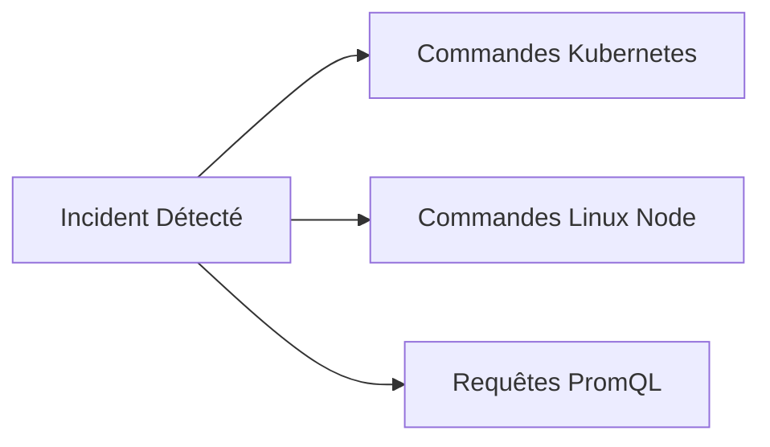

#12 – Interview Cheatsheet & Incident Response Scenarios

This final chapter is your quick revision digest. It summarizes critical commands, essential formulas, pitfalls to avoid and 3 real incident scenarios frequently asked during DevOps / SRE technical interviews.

---

## 1. The Survival Commands Toolbox



### Kubernetes Diagnostic Commands```bash
# 1. Lister les pods non-running ou ayant redémarré
kubectl get pods -A --field-selector=status.phase!=Running

# 2. Inspecter les événements récents triés par heure
kubectl get events -A --sort-by='.lastTimestamp'

# 3. Voir l'état exact du pod et le motif de terminaison (OOMKilled, Probe Failure)
kubectl describe pod <pod-name> -n <namespace>

# 4. Lire les logs de l'instance qui a crashé juste avant la relance
kubectl logs <pod-name> -n <namespace> --previous --tail=100

# 5. Vérifier la consommation instantanée des pods par rapport aux limites
kubectl top pods -n <namespace> --containers
```

### Linux System Diagnostic Commands (EKS/VM Node)```bash
# Vérifier la charge CPU globale et les processus bloqués
uptime && top -b -n 1 | head -n 20

# Vérifier la mémoire réelle disponible et le swap
free -m

# Identifier la saturation I/O disque (colonne %util et avgqu-sz)
iostat -xz 1 5

# Vérifier les ports en écoute et sockets saturées
ss -tulpn

# Examiner les messages de panique du noyau Linux (OOM-Killer, I/O errors)
dmesg -T | grep -E -i "(oom|kill|segfault|error)"
```

---

## 2. Antisèche PromQL : The 5 Queen Queries

```promql
# 1. Taux d'erreurs 5xx relatif (%)
sum(rate(http_requests_total{status=~"5.."}[5m])) / sum(rate(http_requests_total[5m])) * 100

# 2. Latence P99 globale par service (secondes)
histogram_quantile(0.99, sum by (le, job) (rate(http_request_duration_seconds_bucket[5m])))

# 3. Pourcentage de CPU Throttling d'un conteneur (%)
sum(rate(container_cpu_cfs_throttled_periods_total[5m])) / sum(rate(container_cpu_cfs_periods_total[5m])) * 100

# 4. Utilisation Mémoire par rapport à la Limite Kubernetes (%)
sum(container_memory_working_set_bytes{container!=""}) by (pod) / sum(kube_pod_container_resource_limits{resource="memory"}) by (pod) * 100

# 5. Détecter les pods qui redémarrent souvent (Restart Rate)
sum by (namespace, pod) (increase(kube_pod_container_status_restarts_total[1h])) > 3
```

---

## 3. Express Comparison Matrix for Maintenance

| Concept A | Concept B | Key Difference to Formulate |
|---|---|---|
| **Monitoring** | **Observability** | Monitoring says *if* the system is working (external thresholds); observability explains *why* it fails (internal state inferred via M.E.L.T). |
| **SLO** | **SLA** | The SLO is a stricter internal objective to manage the Error Budget; the SLA is an external legal contract with financial penalties. |
| **RED method** | **USE method** | RED (Rate, Errors, Duration) for **application requests**; USE (Utilization, Saturation, Errors) for **hardware/system resources**. |
| **Histogram** | **Summary** | The Histogram allows multi-pod aggregation by calculating quantiles on the Prometheus server; Summary calculates quantiles in the application and cannot be aggregated. |
| **`rate()`** | **`irate()`** | `rate()` calculates a smoothed average over the entire window (mandatory for alerts); `irate()` is based on the last 2 points (live debug of micro-peaks). |
| **OOMKilled** | **CPU Throttled** | Memory overflow = sudden death of the container (Exit Code 137); CPU overflow = forced slowdown without stopping the container. |

---

## 4. Real Interview Incident Response Scenarios

### Scenario 1: The Phantom Deployment
> **Examiner:** *"You are doing a GitOps deployment on Friday afternoon. The dashboard turns red 5 minutes later with 500 errors on the main API. What are you doing?"*

**Expected Structured Response:**

1. **Immediate containment:** I do not start debugging the code in the cluster. I execute a `git revert` on the GitOps repository or I trigger a rollback on ArgoCD to the previous stable version.
2. **Checking return to normal:** I monitor the RED graph (drop in 5xx errors and return to normal traffic).
3. **Cold analysis:** I recover the logs of the faulty container via the log centralization tool (Loki / CloudWatch) with the corresponding commit ID to reproduce the bug in a staging environment.

---

### Scenario 2: The Cluster That Mysteriously Slows Down
> **Reviewer:** *"Our users are complaining about overall slowness. Node and container CPUs are below 35%. Where are you looking?"*

**Expected Structured Response:**

1. **Saturation rather than Utilization (USE Method):** Low CPU load with high latency indicates I/O blocking or concurrency:
   * I check the **CPU Throttling**: do the pods have a too strict limit that restricts their threads?
   * I check the **latency of the storage layer / DB**: slow queries on AWS RDS or saturation of the connection pool (HikariCP / pgBouncer).
2. **Network and DNS:** I test CoreDNS name resolution in the cluster. A saturated CoreDNS adds 2 to 5 seconds of UDP timeout on each call between microservices.
3. **OpenTelemetry traces:** I extract a P99 trace to instantly identify the span that is monopolizing execution time.

---

### Scenario 3: The Cascade Alert at 3 a.m.
> **Reviewer:** *"You receive 120 simultaneous alerts on your phone about 40 different microservices in error. Where do you start?"*

**Expected Structured Response:**

1. **Finding the common cause:** 40 microservices do not fail at the same time by chance. There is a single breaking point in the underlying infrastructure.
2. **Verification of shared pillars:**
   * Has a node or an entire Availability Zone (AZ) fallen? (`kubectl get nodes`).
   * Is the Kubernetes or CoreDNS control plane functional?
   * Is the main Ingress component or the AWS Load Balancer operational?
   * Has there been a TLS certificate renewal or network outage at the VPC / NAT Gateway level?
3. **Continuous Improvement:** After the incident, I configure **muting rules** in Alertmanager so that root component failure automatically mutes secondary alerts from client microservices.