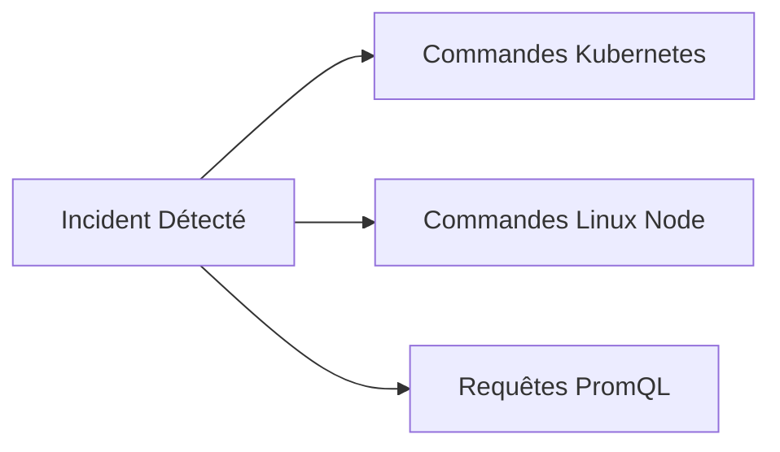

# 12 - Cheatsheet Entretien & Scénarios Incident Response

Ce dernier chapitre est votre condensé de révision rapide. Il synthétise les commandes critiques, les formules indispensables, les pièges à éviter et 3 scénarios d'incident réels fréquemment posés lors des entretiens techniques DevOps / SRE.

---

## 1. La Boîte à Outils des Commandes de Survie



### Commandes de Diagnostic Kubernetes
```bash
# 1. Lister les pods non-running ou ayant redémarré
kubectl get pods -A --field-selector=status.phase!=Running

# 2. Inspecter les événements récents triés par heure
kubectl get events -A --sort-by='.lastTimestamp'

# 3. Voir l'état exact du pod et le motif de terminaison (OOMKilled, Probe Failure)
kubectl describe pod <pod-name> -n <namespace>

# 4. Lire les logs de l'instance qui a crashé juste avant la relance
kubectl logs <pod-name> -n <namespace> --previous --tail=100

# 5. Vérifier la consommation instantanée des pods par rapport aux limites
kubectl top pods -n <namespace> --containers
```

### Commandes de Diagnostic Système Linux (Nœud EKS / VM)
```bash
# Vérifier la charge CPU globale et les processus bloqués
uptime && top -b -n 1 | head -n 20

# Vérifier la mémoire réelle disponible et le swap
free -m

# Identifier la saturation I/O disque (colonne %util et avgqu-sz)
iostat -xz 1 5

# Vérifier les ports en écoute et sockets saturées
ss -tulpn

# Examiner les messages de panique du noyau Linux (OOM-Killer, I/O errors)
dmesg -T | grep -E -i "(oom|kill|segfault|error)"
```

---

## 2. Antisèche PromQL : Les 5 Requêtes Reines

```promql
# 1. Taux d'erreurs 5xx relatif (%)
sum(rate(http_requests_total{status=~"5.."}[5m])) / sum(rate(http_requests_total[5m])) * 100

# 2. Latence P99 globale par service (secondes)
histogram_quantile(0.99, sum by (le, job) (rate(http_request_duration_seconds_bucket[5m])))

# 3. Pourcentage de CPU Throttling d'un conteneur (%)
sum(rate(container_cpu_cfs_throttled_periods_total[5m])) / sum(rate(container_cpu_cfs_periods_total[5m])) * 100

# 4. Utilisation Mémoire par rapport à la Limite Kubernetes (%)
sum(container_memory_working_set_bytes{container!=""}) by (pod) / sum(kube_pod_container_resource_limits{resource="memory"}) by (pod) * 100

# 5. Détecter les pods qui redémarrent souvent (Restart Rate)
sum by (namespace, pod) (increase(kube_pod_container_status_restarts_total[1h])) > 3
```

---

## 3. Matrice Comparatif Express pour l'Entretien

| Concept A | Concept B | Différence Clé à Formuler |
|---|---|---|
| **Monitoring** | **Observabilité** | Le monitoring dit *si* le système marche (seuils externes) ; l'observabilité explique *pourquoi* il échoue (état interne déduit via M.E.L.T). |
| **SLO** | **SLA** | Le SLO est un objectif interne plus strict pour piloter l'Error Budget ; le SLA est un contrat juridique externe assorti de pénalités financières. |
| **Méthode RED** | **Méthode USE** | RED (Rate, Errors, Duration) pour les **requêtes applicatives** ; USE (Utilization, Saturation, Errors) pour les **ressources matérielles/système**. |
| **Histogram** | **Summary** | L'Histogram permet l'agrégation multi-pods en calculant les quantiles sur le serveur Prometheus ; le Summary calcule les quantiles dans l'application et ne peut pas être agrégé. |
| **`rate()`** | **`irate()`** | `rate()` calcule une moyenne lissée sur toute la fenêtre (obligatoire pour alertes) ; `irate()` se base sur les 2 derniers points (debug live de micro-pics). |
| **OOMKilled** | **CPU Throttled** | Dépassement mémoire = mort brutale du conteneur (Exit Code 137) ; dépassement CPU = ralentissement forcé sans arrêt du conteneur. |

---

## 4. Scénarios Réels d'Incident Response en Entretien

### Scénario 1 : Le Déploiement Fantôme
> **Examinateur :** *"Vous faites un déploiement GitOps le vendredi après-midi. Le dashboard passe au rouge 5 minutes plus tard avec des erreurs 500 sur l'API principale. Que faites-vous ?"*

**Réponse Structurée Attendue :**

1. **Confinement immédiat :** Je ne commence pas à debugger le code dans le cluster. J'exécute un `git revert` sur le dépôt GitOps ou je déclenche un rollback sur ArgoCD vers la version précédente stable.
2. **Vérification du retour à la normale :** Je surveille le graphique RED (baisse des erreurs 5xx et reprise du trafic normal).
3. **Analyse à froid :** Je récupère les logs du conteneur défaillant via l'outil de centralisation des logs (Loki / CloudWatch) avec le commit ID correspondant pour reproduire le bug en environnement de staging.

---

### Scénario 2 : Le Cluster qui Ralentit Mystérieusement
> **Examinateur :** *"Nos utilisateurs se plaignent d'une lenteur globale. Les CPU des nœuds et des conteneurs sont à moins de 35%. Où cherchez-vous ?"*

**Réponse Structurée Attendue :**

1. **Saturation plutôt qu'Utilisation (Méthode USE) :** Une charge CPU faible avec une forte latence indique un blocage d'I/O ou de concurrence :
   * Je vérifie le **CPU Throttling** : les pods ont-ils une limite trop stricte qui bride leurs threads ?
   * Je vérifie la **latence de la couche de stockage / DB** : requêtes lentes sur AWS RDS ou saturation du pool de connexions (HikariCP / pgBouncer).
2. **Réseau et DNS :** Je teste la résolution de noms de CoreDNS dans le cluster. Un CoreDNS saturé ajoute 2 à 5 secondes de timeout UDP sur chaque appel entre microservices.
3. **Traces OpenTelemetry :** J'extrais une trace P99 pour identifier instantanément le span qui monopolise le temps d'exécution.

---

### Scénario 3 : L'Alerte en Cascade à 3h du Matin
> **Examinateur :** *"Vous recevez 120 alertes simultanées sur votre téléphone concernant 40 microservices différents en erreur. Par quoi commencez-vous ?"*

**Réponse Structurée Attendue :**

1. **Recherche de la cause commune :** 40 microservices ne tombent pas en panne en même temps par hasard. Il y a un point de rupture unique dans l'infrastructure sous-jacente.
2. **Vérification des piliers partagés :**
   * Un nœud ou une Availability Zone (AZ) complète est-elle tombée ? (`kubectl get nodes`).
   * Le plan de contrôle Kubernetes ou CoreDNS est-il fonctionnel ?
   * Le composant d'Ingress principal ou le Load Balancer AWS est-il opérationnel ?
   * Y a-t-il eu un renouvellement de certificat TLS ou une coupure réseau au niveau du VPC / NAT Gateway ?
3. **Amélioration continue :** Après l'incident, je configure des **règles d'inhibition** dans Alertmanager pour que la panne du composant racine mette automatiquement en sourdine les alertes secondaires des microservices clients.