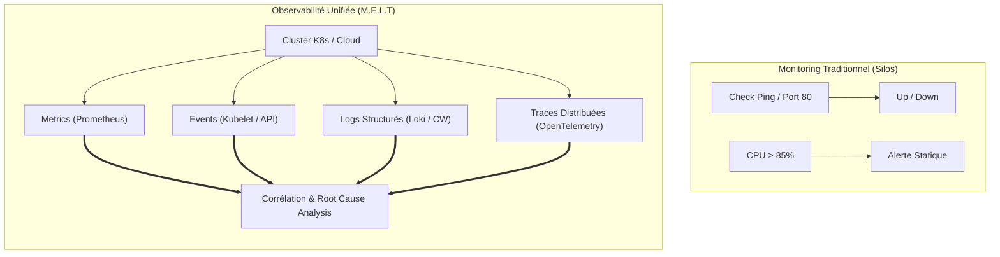
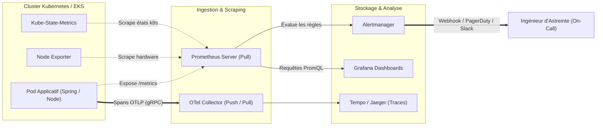

# Observability and Monitoring: From Zero to Production

In DevOps / SRE interview, observability is the subject where recruiters immediately check if you have real field experience or only theoretical knowledge. The classic trick question: *"What is the difference between monitoring a server with Nagios and making a Kubernetes cluster observable?"*.

This course is designed to give you practical weapons, flow architecture, real queries and incident response reflexes.

---

## 1. From Binary Monitoring to Modern Observability

Traditional monitoring checks the external state (*Black-box*), while observability reconstructs the complete internal state (*White-box*) from the signals emitted.

!!! danger "The Trap of Traditional Monitoring"
    A container can respond `HTTP 200` on its health check route while having a saturated SQL connection pool and 90% of its business requests blocked. A simple ping is blind to distributed micro-failures.

---

## 2. Global Architecture of Flows in Production

Here is the standard telemetry pipeline deployed in an enterprise on a managed Kubernetes (EKS) cluster:

---

## 3. MkDocs Curriculum

| Module | File | Operational Objective |
|---|---|---|
| **01** | `01-fondamentaux-theorie.md` | Master M.E.L.T, the 4 Golden Signals and the calculation of an Error Budget (SLI/SLO/SLA). |
| **02** | `02-methodes-use-red.md` | Know which framework to apply: USE (infra resources) vs RED (microservices). |
| **03** | `03-prometheus-architecture.md` | Understand the Pull model, internal TSDB and Kubernetes Service Discovery. |
| **04** | `04-prometheus-metriques.md` | Know how to instrument your code with Counter, Gauge, Histogram and Summary. |
| **05** | `05-promql-mastery.md` | Write complex queries: `rate()`, `histogram_quantile()` and vector joins. |
| **06** | `06-alertmanager.md` | Configure routing, cascading alert inhibition, and silences. |
| **07** | `07-grafana-dashboards.md` | Build efficient dashboards with dynamic variables and unified alerts. |
| **08** | `08-opentelemetry.md` | Deploy the OTel Collector, propagate W3C contexts and track distributed requests. |
| **09** | `09-aws-cloudwatch.md` | Leverage CloudWatch Logs Insights, Container Insights, and composite alarms. |
| **10** | `10-k8s-diagnostics.md` | Live diagnose CrashLoopBackOff, OOMKilled (Exit Code 137) and CPU Throttling. |
| **11** | `11-triage-incidents-prod.md` | Isolate 502/503/504 errors and calculate P95/P99 latencies without getting trapped by averages. |
| **12** | `12-cheatsheet-entretien.md` | Ultra-fast summary of elimination questions and crisis scenarios in interviews. |

!!! tip "Revision Method"
    Each course ends with **Real Interview Questions**. Practice the answer out loud using the precise technical terms (eg: *CFS quota*, *percentile*, *W3C traceparent*).

