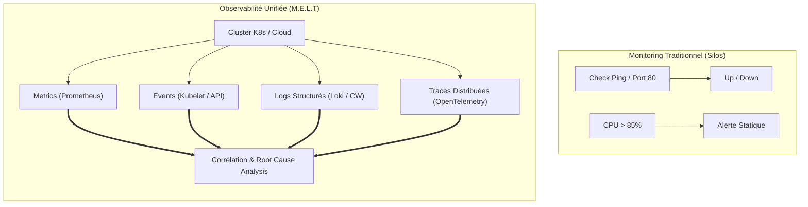
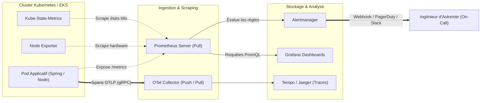

# Observabilité & Monitoring : De Zéro à la Production

En entretien DevOps / SRE, l'observabilité est le sujet où les recruteurs vérifient immédiatement si vous avez une vraie expérience du terrain ou seulement des connaissances théoriques. La question piège classique : *"Quelle est la différence entre surveiller un serveur avec Nagios et rendre un cluster Kubernetes observable ?"*.

Ce cours est conçu pour vous donner les armes pratiques, l'architecture des flux, les requêtes réelles et les réflexes d'incident response.

---

## 1. Du Monitoring Binaire à l'Observabilité Moderne

Le monitoring traditionnel vérifie l'état externe (*Black-box*), tandis que l'observabilité reconstruit l'état interne complet (*White-box*) à partir des signaux émis.

!!! danger "Le Piège du Monitoring Traditionnel"
    Un conteneur peut répondre `HTTP 200` sur sa route de health check tout en ayant un pool de connexions SQL saturé et 90% de ses requêtes métier bloquées. Un simple ping est aveugle face aux micro-pannes distribuées.

---

## 2. Architecture Globale des Flux en Production

Voici le pipeline de télémétrie standard déployé en entreprise sur un cluster Kubernetes managé (EKS) :

---

## 3. Programme du Cursus MkDocs

| Module | Fichier | Objectif Opérationnel |
|---|---|---|
| **01** | `01-fondamentaux-theorie.md` | Maîtriser M.E.L.T, les 4 Golden Signals et le calcul d'un Error Budget (SLI/SLO/SLA). |
| **02** | `02-methodes-use-red.md` | Savoir quel framework appliquer : USE (ressources infra) vs RED (microservices). |
| **03** | `03-prometheus-architecture.md` | Comprendre le modèle Pull, le TSDB interne et la Service Discovery Kubernetes. |
| **04** | `04-prometheus-metriques.md` | Savoir instrumenter son code avec Counter, Gauge, Histogram et Summary. |
| **05** | `05-promql-mastery.md` | Écrire des requêtes complexes : `rate()`, `histogram_quantile()` et jointures vectorielles. |
| **06** | `06-alertmanager.md` | Configurer le routage, l'inhibition des alertes en cascade et les silences. |
| **07** | `07-grafana-dashboards.md` | Construire des dashboards performants avec variables dynamiques et alertes unifiées. |
| **08** | `08-opentelemetry.md` | Déployer l'OTel Collector, propager les contextes W3C et tracker les requêtes distribuées. |
| **09** | `09-aws-cloudwatch.md` | Exploiter CloudWatch Logs Insights, Container Insights et les alarmes composites. |
| **10** | `10-k8s-diagnostics.md` | Diagnostiquer en direct CrashLoopBackOff, OOMKilled (Exit Code 137) et CPU Throttling. |
| **11** | `11-triage-incidents-prod.md` | Isoler les erreurs 502/503/504 et calculer les latences P95/P99 sans se faire piéger par les moyennes. |
| **12** | `12-cheatsheet-entretien.md` | Synthèse ultra-rapide des questions éliminatoires et des scénarios de crise en entretien. |

!!! tip "Méthode de Révision"
    Chaque cours se termine par des **Questions d'Entretien Réelles**. Pratiquez la réponse à voix haute en utilisant les termes techniques précis (ex: *CFS quota*, *percentile*, *W3C traceparent*).