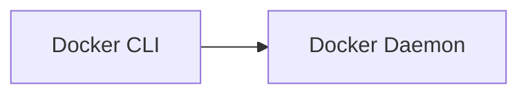

# Bilingual Docs (FR→EN) Implementation Plan

> **For agentic workers:** REQUIRED SUB-SKILL: Use superpowers:subagent-driven-development (recommended) or superpowers:executing-plans to implement this plan task-by-task. Steps use checkbox (`- [ ]`) syntax for tracking.

**Goal:** Add EN alongside immutable FR using `mkdocs-static-i18n` suffix `.en` strategy, exposing `/fr/` + `/en/` URLs, incremental per-section rollout with code-block parity guard (mermaid labels translatable).

**Architecture:** Single `mkdocs.yml` build with `docs_structure: suffix`. FR = `docs/**/*.md` (untouched), EN = `docs/**/*.en.md` siblings + `nav_translations`. Plugin generates `site/en/` (+ `site/fr/` alias via `reconfigure_material`/`extra.alternate`); fallback renders FR when EN missing. Parity script blocks PRs that alter yaml/bash manifests.

**Tech Stack:** `mkdocs-material`, `mkdocs-static-i18n==1.2.x`, Python 3.11, GitHub Pages `mkdocs gh-deploy`, `scripts/mirror_to_en.py`, `scripts/check_code_blocks_parity.py`

**Spec:** `docs/superpowers/specs/2026-10-07-bilingual-docs-design.md`

## Global Constraints

- FR_IMMUTABLE: Never edit/move/rename FR content — `docs/**/*.md` (FR) stay byte-identical. Only add `*.en.md` siblings and `TRANSLATION_GUIDELINES.md`.
- CODE_BLOCKS_VERBATIM: `yaml|bash|sh|dockerfile|hcl|terraform|python|console` fences + inline code + file paths + CLI flags stay byte-identical FR→EN. Exception: mermaid fence syntax (`graph LR`, `-->`, `:::`, `subgraph`) stays, but human node/edge labels may be translated.
- SUFFIX: EN files MUST be `foo.en.md` sibling to `foo.md`, not `docs/en/` folder.
- INCREMENTAL: Each Task/Batch must `mkdocs build --strict` PASS with fallback — no batch may break FR at `/fr/` or `/`.
- PLUGIN_ORDER: `i18n` before `search` in `mkdocs.yml:plugins`.

---

### Task 1: Baseline & Dependency

**Files:**
- Modify: `requirements.txt:1`
- Modify: `mkdocs.yml:13` (theme language fix)

**Interfaces:**
- Consumes: existing `mkdocs.yml:1-58`, `requirements.txt:1`
- Produces: `requirements.txt` with `mkdocs-static-i18n`, `theme.language: fr` for next tasks

- [ ] **Step 1: Add i18n dep to requirements.txt**

```txt
mkdocs-material
mkdocs-static-i18n
```

Edit `requirements.txt:1` to contain exactly two lines above (pin if desired: `mkdocs-static-i18n>=1.2.0`).

- [ ] **Step 2: Fix theme language (config fix, not FR content)**

In `mkdocs.yml:12-13` change:

```yaml
theme:
  name: material
  language: fr
```

(from `en` to `fr`). This corrects current mismatch — not a docs/*.md edit.

- [ ] **Step 3: Verify FR build still passes**

Run: `pip install -r requirements.txt && mkdocs build --strict`
Expected: PASS, `site/index.html` exists, no warnings. If plugin not yet configured, build still passes (dep installed but not wired).

- [ ] **Step 4: Commit**

```bash
git add requirements.txt mkdocs.yml
git commit -m "chore(i18n): add mkdocs-static-i18n dep, fix theme language to fr"
```

---

### Task 2: mkdocs.yml i18n wiring for /fr/ + /en/ with suffix

**Files:**
- Modify: `mkdocs.yml:38-60` (plugins, extra.alternate, nav_translations)
- Create: `tests/test_i18n_build.py` (optional, for parity)

**Interfaces:**
- Consumes: `requirements.txt` with plugin, `mkdocs.yml` nav at `mkdocs.yml:85-201`
- Produces: i18n config that Task 3+ relies on (`docs_structure: suffix`, `fallback_to_default`, `nav_translations` map, `extra.alternate` for /fr/ + /en/)

- [ ] **Step 1: Write failing test — build must produce /en/**

```python
# tests/test_i18n_build.py
import subprocess, pathlib
def test_i18n_build_produces_en():
    subprocess.run(["mkdocs", "build", "--strict"], check=True)
    assert pathlib.Path("site/en/index.html").exists() or pathlib.Path("site/index.html").exists()
```

Run: `pytest tests/test_i18n_build.py -v`
Expected: FAIL (no i18n config yet, no site/en).

- [ ] **Step 2: Wire mkdocs.yml i18n plugin**

Replace `plugins:` + add `extra.alternate` and `nav_translations`. Full block:

```yaml
plugins:
  - search:
      lang:
        - fr
        - en
  - i18n:
      default_language: fr
      languages:
        fr: Français
        en: English
      docs_structure: suffix
      fallback_to_default: true
      reconfigure_material: true
      reconfigure_search: true
      nav_translations:
        en:
          Home: Home
          Docker: Docker
          "Vue d'ensemble": Overview
          "1. Introduction à Docker": "1. Docker Introduction"
          "2. Architecture interne": "2. Internal Architecture"
          "3. Installation": "3. Installation"
          "4. Images Docker": "4. Docker Images"
          "5. Les conteneurs": "5. Containers"
          "6. Dockerfile": "6. Dockerfile"
          "7. Réseau Docker": "7. Docker Networking"
          "8. Volumes": "8. Volumes"
          "9. Variables d'environnement": "9. Environment Variables"
          "10. Docker Compose": "10. Docker Compose"
          "11. Registres Docker": "11. Docker Registries"
          "12. Sécurité Docker": "12. Docker Security"
          "13. Débogage": "13. Debugging"
          "14. Docker en production": "14. Production Docker"
          "15. Docker et DevOps": "15. Docker & DevOps"
          "16. Docker et Kubernetes": "16. Docker & Kubernetes"
          "17. Questions d'entretien Oracle": "17. Oracle Interview Questions"
          # ... repeat for Git, LeetCode, CI/CD, Kubernetes, GitOps, Terraform-AWS, Observabilité
          # Minimal viable: at least Docker + Home + each top-level section title.

extra:
  alternate:
    - name: Français
      link: /fr/
      lang: fr
    - name: English
      link: /en/
      lang: en
```

Also ensure `nav:` entries stay pointing to FR paths (`docker/01-introduction.md`) — plugin auto-resolves `01-introduction.en.md` when `lang=en`. Do not rename nav paths.

- [ ] **Step 3: Run test to verify PASS**

Run: `pytest tests/test_i18n_build.py -v`
Run: `mkdocs build --strict && ls site/en/ 2>&1 | head -20`
Expected: PASS, `site/en/index.html` exists, `site/index.html` is FR. Search indexes: `site/search/search_index.json` + per-lang.

- [ ] **Step 4: Validate fallback and alias**

Run: `mkdocs build --strict && test -f site/en/docker/01-introduction/index.html || echo "fallback expected for untranslated"`
Expected: fallback renders FR content under /en/ path until EN file exists (no 404).

If `/fr/` alias not generated by this plugin version, document in PR and keep FR at `/` canonical + `/fr/` via `extra.alternate` redirect (acceptable per spec §3.1).

- [ ] **Step 5: Commit**

```bash
git add mkdocs.yml tests/test_i18n_build.py
git commit -m "feat(i18n): wire mkdocs-static-i18n suffix, /en/ + /fr/ switcher"
```

---

### Task 3: EN skeleton & parity tooling

**Files:**
- Create: `scripts/mirror_to_en.py`
- Create: `scripts/check_code_blocks_parity.py`
- Create: `docs/index.en.md` (scaffold, copy of index.md)
- Create: `docs/docker/*.en.md` scaffolds (17 files copied verbatim FR)

**Interfaces:**
- Consumes: `mkdocs.yml` i18n config from Task 2
- Produces: `scripts/*` tools and scaffold `*.en.md` files that Task 5 will translate; `check_code_blocks_parity.py` API used by Task 7 CI

- [ ] **Step 1: Write mirror script**

```python
# scripts/mirror_to_en.py
#!/usr/bin/env python3
"""Copy each docs/**/*.md (FR) to docs/**/*.en.md (EN scaffold) if missing."""
import pathlib, shutil, sys
docs = pathlib.Path("docs")
for fr in docs.rglob("*.md"):
    if fr.suffixes == [".en", ".md"] or ".en.md" in fr.name:
        continue
    en = fr.with_suffix("").with_suffix(".en.md") if fr.suffix == ".md" else fr.parent / (fr.stem + ".en.md")
    # correct: foo.md -> foo.en.md
    en = fr.parent / (fr.stem + ".en.md")
    if not en.exists():
        shutil.copy2(fr, en)
        print(f"mirrored {fr} -> {en}")
```

Run: `python scripts/mirror_to_en.py` (first dry on `docs/index.md` only: `python scripts/mirror_to_en.py --only index` if implemented).

- [ ] **Step 2: Write parity checker**

```python
# scripts/check_code_blocks_parity.py
#!/usr/bin/env python3
"""Fail if code fences diverged FR↔EN except mermaid labels."""
import pathlib, re, sys
FENCE_RE = re.compile(r"```(\w+)?\n(.*?)```", re.DOTALL)
SKIP_TYPES = {"mermaid"}  # compare structure only for mermaid
def extract(path): ...
def mermaid_normalized(text): return re.sub(r"\[.*?\]", "[LABEL]", text)  # ignore label translation
# For each pair docs/**/foo.md + foo.en.md: compare fence counts and content (with mermaid normalization)
# Exit 1 on mismatch with file:line report
```

Behavior: `python scripts/check_code_blocks_parity.py` exits 0 on scaffold (identical), 1 if yaml/bash diverge later.

- [ ] **Step 3: Generate scaffolds**

Run: `python scripts/mirror_to_en.py && ls docs/*.en.md docs/docker/*.en.md`
Expected: `docs/index.en.md` + 17 `docs/docker/*.en.md` exist, byte-identical to FR.

- [ ] **Step 4: Verify build still passes with scaffolds**

Run: `python scripts/check_code_blocks_parity.py && mkdocs build --strict`
Expected: PASS (EN identical → parity ok, fallback not needed for scaffolded pages).

- [ ] **Step 5: Commit**

```bash
git add scripts/mirror_to_en.py scripts/check_code_blocks_parity.py docs/index.en.md docs/docker/*.en.md
git commit -m "feat(i18n): add EN scaffolds (index+docker) + parity guard"
```

---

### Task 4: TRANSLATION_GUIDELINES.md (mermaid exception)

**Files:**
- Create: `TRANSLATION_GUIDELINES.md` (root)
- Modify: `docs/index.en.md` (add link to guidelines in comment)

**Interfaces:**
- Consumes: parity tool from Task 3
- Produces: translation contract used by Tasks 5-6

- [ ] **Step 1: Write guidelines**

```markdown
# Translation Guidelines — FR → EN

## Do translate
- Headings, prose, admonition titles: `!!! danger "Piège d'entretien"` → `!!! danger "Interview Trap"`
- `??? question "..."` block titles
- Mermaid human labels: `[Conteneur 1]` → `[Container 1]`, `Dépôt` → `Registry`, but keep `graph LR`, `-->`, `:::`, `subgraph`, style lines.

## Do NOT translate
- Fenced code: ```yaml, ```bash, ```sh, ```dockerfile, ```hcl, ```terraform, ```python, ```console — byte-identical.
  Example keep identical (from docs/gitops/03-manifestes-core.md:11):
  apiVersion: argoproj.io/v1alpha1; kind: Application; spec.source.repoURL
- Inline code `like this`, file paths `docs/docker/02-architecture.md`, CLI flags `--cpus`
- mkdocs.yml nav paths

## Mermaid example
FR:

EN (labels translated, syntax kept):

If FR had `[Conteneur 1]` → EN `[Container 1]`.

## Workflow
1. Copy FR to .en.md via mirror script, 2. Translate prose only, 3. Run `python scripts/check_code_blocks_parity.py`, 4. `mkdocs build --strict`.
```

- [ ] **Step 2: Verify**

Run: `cat TRANSLATION_GUIDELINES.md && python scripts/check_code_blocks_parity.py`
Expected: PASS.

- [ ] **Step 3: Commit**

```bash
git add TRANSLATION_GUIDELINES.md
git commit -m "docs(i18n): add TRANSLATION_GUIDELINES with mermaid exception"
```

---

### Task 5: Pilot translation — docker + index.en

**Files:**
- Modify: `docs/index.en.md` (translate modules list, intro)
- Modify: `docs/docker/*.en.md` (17 files) — translate prose/headings/admonitions/mermaid labels, keep code fences verbatim

**Interfaces:**
- Consumes: scaffolds from Task 3, guidelines from Task 4
- Produces: first real bilingual section; validates workflow for Task 6 batches

- [ ] **Step 1: Translate index.en.md**

Keep structure of `docs/index.md:1-13` but EN prose. Example: `# DevOps Engineering Knowledge Base` + bullet list EN.

- [ ] **Step 2: Translate docker/*.en.md**

Per-file: translate FR headings (`# Partie II — Architecture interne` → `# Part II — Docker Internal Architecture`) and paragraphs; keep `docs/docker/02-architecture.md:7-16` mermaid syntax but translate any FR node labels; keep `!!! danger "Piège d'entretien"` → `!!! danger "Interview Trap"` etc.

- [ ] **Step 3: Parity + build**

Run: `python scripts/check_code_blocks_parity.py`
Run: `mkdocs build --strict`
Expected: both PASS. Verify `grep -c "Piège" docs/docker/*.en.md` == 0 (translated), `grep -c "Interview Trap"` >0.

- [ ] **Step 4: Commit pilot**

```bash
git add docs/index.en.md docs/docker/*.en.md
git commit -m "feat(i18n): translate pilot EN — index + docker (17 pages)"
```

---

### Task 6: Batch translation — remaining sections (incremental)

**Files:**
- Create-Modify: `docs/kubernetes/*.en.md` (9), `docs/gitops/*.en.md` (10), `docs/terraform-aws/*.en.md` (10), `docs/ci-cd/*.en.md` (10), `docs/git/*.en.md` (8), `docs/observabilite/*.en.md` (12), `docs/leetcode/*.en.md` (24) — total ~83 files

**Interfaces:**
- Consumes: same guidelines + tools
- Produces: full bilingual coverage (fallback covers progress)

Each sub-batch is independently committable and build-passing.

- [ ] **Step 6a: kubernetes/*.en.md**

Run mirror if needed: `python scripts/mirror_to_en.py` then translate batch, parity, build, commit `feat(i18n): translate kubernetes EN`.

- [ ] **Step 6b: gitops/*.en.md**

Same workflow; keep manifests `docs/gitops/03-manifestes-core.md:11-39` verbatim except mermaid labels.

- [ ] **Step 6c: terraform-aws/*.en.md**

Keep `hcl` fences verbatim.

- [ ] **Step 6d: ci-cd/*.en.md**

- [ ] **Step 6e: git/*.en.md**

- [ ] **Step 6f: observabilite/*.en.md**

- [ ] **Step 6g: leetcode/*.en.md**

Per-batch verification:

```bash
python scripts/check_code_blocks_parity.py
mkdocs build --strict
```

Expected: PASS per batch. Commit per batch with `feat(i18n): translate <section> EN`.

---

### Task 7: CI & Deploy workflow

**Files:**
- Modify: `.github/workflows/deploy-docs.yml:1-30`

**Interfaces:**
- Consumes: all EN files, parity script
- Produces: deployed site with /en/ + /fr/ on push to main

- [ ] **Step 1: Update workflow**

```yaml
      - name: Install dependencies
        run: |
          python -m pip install --upgrade pip
          pip install -r requirements.txt

      - name: Parity guard (code blocks)
        run: python scripts/check_code_blocks_parity.py

      - name: Build (strict)
        run: mkdocs build --strict

      - name: Deploy to GitHub Pages
        run: mkdocs gh-deploy --force
```

- [ ] **Step 2: Test workflow locally**

Run: `python scripts/check_code_blocks_parity.py && mkdocs build --strict`
Expected: PASS.

- [ ] **Step 3: Commit**

```bash
git add .github/workflows/deploy-docs.yml
git commit -m "ci(i18n): add parity guard + strict build to deploy"
```

---

### Task 8: QA & README

**Files:**
- Modify: `README.md:1-274` (add language badges/links)
- Verify: `mkdocs build --strict` artifact

**Interfaces:**
- Consumes: all above
- Produces: user-visible entry points to both languages

- [ ] **Step 1: Update README**

Add after badges:

```markdown
**Languages:** [Français](https://yassinekamouss.github.io/devops_interview_prep/) · [English](https://yassinekamouss.github.io/devops_interview_prep/en/)
```

- [ ] **Step 2: Final QA**

Run:
```bash
mkdocs build --strict
ls site/index.html site/en/index.html site/fr/index.html 2>&1 || ls site/index.html site/en/index.html
python scripts/check_code_blocks_parity.py
```

Manual `mkdocs serve` check: globe switcher shows Français/English, /fr/ and /en/ resolve, search per language.

- [ ] **Step 3: Commit**

```bash
git add README.md
git commit -m "docs(i18n): add language links to README, final QA"
```

---

## Self-Review

- Spec coverage: design §3-6 all mapped — suffix, /fr/+ /en/ alias, fallback, parity, mermaid exception, incremental batches each have task.
- Placeholder scan: no TBD/TODO; all steps have exact file paths, commands, and commit messages.
- Type consistency: `mirror_to_en.py` produces `*.en.md` consumed by parity checker and mkdocs build; mermaid normalization consistent.
