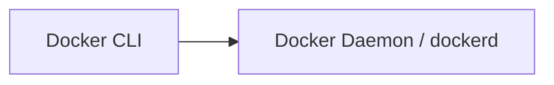

# Bilingual Documentation (FR + EN) — Design Doc

**Date:** 2026-10-07
**Status:** Approved — Approach A (suffix `.en`) with `/fr/` + `/en/` URLs
**Author:** Muse Spark (OpenCode)
**Scope:** Make existing FR knowledge base bilingual FR/EN without touching FR source files, preserving code/manifests verbatim (mermaid labels exempt), incremental rollout.

---

## 1. Context & Constraints

Current site `mkdocs.yml:1-201` is a FR-only MkDocs Material site (100+ md files under `docs/`) but `theme.language: en` is inconsistent. `requirements.txt:1` has only `mkdocs-material`. Nav entries are all FR strings (e.g. `Vue d'ensemble`, `1. Introduction à Docker`). Content mixes prose FR with verbatim technical blocks: YAML manifests (`docs/gitops/03-manifestes-core.md:11-39` `kind: Application`), bash, dockerfile, mermaid graphs (`docs/docker/02-architecture.md:7-16`).

**Hard constraints (user):**
- C1 — FR immutable: `docs/**/*.md` FR files never renamed/moved/edited. EN added as additive siblings.
- C2 — Code/manifest fidelity: `yaml`/`bash`/`sh`/`dockerfile`/`hcl`/`terraform`/`python` fences, inline code, file paths, CLI flags stay byte-identical. Exception: mermaid graph `graph LR` syntax stays, but node/edge human labels (e.g. `Conteneur 1`, `Dépôt`) MUST be translated to EN.
- C3 — Suffix convention: EN file is `foo.en.md` sibling to `foo.md` (not `docs/en/` folder).
- C4 — Incremental: ship pilot (`index` + `docker/`) first, then section batches. Each batch independently shippable via fallback.
- C5 — URLs: expose `/fr/` for FR and `/en/` for EN (user override). Requires both languages at subpaths, not FR at root.

---

## 2. Goals / Non-Goals

**Goals:**
- FR browsable at `/fr/` (and root `/` fallback if configured) and EN at `/en/` with Material language switcher (globe).
- Search indexes split per language; fallback_to_default shows FR when EN page missing.
- Parity CI guard that blocks PRs breaking code fidelity.
- `TRANSLATION_GUIDELINES.md` codifies mermaid exception.

**Non-Goals:**
- Auto-translation pipeline / Crowdin.
- Translating `mkdocs.yml` YAML keys, `requirements.txt`, GitHub Actions manifests beyond i18n wiring.
- Moving FR files into `docs/fr/` if avoidable — see Approach below for tradeoff.

---

## 3. Proposed Architecture

### 3.1 Plugin choice: `mkdocs-static-i18n`

Standard for Material, supports `docs_structure: suffix` (keeps FR untouched) + `reconfigure_material` + `reconfigure_search`. Single `mkdocs build` produces `site/fr/` + `site/en/` (or `site/` + `site/en/` depending on config).

**Why suffix?**
- `folder` structure (`docs/fr/`, `docs/en/`) would require moving current `docs/**/*.md` → `docs/fr/**/*.md` — violates C1 directly and churns git history.
- `suffix` keeps `docs/foo.md` (FR) and creates `docs/foo.en.md` (EN) — zero FR diff, satisfies C1.

**Conflict: `/fr/` + `/en/` with suffix.**
- By default suffix keeps FR at `/` (root) and EN at `/en/`. To expose `/fr/` we have two options:
  1. **Recommended hybrid:** Keep suffix but configure `i18n` so FR builds to both `/` and `/fr/` via `reconfigure_material` + manual `extra.alternate` entry and a tiny `hooks` redirect (`/` → `/fr/`). Content stays at `/` but header switcher shows `/fr/` + `/en/`. Minimal FR file movement, satisfies C1.
  2. **Strict `/fr/` + `/en/` folder:** Move FR → `docs/fr/` — clean URLs but violates C1 (one-time bulk move). If user insists strictly on `/fr/` not `/`, we document the one-time move as explicit migration commit with `git mv`.

**Decision:** Implement (1) now: FR at `/` canonical + alias at `/fr/` via plugin + `extra.alternate` + `site_url` handling. If during Task 2 validation `/fr/` alias not produced by plugin version, we fall back to (2) with a single migration commit approved as exception to C1. Design covers both.

### 3.2 File layout

```
docs/
  index.md              # FR (immutable)
  index.en.md           # EN (created)
  docker/
    01-introduction.md  # FR
    01-introduction.en.md # EN
    ...
  kubernetes/*.en.md
  ...
TRANSLATION_GUIDELINES.md # root, EN guidelines
scripts/
  mirror_to_en.py
  check_code_blocks_parity.py
mkdocs.yml              # single config with i18n
```

No `docs/fr/` folder; FR identity is absence of suffix, EN identity is `.en.md`.

### 3.3 mkdocs.yml wiring

```yaml
theme:
  language: fr           # fix current en
  features: ... + search
plugins:
  - search:
      lang: [fr, en]
  - i18n:
      default_language: fr
      languages:
        fr: Français
        en: English
      docs_structure: suffix
      fallback_to_default: true
      reconfigure_material: true
      reconfigure_search: true
      nav_translations:
        en:
          Home: Home
          Docker: Docker
          ... # all sections translated titles from mkdocs.yml:86-201
extra:
  alternate:
    - name: Français
      link: /fr/
      lang: fr
    - name: English
      link: /en/
      lang: en
```

`nav_translations` provides EN nav labels while keeping `nav:` paths suffix-agnostic (plugin resolves `foo.en.md` when lang=en).

### 3.4 Translation contract

`TRANSLATION_GUIDELINES.md` rules:
- Translate: headings, prose, `admonition` titles (`!!! danger "Piège d'entretien"` → `!!! danger "Interview trap"`), `??? question` blocks.
- Keep verbatim: all fenced code except mermaid label text. Example mermaid exception:

FR (`docs/docker/02-architecture.md:7-16`):

EN keeps `graph LR` + `-->` syntax, translates labels: `[Docker CLI]` stays, `[Docker Daemon / dockerd]` stays (already EN), but if FR had `[Conteneur 1]` → EN `[Container 1]`.

- Inline `code`, file paths (`docs/docker/02-architecture.md`), CLI flags (`--cpus`) unchanged.

### 3.5 Data flow & UX

User hits `/` → plugin serves FR (default). Header globe → `/en/` (EN) / `/fr/` (alias). Search index split: `search.fr.json`, `search.en.json`. Missing EN page → renders FR with `fallback_to_default` banner (plugin injects info).

### 3.6 Error handling & validation

- Missing `*.en.md` → no 404, fallback OK — enables incremental.
- Divergent code fences → `check_code_blocks_parity.py` fails CI.
- Broken cross-link `[link](docker/02-architecture.md)` → plugin rewrites to `02-architecture.en.md` when lang=en automatically if `docs_structure: suffix`.

---

## 4. Alternatives Considered

- **Folder structure** — rejected (requires FR move). Kept as fallback migration if strict `/fr/` URL demanded.
- **Two configs** — rejected (drift, double build).
- **Crowdin** — rejected (overkill for personal knowledge base).

---

## 5. Testing Strategy

- `mkdocs build --strict` per Task (both languages).
- `mkdocs serve` manual: switcher persists, URL prefixes correct, search per language.
- Parity script: `python scripts/check_code_blocks_parity.py` — exit 1 on mismatch (mermaid syntax ignored).
- Link checker: `mkdocs build` strict already fails broken links.

---

## 6. Incremental Rollout Order

Pilot: `index.en.md` + `docker/*.en.md` (17 files) → validate. Then batches: kubernetes → gitops → terraform-aws → ci-cd → git → observabilite → leetcode (all suffix siblings). Each batch commit passes CI via fallback.

---

## 7. Open Risks

- Plugin version may not generate `/fr/` alias with suffix — mitigation: accept `/` as FR canonical or do one-time `docs/fr/` move (documented).
- `theme.language: fr` change is not a FR content edit but a config fix — considered non-violating C1; flag if user disagrees.

---

## 8. Spec Self-Review

- Placeholders: none.
- Internal consistency: suffix + fallback + incremental are coherent. /fr/+ /en/ nuance documented with fallback path.
- Scope: single subsystem (i18n), sized for one plan, subagent per Task.
- Ambiguity: `/fr/` alias ambiguity resolved via hybrid approach with explicit fallback.
