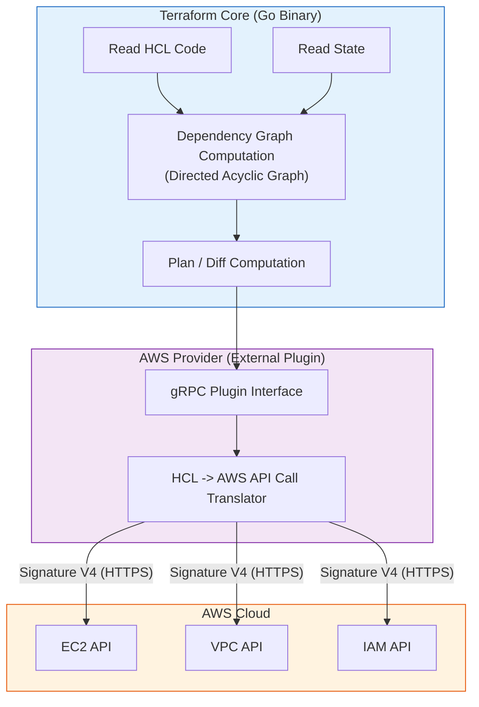

# 01 - IaC Fundamentals & HCL Syntax

In a DevOps interview, Infrastructure as Code (IaC) is not just a way to write scripts: it is the cornerstone of reproducibility, traceability, and Cloud automation. This chapter lays the theoretical foundations, the internal architecture of the Terraform engine, and HCL syntax applied to AWS.

---

## 1. The Major IaC Paradigms

In a technical interview, you will often be asked to position Terraform against other tools such as Ansible, CloudFormation, or Pulumi.

| Criterion | Declarative Approach (Terraform) | Imperative Approach (Bash, Ansible) |
|---|---|---|
| **Philosophy** | You describe **what you want** (Desired State). The tool computes the steps needed to achieve it. | You describe **how to do it** step by step (a sequence of instructions). |
| **Idempotence** | **Native**: re-running the code 10 times without changes applies no modifications on AWS. | **Manual**: the script must first test whether the resource already exists, otherwise it fails. |
| **Destruction handling** | If you remove a line of code, Terraform deletes the resource on AWS. | If you remove a line in a shell script, the resource remains active on AWS indefinitely. |
| **Primary use case** | Cloud infrastructure provisioning (VPC, EKS, RDS, IAM). | In-guest OS configuration (package installation, `/etc` file configuration). |

!!! info "Mutable vs Immutable Infrastructure"
    - **Mutable Infrastructure (e.g., Ansible/Chef):** Servers are modified "in place" (updates, package patches). High risk of *configuration drift* over time.
    - **Immutable Infrastructure (e.g., Terraform + Golden AMIs / Containers):** Servers are never updated in place. To deploy a new version, Terraform destroys the old instances and provisions new ones created from an updated image.

---

## 2. Internal Architecture: How Does Terraform Work?

Terraform is not a monolith: it is split into two distinct components that communicate via local RPC (gRPC) calls.



1. **Terraform Core:** The central engine written in Go. It parses `.tf` files, manages the state file (`terraform.tfstate`), builds the **Directed Acyclic Graph (DAG)** to determine the precise resource creation order, and computes the diff.
2. **Providers (Plugins):** Standalone binaries downloaded during `terraform init`. The AWS provider translates Core intentions into real AWS API calls (via the official AWS SDK, authenticated with the AWS SigV4 protocol).
3. **The DAG (Directed Acyclic Graph):** Terraform parallelizes resource creation as much as possible. If two subnets do not depend on each other, Terraform creates them simultaneously via the AWS API.

!!! warning "OpenTofu vs Terraform Context (Topical Interview Question)"
    In August 2023, HashiCorp changed Terraform's license from open source (MPL 2.0) to a restricted commercial license (BSL v1.1). In response, the Linux Foundation community created a 100% open-source fork: **OpenTofu**. HCL code and AWS providers remain almost identical, but being able to explain this change shows you follow the ecosystem.

---

## 3. Anatomy of an HCL Configuration for AWS

An enterprise Terraform project revolves around 4 fundamental block types:

```hcl
# 1. Configuration globale et contraintes de versions
terraform {
  required_version = ">= 1.5.0"

  required_providers {
    aws = {
      source  = "hashicorp/aws"
      version = "~> 5.0" # Autorise les versions 5.x mais bloque la future v6 (breaking)
    }
  }
}

# 2. Configuration du Provider AWS
provider "aws" {
  region = "eu-west-3" # Région Paris

  default_tags {
    tags = {
      Environment = "Production"
      ManagedBy   = "Terraform"
      Project     = "Oracle-Preparation"
    }
  }
}

# 3. Data Source : Lire une ressource existante sur AWS sans la modifier
data "aws_ami" "ubuntu_latest" {
  most_recent = true
  owners      = ["099720109477"] # Canonical (Éditeur officiel Ubuntu)

  filter {
    name   = "name"
    values = ["ubuntu/images/hvm-ssd/ubuntu-jammy-22.04-amd64-server-*"]
  }
}

# 4. Resource : Créer un composant d'infrastructure
resource "aws_instance" "web_app" {
  ami           = data.aws_ami.ubuntu_latest.id # Dépendance implicite vers la Data Source
  instance_type = "t3.micro"

  tags = {
    Name = "frontend-web-server"
  }
}
```

---

## 4. Dependencies & Lifecycle Meta-Arguments

### A. Implicit vs Explicit Dependencies

* **Implicit Dependency (Recommended):** Automatically inferred by Terraform when a block references an attribute of another block (e.g., `subnet_id = aws_subnet.public.id`). Terraform knows it must first create the subnet before placing the instance there.
* **Explicit Dependency (`depends_on`):** To be used only when Terraform cannot infer the dependency from code (for example, if a resource needs an IAM role or a network gateway to be active without its ID being directly passed as a parameter).

```hcl
resource "aws_instance" "app" {
  ami           = data.aws_ami.ubuntu_latest.id
  instance_type = "t3.micro"

  # Force Terraform à attendre que la table DynamoDB soit disponible
  depends_on = [aws_dynamodb_table.app_state]
}
```

### B. The `lifecycle` Block (Behavior Control)

By default, if an argument change requires recreating an AWS resource, Terraform **destroys it first** then recreates the new one. In production, this causes downtime. The `lifecycle` block lets you adjust this behavior:

```hcl
resource "aws_instance" "production_api" {
  ami           = data.aws_ami.ubuntu_latest.id
  instance_type = "t3.medium"

  lifecycle {
    # 1. Crée la nouvelle instance AVANT de détruire l'ancienne (Zero Downtime)
    create_before_destroy = true

    # 2. Empêche formellement un terraform destroy accidentel sur une base critique
    prevent_destroy = false

    # 3. Ignore les modifications manuelles ou dynamiques (ex: tags autoscaling)
    ignore_changes = [
      tags["LastUpdatedByMonitoring"]
    ]
  }
}
```

---

## 5. Frequently Asked Interview Questions (Entry-Level)

!!! question "Q: What is an implicit dependency and why is it preferable to `depends_on`?"
    An implicit dependency is automatically generated by Terraform Core when a resource references an attribute exported by another resource (e.g., `vpc_id = aws_vpc.main.id`). It is preferable because it allows Terraform to optimize the Directed Acyclic Graph (DAG) and parallelize actions as much as possible. Excessive use of `depends_on` forces sequential execution and considerably slows down deployments.

!!! question "Q: What is the `create_before_destroy` meta-argument used for on AWS?"
    By default, when a change requires replacing an AWS resource (e.g., changing the AMI of an EC2 without an ASG), Terraform first deletes the existing instance before creating the new one, which causes downtime. By setting `create_before_destroy = true`, Terraform first instantiates the new resource, waits until it is operational, then destroys the old one, thus ensuring service continuity.

!!! question "Q: Why is it critical to use `default_tags` in the AWS `provider` block?"
    In enterprise and Cloud FinOps, tagging is mandatory for cost tracking, security compliance, and governance. Defining `default_tags` at the provider level automatically injects labels (`Environment`, `Owner`, `ManagedBy = Terraform`) on **all** AWS resources created by this project, avoiding manual omissions in resource declarations.

!!! question "Q: What is the difference between a `resource` and a `data source` in Terraform?"
    A `resource` manages the full lifecycle of an infrastructure component (creation, update, deletion) owned by this Terraform project. A `data source` (`data` block) is read-only: it makes an API request to AWS to retrieve metadata of an existing resource (e.g., ID of an existing VPC, latest official AMI) without ever being able to modify or delete it.

!!! question "Q: What is a Directed Acyclic Graph (DAG) in Terraform's internal operation?"
    The DAG is the mathematical data structure that Terraform Core generates to represent all resources and their dependency relationships. It guarantees there is no infinite loop (acyclic) and allows the engine to execute all independent infrastructure branches simultaneously (in parallel via multithreaded workers), thus maximizing deployment speed.
