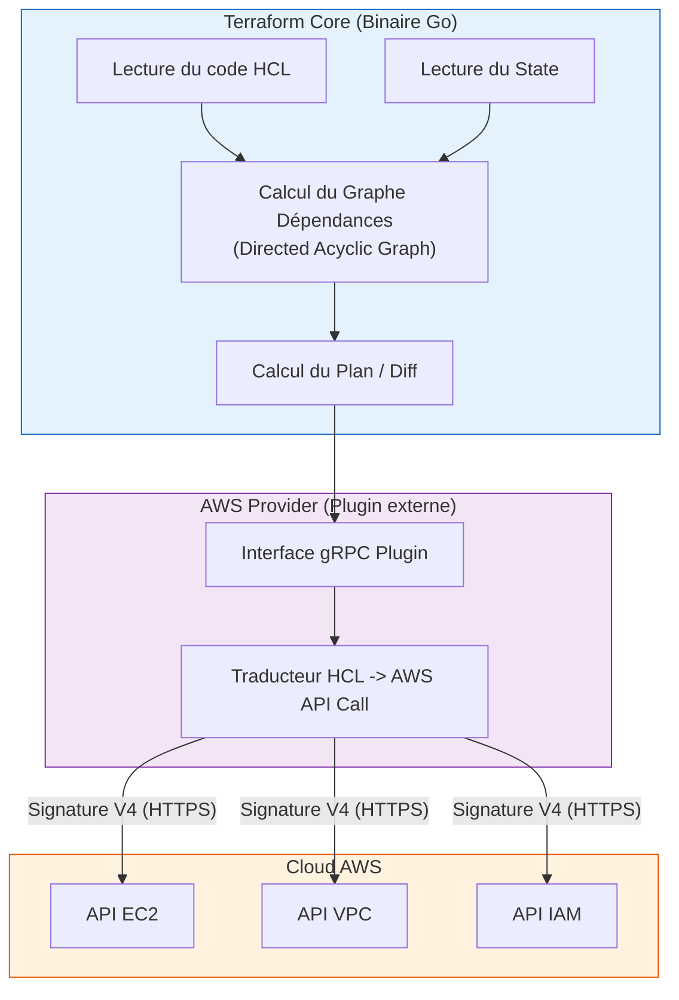

# 01 - Fondamentaux IaC & Syntaxe HCL

En entretien DevOps, l'Infrastructure as Code (IaC) n'est pas simplement une façon d'écrire des scripts : c'est la pierre angulaire de la reproductibilité, de la traçabilité et de l'automatisation Cloud. Ce chapitre pose les fondations théoriques, l'architecture interne du moteur Terraform et la syntaxe HCL appliquée à AWS.

---

## 1. Les Grands Paradigmes de l'IaC

Lors d'un entretien technique, on vous demandera fréquemment de positionner Terraform par rapport à d'autres outils comme Ansible, CloudFormation ou Pulumi.

| Critère | Approche Déclarative (Terraform) | Approche Impérative (Bash, Ansible) |
|---|---|---|
| **Philosophie** | Vous décrivez **ce que vous voulez** (Desired State). L'outil calcule les étapes nécessaires pour y parvenir. | Vous décrivez **comment faire** étape par étape (séquence d'instructions pas à pas). |
| **Idempotence** | **Native** : réexécuter le code 10 fois sans changement n'applique aucune modification sur AWS. | **Manuelle** : nécessite que le script teste au préalable si la ressource existe déjà sous peine d'erreur. |
| **Gestion de la destruction** | Si vous supprimez une ligne de code, Terraform supprime la ressource sur AWS. | Si vous supprimez une ligne dans un script shell, la ressource reste active sur AWS indéfiniment. |
| **Cas d'usage primaire** | Provisionnement d'infrastructure Cloud (VPC, EKS, RDS, IAM). | Configuration interne d'OS (installation de packages, configuration de fichiers `/etc`). |

!!! info "Infrastructure Mutable vs Immuable"
    - **Infrastructure Mutable (ex: Ansible/Chef) :** Les serveurs sont modifiés "en place" (mises à jour, patches de paquets). Risque élevé de *configuration drift* au cours du temps.
    - **Infrastructure Immuable (ex: Terraform + Golden AMIs / Conteneurs) :** Les serveurs ne sont jamais mis à jour sur place. Pour déployer une nouvelle version, Terraform détruit les anciennes instances et provisionne de nouvelles instances créées à partir d'une image mise à jour.

---

## 2. Architecture Interne : Comment Fonctionne Terraform ?

Terraform n'est pas un monolithe : il est scindé en deux composants distincts qui communiquent via des appels RPC (gRPC) en local.



1. **Terraform Core :** Le moteur central écrit en Go. Il parse les fichiers `.tf`, gère le fichier d'état (`terraform.tfstate`), construit le **Directed Acyclic Graph (DAG)** pour déterminer l'ordre précis de création des ressources et calcule le diff.
2. **Providers (Plugins) :** Des binaires indépendants téléchargés lors du `terraform init`. Le provider AWS traduit les intentions du Core en véritables appels d'API AWS (via le SDK AWS officiel, authentifiés par le protocole AWS SigV4).
3. **Le DAG (Directed Acyclic Graph) :** Terraform parallélise au maximum les créations de ressources. Si deux sous-réseaux ne dépendent pas l'un de l'autre, Terraform les crée simultanément via l'API AWS.

!!! warning "Le Contexte OpenTofu vs Terraform (Question d'actualité en entretien)"
    En août 2023, HashiCorp a changé la licence de Terraform de l'open-source (MPL 2.0) vers une licence commerciale restreinte (BSL v1.1). En réponse, la communauté Linux Foundation a créé un fork 100% open-source : **OpenTofu**. Le code HCL et les providers AWS restent quasi identiques, mais savoir expliquer ce changement démontre que vous suivez l'écosystème.

---

## 3. Anatomie d'une Configuration HCL pour AWS

Un projet Terraform d'entreprise s'organise autour de 4 types de blocs fondamentaux :

```hcl
# 1. Configuration globale et contraintes de versions
terraform {
  required_version = ">= 1.5.0"

  required_providers {
    aws = {
      source  = "hashicorp/aws"
      version = "~> 5.0" # Autorise les versions 5.x mais bloque la future v6 (breaking)
    }
  }
}

# 2. Configuration du Provider AWS
provider "aws" {
  region = "eu-west-3" # Région Paris

  default_tags {
    tags = {
      Environment = "Production"
      ManagedBy   = "Terraform"
      Project     = "Oracle-Preparation"
    }
  }
}

# 3. Data Source : Lire une ressource existante sur AWS sans la modifier
data "aws_ami" "ubuntu_latest" {
  most_recent = true
  owners      = ["099720109477"] # Canonical (Éditeur officiel Ubuntu)

  filter {
    name   = "name"
    values = ["ubuntu/images/hvm-ssd/ubuntu-jammy-22.04-amd64-server-*"]
  }
}

# 4. Resource : Créer un composant d'infrastructure
resource "aws_instance" "web_app" {
  ami           = data.aws_ami.ubuntu_latest.id # Dépendance implicite vers la Data Source
  instance_type = "t3.micro"

  tags = {
    Name = "frontend-web-server"
  }
}
```

---

## 4. Dépendances & Méta-arguments de Cycle de Vie

### A. Dépendances Implicites vs Explicites

* **Dépendance Implicite (Recommandée) :** Déduite automatiquement par Terraform lorsqu'un bloc fait référence à un attribut d'un autre bloc (ex: `subnet_id = aws_subnet.public.id`). Terraform sait qu'il doit d'abord créer le subnet avant d'y placer l'instance.
* **Dépendance Explicite (`depends_on`) :** À utiliser uniquement lorsque Terraform ne peut pas déduire la dépendance via le code (par exemple, si une ressource a besoin qu'un rôle IAM ou une passerelle réseau soit active, sans que son ID ne soit directement passé en paramètre).

```hcl
resource "aws_instance" "app" {
  ami           = data.aws_ami.ubuntu_latest.id
  instance_type = "t3.micro"

  # Force Terraform à attendre que la table DynamoDB soit disponible
  depends_on = [aws_dynamodb_table.app_state]
}
```

### B. Le Bloc `lifecycle` (Contrôle du Comportement)

Par défaut, si une modification d'argument impose de recréer une ressource AWS, Terraform la **détruit d'abord** puis recrée la nouvelle. En production, cela provoque une coupure de service. Le bloc `lifecycle` permet d'ajuster ce comportement :

```hcl
resource "aws_instance" "production_api" {
  ami           = data.aws_ami.ubuntu_latest.id
  instance_type = "t3.medium"

  lifecycle {
    # 1. Crée la nouvelle instance AVANT de détruire l'ancienne (Zero Downtime)
    create_before_destroy = true

    # 2. Empêche formellement un terraform destroy accidentel sur une base critique
    prevent_destroy = false

    # 3. Ignore les modifications manuelles ou dynamiques (ex: tags autoscaling)
    ignore_changes = [
      tags["LastUpdatedByMonitoring"]
    ]
  }
}
```

---

## 5. Questions d'Entretien Fréquentes (Niveau Entry-Level)

!!! question "Q: Qu'est-ce qu'une dépendance implicite et pourquoi est-elle préférable à `depends_on` ?"
    Une dépendance implicite est générée automatiquement par Terraform Core lorsqu'une ressource fait référence à un attribut exporté par une autre ressource (ex: `vpc_id = aws_vpc.main.id`). Elle est préférable car elle permet à Terraform d'optimiser le Directed Acyclic Graph (DAG) et de paralléliser les actions au maximum. L'utilisation excessive de `depends_on` force une exécution séquentielle inutile et ralentit considérablement les déploiements.

!!! question "Q: À quoi sert le méta-argument `create_before_destroy` sur AWS ?"
    Par défaut, lorsqu'une modification impose le remplacement d'une ressource AWS (ex: changer l'AMI d'une EC2 sans ASG), Terraform supprime d'abord l'instance existante avant de créer la nouvelle, ce qui engendre un temps d'indisponibilité. En configurant `create_before_destroy = true`, Terraform instancie d'abord la nouvelle ressource, attend qu'elle soit opérationnelle, puis détruit l'ancienne, garantissant ainsi la continuité de service.

!!! question "Q: Pourquoi est-il critique d'utiliser `default_tags` dans le bloc `provider` AWS ?"
    En entreprise et en Cloud FinOps, le tagging est obligatoire pour le suivi des coûts, la conformité de sécurité et la gouvernance. Définir des `default_tags` au niveau du provider permet d'injecter automatiquement des labels (`Environment`, `Owner`, `ManagedBy = Terraform`) sur **toutes** les ressources AWS créées par ce projet, évitant ainsi les oublis manuels dans les déclarations de ressources.

!!! question "Q: Quelle est la différence entre une `resource` et une `data source` dans Terraform ?"
    Une `resource` gère le cycle de vie complet d'un composant d'infrastructure (création, mise à jour, suppression) géré par ce projet Terraform. Une `data source` (bloc `data`) est en lecture seule : elle effectue une requête d'API vers AWS pour récupérer les métadonnées d'une ressource existante (ex: ID d'un VPC existant, dernière AMI officielle) sans jamais pouvoir la modifier ou la supprimer.

!!! question "Q: Qu'est-ce qu'un Directed Acyclic Graph (DAG) dans le fonctionnement interne de Terraform ?"
    Le DAG est la structure de données mathématique que Terraform Core génère pour représenter l'ensemble des ressources et leurs relations de dépendance. Il garantit qu'il n'existe aucune boucle infinie (acyclique) et permet au moteur d'exécuter simultanément (en parallèle via des workers multithreadés) toutes les branches indépendantes de l'infrastructure, maximisant ainsi la vitesse de déploiement.