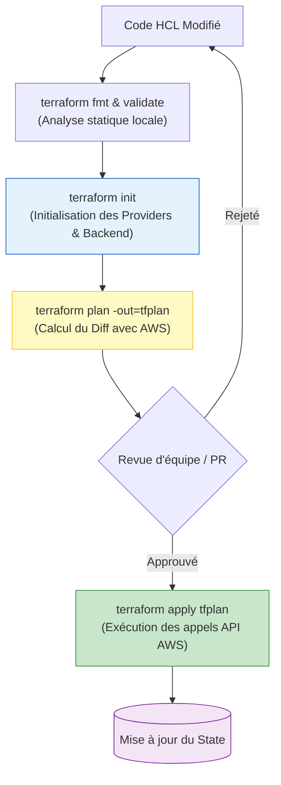

# 02 - Core Commands & Lifecycle

Using Terraform in production requires strict discipline. In elite DevOps teams, mastering the workflow is not just about knowing how to run `apply`: you need to understand what happens under the hood with AWS APIs and know how to handle infrastructure during day-to-day maintenance (**Day-2 Operations**).

---

## 1. The Standard Terraform Workflow

The lifecycle of an infrastructure change follows an ordered sequence ensuring safety, peer review, and zero downtime.



---

## 2. In-Depth Analysis of Core Commands

### 1. `terraform init`: Initialization
Before any operation, Terraform prepares the working environment:

* **What does it do?** It configures the backend (where the state lives), downloads provider plugins (e.g., `hashicorp/aws`) into the `.terraform/` directory, and fetches remote modules.
* **The lock file (`.terraform.lock.hcl`):** Automatically generated during init, it records the exact checksums (cryptographic hashes) of the provider binaries used. **This file must be committed to Git** to ensure all developers and CI run exactly the same plugin versions.

### 2. `terraform fmt` & `terraform validate`: Code Quality
* `terraform fmt -check -diff`: Checks indentation compliance and shows diffs. Ideal in a pre-commit linter or an early CI step.
* `terraform validate`: Checks syntax validity and internal consistency (variable types, required arguments present) **without contacting AWS APIs**.

### 3. `terraform plan`: The Predictive Dry-Run
Terraform contacts AWS in read-only mode to compare the real state of resources with `terraform.tfstate`, then computes the delta with your HCL code:

* `+`: Resource to create.
* `~`: Resource to update in place (in-place update, no destruction).
* `-`: Resource to destroy.
* `- / +`: Full replacement (destroy then recreate, often synonymous with downtime if not handled properly).

!!! tip "Absolute best practice: The binary plan file"
    In production and CI/CD, always run:
    ```bash
    terraform plan -out=tfplan
    ```
    This freezes the plan in a binary file. In the next step, running `terraform apply tfplan` guarantees Terraform applies **strictly** what was approved, even if something changed on AWS in the meantime.

### 4. `terraform apply`: Executing Changes
* In interactive local mode, Terraform displays the plan and waits for `yes` input.
* In non-interactive CI/CD pipelines, use `terraform apply -auto-approve` (or `terraform apply tfplan`).

### 5. `terraform plan -detailed-exitcode`: The CI/CD Key
Very frequently asked in DevOps interviews, this option changes the Linux exit codes of the command:

* `0`: Success, no changes detected (infrastructure in sync).
* `1`: Execution error (syntax, insufficient AWS permissions).
* `2`: Success, but **changes are required** (allows a CI script to know whether to trigger an alert or open a drift Pull Request).

---

## 3. Day-2 Operations: Maintenance & Production Rescue

As a DevOps engineer, you will often need to restructure existing code without destroying running databases or clusters.

### A. Inspecting State
```bash
terraform state list                    # Liste toutes les ressources suivies
terraform state show aws_instance.web   # Affiche les métadonnées détaillées d'une ressource
```

### B. Refactoring without Downtime: `terraform state mv`
Suppose you have a resource `aws_security_group.sg_app` declared in your code, and you decide to move it into a module `module.networking.aws_security_group.sg_app`.
If you simply change the code, Terraform will consider that the old SG must be **destroyed** and the new one **created** (causing a network outage!).

**The DevOps solution:**
```bash
terraform state mv aws_security_group.sg_app module.networking.aws_security_group.sg_app
```
Terraform updates its internal pointer in the State. **No destruction call is sent to AWS.**

### C. Replacing a Failed Resource: `apply -replace`
If an EC2 instance has become unstable and you want to force its recreation on the next apply:
```bash
# Ancienne méthode (dépréciée) : terraform taint aws_instance.web
# Méthode moderne (Terraform 1.0+) :
terraform apply -replace="aws_instance.web"
```

### D. Adopting Existing Infrastructure (Import)

If an engineer created an S3 bucket manually in the AWS console (ClickOps) and you need to bring it under Terraform control:

**Modern Method (Terraform 1.5+) via the `import` block:**
```hcl
# Dans votre code HCL
import {
  to = aws_s3_bucket.legacy_data
  id = "mon-bucket-cree-a-la-main-2024"
}
```
Then generate the HCL code automatically:
```bash
terraform plan -generate-config-out=generated_resources.tf
```

!!! danger "Interview Anti-Pattern: Using `-target` in Production"
    The command `terraform apply -target="aws_instance.web"` applies changes only to a specific resource, ignoring the rest.
    **Why is it banned in production?**
    Because `-target` breaks the global dependency graph, does not update the state of other components, and can leave the State out of sync with the Cloud reality. Reserve it exclusively for extreme emergency situations (Disaster Recovery).

---

## 4. Frequently Asked Interview Questions (Entry-Level)

!!! question "Q: Why is it essential to version the `.terraform.lock.hcl` file in Git?"
    The `.terraform.lock.hcl` file pins the versions and cryptographic hashes of each downloaded provider plugin. If it is not committed, a CI/CD runner could download a newer minor version of the AWS provider on the next build, introducing regressions or unexpected behavior compared to the developer's local environment.

!!! question "Q: How does the `-detailed-exitcode` flag work and why is it essential in CI/CD?"
    By default, `terraform plan` returns exit code 0 on success, whether or not there are changes to apply. With `-detailed-exitcode`, it returns `0` if no changes are required, `2` if infrastructure changes are needed, and `1` on error. This allows CI/CD pipeline scripts (e.g., nightly drift detection cron) to know precisely whether infrastructure has drifted without parsing text output.

!!! question "Q: Which command do you use to rename an HCL resource block without Terraform deleting the resource on AWS?"
    Use `terraform state mv <old_identifier> <new_identifier>`. This updates the internal mapping in the `terraform.tfstate` state file without generating destruction or recreation calls to AWS APIs. Since Terraform 1.1, you can also declare a `moved {}` block directly in HCL code so the renaming is versioned and automatic for the whole team.

!!! question "Q: Why can running `terraform apply` directly without a saved plan (`-out=tfplan`) be dangerous in an enterprise?"
    If you run `terraform apply` directly, Terraform recomputes a plan at execution time. In a team of several engineers, a change may have been pushed to AWS between the time the initial plan was reviewed and the time the apply is triggered. Using a binary plan (`-out=tfplan`) guarantees Terraform will apply exactly the set of actions that were inspected and approved during review.
