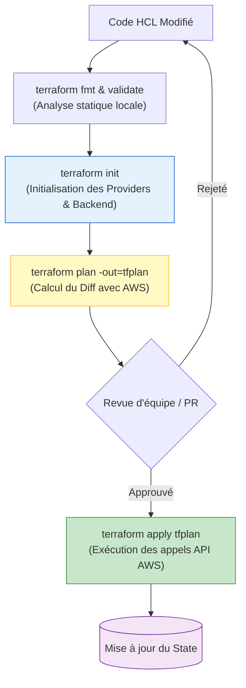

# 02 - Commandes Core & Cycle de vie

L'utilisation de Terraform en environnement de production exige une discipline stricte. Dans les équipes DevOps d'élite, maîtriser le workflow ne se limite pas à savoir lancer un `apply` : il faut comprendre ce qui se passe sous le capot vis-à-vis des API AWS et savoir manipuler l'infrastructure lors des opérations de maintenance quotidienne (**Day-2 Operations**).

---

## 1. Le Workflow Terraform Standard

Le cycle de vie d'une modification d'infrastructure suit une séquence ordonnée garantissant sécurité, validation par les pairs et absence d'interruption de service.



---

## 2. Analyse Approfondie des Commandes Core

### 1. `terraform init` : L'initialisation
Avant toute opération, Terraform prépare l'environnement de travail :

* **Que fait-il ?** Il configure le backend (où réside l'état), télécharge les plugins des providers (ex: `hashicorp/aws`) dans le dossier `.terraform/` et télécharge les modules distants.
* **Le fichier de verrouillage (`.terraform.lock.hcl`) :** Généré automatiquement lors de l'init, il enregistre les sommes de contrôle (checksums cryptographiques) exactes des binaires des providers utilisés. **Ce fichier doit impérativement être commité dans Git** pour garantir que tous les développeurs et la CI exécutent exactement la même version des plugins.

### 2. `terraform fmt` & `terraform validate` : La qualité du code
* `terraform fmt -check -diff` : Vérifie la conformité de l'indentation et affiche les écarts. Idéal dans un linter de pré-commit ou une étape précoce de CI.
* `terraform validate` : Vérifie la validité syntaxique et la consistance interne (types des variables, arguments requis présents) **sans contacter les API AWS**.

### 3. `terraform plan` : Le Dry-Run prédictif
Terraform contacte AWS en lecture seule pour comparer l'état réel des ressources avec le `terraform.tfstate`, puis calcule le delta avec votre code HCL :

* `+` : Ressource à créer.
* `~` : Ressource modifiée en place (in-place update, sans destruction).
* `-` : Ressource à détruire.
* `- / +` : Remplacement complet (destruction puis recréation, souvent synonyme d'indisponibilité si mal maîtrisé).

!!! tip "Bonne pratique absolue : Le fichier de plan binaire"
    En production et en CI/CD, on exécute systématiquement :
    ```bash
    terraform plan -out=tfplan
    ```
    Cela fige le plan dans un fichier binaire. Lors de l'étape suivante, lancer `terraform apply tfplan` garantit que Terraform applique **strictement** ce qui a été approuvé, même si un élément a changé sur AWS entre-temps.

### 4. `terraform apply` : L'exécution des changements
* En local interactif, Terraform affiche le plan et attend la saisie de `yes`.
* En pipeline CI/CD non interactif, on utilise `terraform apply -auto-approve` (ou `terraform apply tfplan`).

### 5. `terraform plan -detailed-exitcode` : La clé de la CI/CD
Très fréquemment demandée en entretien DevOps, cette option modifie les codes de sortie Linux (exit codes) de la commande :

* `0` : Succès, aucune modification détectée (infrastructure synchronisée).
* `1` : Erreur d'exécution (syntaxe, permissions AWS insuffisantes).
* `2` : Succès, mais **des changements sont nécessaires** (permet à un script CI de savoir s'il faut déclencher une alerte ou ouvrir une Pull Request de dérive).

---

## 3. Opérations Day-2 : Maintenance & Sauvetage en Production

En tant qu'ingénieur DevOps, vous devrez souvent restructurer du code existant sans détruire les bases de données ou les clusters en cours d'exécution.

### A. Inspection du State
```bash
terraform state list                    # Liste toutes les ressources suivies
terraform state show aws_instance.web   # Affiche les métadonnées détaillées d'une ressource
```

### B. Refactorer sans Downtime : `terraform state mv`
Supposons que vous ayez une ressource `aws_security_group.sg_app` déclarée dans votre code, et que vous décidiez de la déplacer dans un module `module.networking.aws_security_group.sg_app`.
Si vous modifiez simplement le code, Terraform va considérer que l'ancien SG doit être **détruit** et le nouveau **créé** (provoquant une coupure réseau !).

**La solution DevOps :**
```bash
terraform state mv aws_security_group.sg_app module.networking.aws_security_group.sg_app
```
Terraform met à jour son pointeur interne dans le State. **Aucun appel de destruction n'est envoyé à AWS.**

### C. Remplacement d'une ressource défaillante : `apply -replace`
Si une instance EC2 est devenue instable et que vous souhaitez forcer sa recréation lors du prochain apply :
```bash
# Ancienne méthode (dépréciée) : terraform taint aws_instance.web
# Méthode moderne (Terraform 1.0+) :
terraform apply -replace="aws_instance.web"
```

### D. Adoption d'infrastructure existante (Import)

Si un ingénieur a créé un bucket S3 manuellement dans la console AWS (ClickOps) et que vous devez le faire entrer sous le contrôle de Terraform :

**Méthode Moderne (Terraform 1.5+) via le bloc `import` :**
```hcl
# Dans votre code HCL
import {
  to = aws_s3_bucket.legacy_data
  id = "mon-bucket-cree-a-la-main-2024"
}
```
Puis exécuter la génération automatique du code HCL :
```bash
terraform plan -generate-config-out=generated_resources.tf
```

!!! danger "Anti-pattern d'entretien : L'usage de `-target` en production"
    La commande `terraform apply -target="aws_instance.web"` permet de n'appliquer les changements que sur une ressource précise en ignorant le reste.
    **Pourquoi est-ce banni en production ?**
    Parce que `-target` casse le graphe de dépendances global, ne met pas à jour l'état des autres composants et peut laisser le State dans un état désynchronisé par rapport à la réalité Cloud. À réserver exclusivement aux situations d'urgence extrême (Disaster Recovery).

---

## 4. Questions d'Entretien Fréquentes (Niveau Entry-Level)

!!! question "Q: Pourquoi est-il indispensable de versionner le fichier `.terraform.lock.hcl` dans Git ?"
    Le fichier `.terraform.lock.hcl` fige les versions et les empreintes cryptographiques (hashes) de chaque plugin de provider téléchargé. S'il n'est pas commité, un runner CI/CD pourrait télécharger une version mineure plus récente du provider AWS lors du prochain build, introduisant des régressions ou des comportements inattendus par rapport à l'environnement local du développeur.

!!! question "Q: Comment fonctionne le flag `-detailed-exitcode` et pourquoi est-il indispensable en CI/CD ?"
    Par défaut, `terraform plan` retourne un code 0 en cas de succès, qu'il y ait des changements à appliquer ou non. Avec `-detailed-exitcode`, il retourne `0` si aucune modification n'est requise, `2` si des modifications d'infrastructure sont nécessaires, et `1` en cas d'erreur. Cela permet aux scripts de pipeline CI/CD (ex: cron de détection de dérive nocturne) de savoir précisément si l'infrastructure a dérivé sans devoir analyser la sortie texte.

!!! question "Q: Quelle commande utilisez-vous pour renommer un bloc de ressource HCL sans que Terraform ne supprime la ressource sur AWS ?"
    On utilise `terraform state mv <ancien_identifiant> <nouvel_identifiant>`. Cela met à jour le mapping interne dans le fichier d'état `terraform.tfstate` sans générer d'appels de destruction ou de recréation vers les API d'AWS. Depuis Terraform 1.1, on peut également déclarer un bloc `moved {}` directement dans le code HCL pour que le renommage soit versionné et automatique pour toute l'équipe.

!!! question "Q: Pourquoi exécuter `terraform apply` directement sans plan sauvegardé (`-out=tfplan`) peut-il être dangereux en entreprise ?"
    Si on exécute `terraform apply` directement, Terraform recalcule un plan au moment de l'exécution. Dans une équipe de plusieurs ingénieurs, une modification a pu être poussée sur AWS entre le moment où le plan initial a été examiné et le moment où l'apply est déclenché. Utiliser un plan binaire (`-out=tfplan`) garantit que Terraform appliquera exactement l'ensemble des actions qui ont été inspectées et validées lors de la revue.