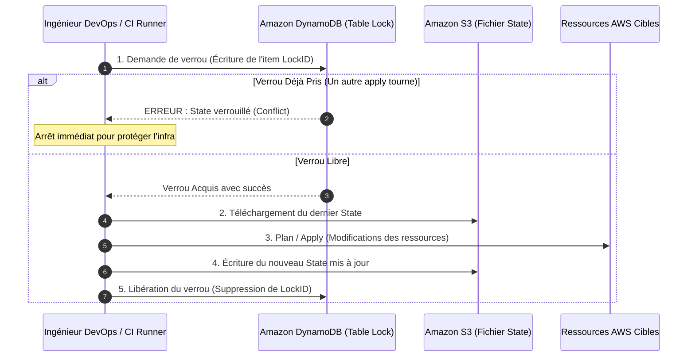

# 03 - State & Remote Backend (S3 + DynamoDB)

In a DevOps interview, Terraform **State** is by far the most tested technical topic. Understanding how Terraform stores infrastructure reality, how it handles concurrent access, and how to secure sensitive data is what separates a beginner from a production-ready engineer.

---

## 1. What Is State and Why Is It Essential?

Terraform is not a stateless tool. On each execution, it generates or consults a JSON file called `terraform.tfstate`.

### The 3 Fundamental Roles of State
1. **Real <-> Declarative Mapping:** In your HCL code, you write `resource "aws_vpc" "main" {}`. AWS does not know the name `"main"`: AWS assigns a unique identifier (e.g., `vpc-0123456789abcdef0`). State keeps the exact correspondence table between your code names and the real Cloud identifiers.
2. **Metadata & Dependency Tracking:** It traces the dependency history to know the precise order in which to destroy or modify resources.
3. **Performance Cache:** On an infrastructure with hundreds of components, querying AWS APIs for every resource before any action would saturate API quotas (AWS rate-limiting). State caches attributes locally.

```json
// Extrait simplifié de l'anatomie d'un terraform.tfstate
{
  "version": 4,
  "terraform_version": "1.8.0",
  "serial": 12,
  "lineage": "3e9b1d28-1123-4567-89ab-cdef01234567",
  "resources": [
    {
      "mode": "managed",
      "type": "aws_vpc",
      "name": "main",
      "provider": "provider[\"registry.terraform.io/hashicorp/aws\"]",
      "instances": [
        {
          "attributes": {
            "id": "vpc-0a1b2c3d4e5f67890",
            "cidr_block": "10.0.0.0/16",
            "enable_dns_hostnames": true
          }
        }
      ]
    }
  ]
}
```

!!! danger "The 3 Deadly Dangers of Local State in an Enterprise"
    1. **No team sharing:** If the file is on your laptop, colleagues cannot collaborate on the same infrastructure.
    2. **Concurrent overwrites (Race Conditions):** If two engineers run `terraform apply` at the same time, the last one to finish overwrites and corrupts the infrastructure state.
    3. **Critical secret leakage:** The State file stores **all attributes in plain text** (including RDS database passwords or TLS private keys). **Never commit `terraform.tfstate` to Git.**

---

## 2. Enterprise Architecture: Remote Backend (S3 + DynamoDB)

The standard solution recommended by AWS and HashiCorp relies on a pair of managed services:

* **Amazon S3:** Durable and highly available storage for the state file.
* **Amazon DynamoDB:** Distributed locking mechanism (**State Locking**) to prevent concurrent executions.



---

## 3. Complete HCL Implementation

### A. Backend Configuration in the Project

This block is placed in your `versions.tf` or `main.tf` file:

```hcl
terraform {
  required_version = ">= 1.5.0"

  backend "s3" {
    bucket         = "mon-entreprise-terraform-state-prod"
    key            = "networking/vpc.tfstate" # Chemin unique dans le bucket
    region         = "eu-west-3"
    encrypt        = true                     # Chiffrement AES-256 / KMS
    dynamodb_table = "terraform-state-locks"  # Table DynamoDB pour le State Lock
  }
}
```

### B. Backend Infrastructure Bootstrap (Reusable Code)

Before you can use the backend, you need to create the S3 bucket and DynamoDB table. Here is the hardened HCL code following AWS security recommendations:

```hcl
# 1. Bucket S3 pour stocker le State
resource "aws_s3_bucket" "terraform_state" {
  bucket        = "mon-entreprise-terraform-state-prod"
  force_destroy = false # Empêche la suppression accidentelle

  lifecycle {
    prevent_destroy = true
  }
}

# 2. Activer le versioning (Obligatoire pour restaurer un State corrompu)
resource "aws_s3_bucket_versioning" "state_versioning" {
  bucket = aws_s3_bucket.terraform_state.id
  versioning_configuration {
    status = "Enabled"
  }
}

# 3. Chiffrement obligatoire au repos (SSE-S3 ou KMS)
resource "aws_s3_bucket_server_side_encryption_configuration" "state_crypto" {
  bucket = aws_s3_bucket.terraform_state.id
  rule {
    apply_server_side_encryption_by_default {
      sse_algorithm = "AES256"
    }
  }
}

# 4. Blocage absolu de tout accès public
resource "aws_s3_bucket_public_access_block" "state_privacy" {
  bucket = aws_s3_bucket.terraform_state.id

  block_public_acls       = true
  block_public_policy     = true
  ignore_public_acls      = true
  restrict_public_buckets = true
}

# 5. Table DynamoDB pour le State Locking
resource "aws_dynamodb_table" "terraform_locks" {
  name         = "terraform-state-locks"
  billing_mode = "PAY_PER_REQUEST" # Mode on-demand économique
  hash_key     = "LockID"          # Nom exact requis par Terraform

  attribute {
    name = "LockID"
    type = "S" # Type String obligatoire
  }
}
```

---

## 4. Production Incident Troubleshooting (Day-2 Operations)

### What to Do When Facing `Error acquiring the state lock`?

When a deployment is abruptly interrupted (CI runner crash, network loss), the DynamoDB lock can remain stuck. Any new `apply` will fail with this message:

```text
Error: Error acquiring the state lock
Lock Info:
  ID:        b1a2c3d4-5678-90ab-cdef-1234567890ab
  Path:      mon-entreprise-terraform-state-prod/networking/vpc.tfstate
  Who:       runner@github-actions-01
  Created:   2026-09-23 16:30:00 UTC
```

**Surgical unlock procedure:**

1. **Human verification:** Make sure no other pipeline or colleague is actually deploying this component.
2. **Emergency unlock:**
```bash
terraform force-unlock b1a2c3d4-5678-90ab-cdef-1234567890ab
```

### Reducing Blast Radius: State Isolation

!!! warning "Anti-Pattern: The Monolithic State"
    Putting the entire Cloud (VPC + EKS + RDS + IAM) in **a single State file** is a serious architectural mistake:
    
    - A `plan` takes tens of minutes.
    - A careless tag mistake can break the production database.
    - The risk of lock contention paralyzes the whole engineering team.

**Best Practice: Split into Independent Layers (Micro-States)**
```
s3://mon-entreprise-terraform-state-prod/
├── networking/vpc.tfstate       # Modifié 2 fois par an
├── security/iam.tfstate         # Modifié mensuellement
├── compute/eks-cluster.tfstate  # Modifié chaque semaine
└── data/rds-databases.tfstate   # Isolé et ultra-protégé
```

To read outputs from another State (e.g., retrieving the `vpc_id` in the EKS project):
```hcl
data "terraform_remote_state" "networking" {
  backend = "s3"
  config = {
    bucket = "mon-entreprise-terraform-state-prod"
    key    = "networking/vpc.tfstate"
    region = "eu-west-3"
  }
}

# Utilisation
resource "aws_security_group" "eks" {
  vpc_id = data.terraform_remote_state.networking.outputs.vpc_id
}
```

---

## 5. Frequently Asked Interview Questions (Entry-Level)

!!! question "Q: Why must the `terraform.tfstate` file NEVER be pushed to a Git repository?"
    State contains all attributes returned by Cloud APIs, including sensitive data in plain text: generated RDS database passwords, secret tokens, certificates, and private keys. Moreover, Git does not handle real-time locking and risks major corruption if two engineers modify infrastructure simultaneously.

!!! question "Q: How exactly does State Locking work with DynamoDB on AWS?"
    When you run `terraform plan` or `apply`, Terraform writes a record in the DynamoDB table with primary key `LockID` containing the session ID, user, and timestamp. If another process tries to execute a Terraform command on the same State, DynamoDB rejects the write with a conflict error. Once the operation completes successfully or is properly cancelled, Terraform deletes the record, thus releasing the lock for subsequent deployments.

!!! question "Q: What do you do if a CI pipeline crash leaves State locked indefinitely?"
    I first rigorously verify (in the CI console and with the team) that the previous runner is actually dead and no write operation is in progress. Then I retrieve the `Lock ID` displayed in the error message and run `terraform force-unlock <LockID>`. This manually removes the entry from the DynamoDB table and restores pipeline availability.

!!! question "Q: Why is it mandatory to enable Versioning on the S3 backend bucket?"
    State is the single source of truth for infrastructure. In case of accidental file corruption (State mishandling, network failure during write), S3 versioning allows instantly rolling back to the last healthy N-1 version of the JSON file in a few clicks, avoiding a catastrophic disaster recovery scenario.
