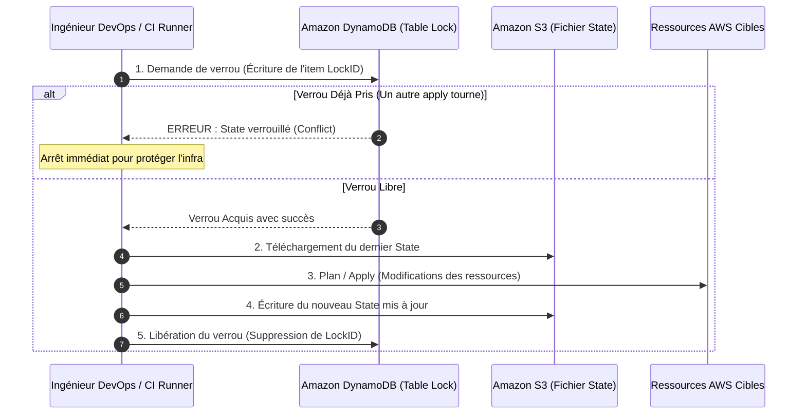

# 03 - Le State & Remote Backend (S3 + DynamoDB)

En entretien DevOps, le **State** de Terraform est sans conteste le sujet technique le plus testé. Comprendre comment Terraform stocke la réalité de l'infrastructure, comment il gère les accès concurrents et comment sécuriser les données sensibles fait la différence entre un profil débutant et un ingénieur opérationnel en production.

---

## 1. Qu'est-ce que le State et Pourquoi est-il Indispensable ?

Terraform n'est pas un outil sans état (stateless). À chaque exécution, il génère ou consulte un fichier JSON appelé `terraform.tfstate`.

### Les 3 Rôles Fondamentaux du State
1. **Mapping Réel <-> Déclaratif :** Dans votre code HCL, vous écrivez `resource "aws_vpc" "main" {}`. AWS ne connaît pas le nom `"main"` : AWS attribue un identifiant unique (ex: `vpc-0123456789abcdef0`). Le State conserve la table de correspondance exacte entre vos noms de code et les identifiants réels du Cloud.
2. **Métadonnées & Suivi des Dépendances :** Il trace l'historique des dépendances pour savoir dans quel ordre précis détruire ou modifier les ressources.
3. **Cache de Performance :** Sur une infrastructure comportant des centaines de composants, interroger les API AWS pour chaque ressource avant la moindre action saturerait les quotas d'API (rate-limiting AWS). Le State stocke les attributs en cache localement.

```json
// Extrait simplifié de l'anatomie d'un terraform.tfstate
{
  "version": 4,
  "terraform_version": "1.8.0",
  "serial": 12,
  "lineage": "3e9b1d28-1123-4567-89ab-cdef01234567",
  "resources": [
    {
      "mode": "managed",
      "type": "aws_vpc",
      "name": "main",
      "provider": "provider[\"registry.terraform.io/hashicorp/aws\"]",
      "instances": [
        {
          "attributes": {
            "id": "vpc-0a1b2c3d4e5f67890",
            "cidr_block": "10.0.0.0/16",
            "enable_dns_hostnames": true
          }
        }
      ]
    }
  ]
}
```

!!! danger "Les 3 Dangers Mortels du State Local en Entreprise"
    1. **Aucun partage d'équipe :** Si le fichier est sur votre laptop, vos collègues ne peuvent pas collaborer sur la même infrastructure.
    2. **Écrasements concurrents (Race Conditions) :** Si deux ingénieurs exécutent `terraform apply` en même temps, le dernier à terminer écrase et corrompt l'état de l'infrastructure.
    3. **Fuite critique de secrets :** Le fichier State stocke **tous les attributs en texte clair** (y compris les mots de passe de bases de données RDS ou les clés privées TLS). **Ne jamais commiter `terraform.tfstate` dans Git.**

---

## 2. L'Architecture Enterprise : Remote Backend (S3 + DynamoDB)

La solution standard recommandée par AWS et HashiCorp repose sur un binôme de services managés :

* **Amazon S3 :** Stockage durable et hautement disponible du fichier d'état.
* **Amazon DynamoDB :** Mécanisme de verrouillage distribué (**State Locking**) pour empêcher les exécutions simultanées.



---

## 3. Implémentation HCL Complète

### A. Configuration du Backend dans le Projet

Ce bloc est placé dans votre fichier `versions.tf` ou `main.tf` :

```hcl
terraform {
  required_version = ">= 1.5.0"

  backend "s3" {
    bucket         = "mon-entreprise-terraform-state-prod"
    key            = "networking/vpc.tfstate" # Chemin unique dans le bucket
    region         = "eu-west-3"
    encrypt        = true                     # Chiffrement AES-256 / KMS
    dynamodb_table = "terraform-state-locks"  # Table DynamoDB pour le State Lock
  }
}
```

### B. Bootstrap de l'Infrastructure du Backend (Code Réutilisable)

Avant de pouvoir utiliser le backend, il faut créer le bucket S3 et la table DynamoDB. Voici le code HCL durci selon les recommandations de sécurité AWS :

```hcl
# 1. Bucket S3 pour stocker le State
resource "aws_s3_bucket" "terraform_state" {
  bucket        = "mon-entreprise-terraform-state-prod"
  force_destroy = false # Empêche la suppression accidentelle

  lifecycle {
    prevent_destroy = true
  }
}

# 2. Activer le versioning (Obligatoire pour restaurer un State corrompu)
resource "aws_s3_bucket_versioning" "state_versioning" {
  bucket = aws_s3_bucket.terraform_state.id
  versioning_configuration {
    status = "Enabled"
  }
}

# 3. Chiffrement obligatoire au repos (SSE-S3 ou KMS)
resource "aws_s3_bucket_server_side_encryption_configuration" "state_crypto" {
  bucket = aws_s3_bucket.terraform_state.id
  rule {
    apply_server_side_encryption_by_default {
      sse_algorithm = "AES256"
    }
  }
}

# 4. Blocage absolu de tout accès public
resource "aws_s3_bucket_public_access_block" "state_privacy" {
  bucket = aws_s3_bucket.terraform_state.id

  block_public_acls       = true
  block_public_policy     = true
  ignore_public_acls      = true
  restrict_public_buckets = true
}

# 5. Table DynamoDB pour le State Locking
resource "aws_dynamodb_table" "terraform_locks" {
  name         = "terraform-state-locks"
  billing_mode = "PAY_PER_REQUEST" # Mode on-demand économique
  hash_key     = "LockID"          # Nom exact requis par Terraform

  attribute {
    name = "LockID"
    type = "S" # Type String obligatoire
  }
}
```

---

## 4. Dépannage d'Incidents en Production (Day-2 Operations)

### Que faire face à l'erreur `Error acquiring the state lock` ?

Lors d'un déploiement interrompu brutalement (crash du runner CI, perte de connexion réseau), le verrou DynamoDB peut rester bloqué. Tout nouvel `apply` échouera avec ce message :

```text
Error: Error acquiring the state lock
Lock Info:
  ID:        b1a2c3d4-5678-90ab-cdef-1234567890ab
  Path:      mon-entreprise-terraform-state-prod/networking/vpc.tfstate
  Who:       runner@github-actions-01
  Created:   2026-09-23 16:30:00 UTC
```

**Procédure de déblocage chirurgicale :**
1. **Vérification humaine :** S'assurer qu'aucun autre pipeline ni collègue n'est effectivement en cours de déploiement sur ce composant.
2. **Déverrouillage d'urgence :**
```bash
terraform force-unlock b1a2c3d4-5678-90ab-cdef-1234567890ab
```

### Réduire le Rayon d'Impact (Blast Radius) : L'Isolation des States

!!! warning "Anti-pattern : Le State Monolithique"
    Mettre l'ensemble du Cloud (VPC + EKS + RDS + IAM) dans **un seul et unique fichier State** est une erreur architecturale grave :
    - Un `plan` prend des dizaines de minutes.
    - Une erreur d'inattention sur un tag peut casser la base de production.
    - Le risque de blocage par verrou paralyse toute l'équipe technique.

**La Bonne Pratique : Découper en couches indépendantes (Micro-States)**
```
s3://mon-entreprise-terraform-state-prod/
├── networking/vpc.tfstate       # Modifié 2 fois par an
├── security/iam.tfstate         # Modifié mensuellement
├── compute/eks-cluster.tfstate  # Modifié chaque semaine
└── data/rds-databases.tfstate   # Isolé et ultra-protégé
```

Pour lire les outputs d'un autre State (ex: récupérer le `vpc_id` dans le projet EKS) :
```hcl
data "terraform_remote_state" "networking" {
  backend = "s3"
  config = {
    bucket = "mon-entreprise-terraform-state-prod"
    key    = "networking/vpc.tfstate"
    region = "eu-west-3"
  }
}

# Utilisation
resource "aws_security_group" "eks" {
  vpc_id = data.terraform_remote_state.networking.outputs.vpc_id
}
```

---

## 5. Questions d'Entretien Fréquentes (Niveau Entry-Level)

!!! question "Q: Pourquoi le fichier `terraform.tfstate` ne doit-il JAMAIS être poussé dans un dépôt Git ?"
    Le State contient l'ensemble des attributs retournés par les API Cloud, y compris les données sensibles en texte clair : mots de passe de bases de données RDS générés, tokens secrets, certificats et clés privées. De plus, Git ne gère pas le verrouillage en temps réel et risque d'entraîner des corruptions majeures si deux ingénieurs modifient l'infrastructure simultanément.

!!! question "Q: Comment fonctionne exactement le State Locking avec DynamoDB sur AWS ?"
    Lorsque vous lancez `terraform plan` ou `apply`, Terraform écrit un enregistrement dans la table DynamoDB avec comme clé primaire `LockID` contenant l'ID de session, l'utilisateur et l'horodatage. Si un autre processus tente d'exécuter une commande Terraform sur le même State, DynamoDB rejette l'écriture avec une erreur de conflit. Une fois l'opération terminée avec succès ou annulée proprement, Terraform supprime l'enregistrement, libérant ainsi le verrou pour les déploiements suivants.

!!! question "Q: Que faites-vous si un crash de pipeline CI laisse le State verrouillé indéfiniment ?"
    Je vérifie d'abord rigoureusement (dans la console CI et auprès de l'équipe) que le runner précédent est réellement mort et qu'aucune opération d'écriture n'est en cours. Ensuite, je récupère le `Lock ID` affiché dans le message d'erreur et j'exécute la commande `terraform force-unlock <LockID>`. Cela supprime manuellement l'entrée dans la table DynamoDB et restaure la disponibilité du pipeline.

!!! question "Q: Pourquoi est-il obligatoire d'activer le Versioning sur le bucket S3 du backend ?"
    Le State est la source unique de vérité de l'infrastructure. En cas de corruption accidentelle du fichier (mauvaise manipulation du State, panne réseau während l'écriture), le versioning S3 permet de revenir instantanément à la version N-1 saine du fichier JSON en quelques clics, évitant un scénario de reprise après sinistre catastrophique.